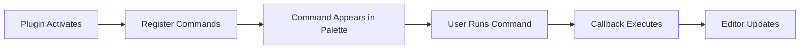

import { Callout, Tabs,  Steps } from 'nextra/components'

# Adding Commands Tutorial

Build a text transformation plugin that demonstrates command registration, keyboard shortcuts, command categories, and editor integration.

## What You'll Build

A "Text Transformer" plugin with:
- ✅ Multiple commands with different purposes
- ✅ Keyboard shortcuts for quick access
- ✅ Command categories for organization
- ✅ Editor text manipulation
- ✅ Command palette integration
- ✅ Context-aware commands

**Time to complete:** 20 minutes

---

## Prerequisites

<Callout type="info">
Before starting:
- Complete [Your First Plugin](/developers/plugins/guides/first-plugin)
- Basic understanding of plugin structure
- Lokus installed and running
</Callout>

---

## Step 1: Create the Plugin

```bash
mkdir text-transformer-plugin
cd text-transformer-plugin
npm init -y
npm install --save-dev lokus-plugin-sdk typescript esbuild
```

---

## Step 2: Create the Manifest

Create `plugin.json`:

```json filename="plugin.json"
{
  "manifest": "2.0",
  "id": "text-transformer",
  "name": "text-transformer",
  "displayName": "Text Transformer",
  "version": "1.0.0",
  "description": "Transform selected text with various commands",
  "author": "Your Name",
  "license": "MIT",
  "main": "./dist/index.js",
  "lokusVersion": ">=1.0.0",
  "permissions": [
    "commands:register",
    "editor:read",
    "editor:write",
    "ui:notifications"
  ],
  "activationEvents": ["onStartup"],
  "contributes": {
    "commands": [
      {
        "id": "textTransformer.toUpperCase",
        "title": "Text Transformer: To UPPERCASE",
        "category": "Transform"
      },
      {
        "id": "textTransformer.toLowerCase",
        "title": "Text Transformer: To lowercase",
        "category": "Transform"
      },
      {
        "id": "textTransformer.toTitleCase",
        "title": "Text Transformer: To Title Case",
        "category": "Transform"
      },
      {
        "id": "textTransformer.reverse",
        "title": "Text Transformer: Reverse Text",
        "category": "Transform"
      }
    ],
    "keybindings": [
      {
        "command": "textTransformer.toUpperCase",
        "key": "Ctrl+Shift+U",
        "mac": "Cmd+Shift+U"
      },
      {
        "command": "textTransformer.toLowerCase",
        "key": "Ctrl+Shift+L",
        "mac": "Cmd+Shift+L"
      }
    ]
  }
}
```

### Manifest Explained

<Tabs items={['Permissions', 'Commands', 'Keybindings']}>
  <Tabs.Tab>
    **Permissions**

    ```json
    "permissions": [
      "commands:register",  // Register commands
      "editor:read",        // Read editor content
      "editor:write",       // Modify editor content
      "ui:notifications"    // Show messages
    ]
    ```

    Required for:
    - Registering commands in command palette
    - Reading selected text
    - Replacing text
    - Showing success/error messages
  </Tabs.Tab>

  <Tabs.Tab>
    **Commands**

    ```json
    "commands": [
      {
        "id": "textTransformer.toUpperCase",
        "title": "Text Transformer: To UPPERCASE",
        "category": "Transform"
      }
    ]
    ```

    - `id`: Unique command identifier
    - `title`: What appears in command palette
    - `category`: Groups commands together
  </Tabs.Tab>

  <Tabs.Tab>
    **Keybindings**

    ```json
    "keybindings": [
      {
        "command": "textTransformer.toUpperCase",
        "key": "Ctrl+Shift+U",    // Windows/Linux
        "mac": "Cmd+Shift+U"       // macOS
      }
    ]
    ```

    Platform-specific shortcuts:
    - `key`: Windows and Linux
    - `mac`: macOS only
  </Tabs.Tab>
</Tabs>

---

## Step 3: Configure Build

Create `tsconfig.json` and `esbuild.config.js` (same as previous tutorial):

<details>
<summary>tsconfig.json</summary>

```json filename="tsconfig.json"
{
  "compilerOptions": {
    "target": "ES2020",
    "module": "ESNext",
    "lib": ["ES2020"],
    "moduleResolution": "node",
    "esModuleInterop": true,
    "skipLibCheck": true,
    "strict": true,
    "declaration": true,
    "outDir": "./dist",
    "rootDir": "./src"
  },
  "include": ["src/**/*"],
  "exclude": ["node_modules", "dist"]
}
```

</details>

<details>
<summary>esbuild.config.js</summary>

```javascript filename="esbuild.config.js"
const esbuild = require('esbuild');

esbuild.build({
  entryPoints: ['src/index.ts'],
  bundle: true,
  outfile: 'dist/index.js',
  platform: 'node',
  target: 'es2020',
  format: 'esm',
  sourcemap: true,
  external: ['lokus-plugin-sdk'],
}).catch(() => process.exit(1));
```

</details>

Update `package.json`:

```json filename="package.json"
{
  "name": "text-transformer",
  "version": "1.0.0",
  "type": "module",
  "scripts": {
    "build": "node esbuild.config.js"
  }
}
```

---

## Step 4: Write the Plugin Code

Create `src/index.ts`:

```typescript filename="src/index.ts"
import { PluginContext } from 'lokus-plugin-sdk';

export default class TextTransformerPlugin {
  private context: PluginContext;
  private logger: PluginContext['logger'];

  constructor(context: PluginContext) {
    this.context = context;
    this.logger = context.logger;
    this.logger.info('TextTransformerPlugin initialized');
  }

  async activate(activationContext: any): Promise<void> {
    this.logger.info('Activating TextTransformerPlugin...');

    try {
      // Register all transformation commands
      this.registerCommands(activationContext);

      this.logger.info('TextTransformerPlugin activated successfully');
      this.context.ui.showInformationMessage(
        'Text Transformer plugin is ready! Select text and use Cmd/Ctrl+Shift+U/L'
      );
    } catch (error) {
      this.logger.error('Failed to activate plugin:', error);
      throw error;
    }
  }

  async deactivate(): Promise<void> {
    this.logger.info('TextTransformerPlugin deactivated');
  }

  /**
   * Register all commands
   */
  private registerCommands(activationContext: any): void {
    const commands = [
      {
        id: 'textTransformer.toUpperCase',
        name: 'Text Transformer: To UPPERCASE',
        description: 'Convert selected text to UPPERCASE',
        category: 'Transform',
        handler: () => this.transformText((text) => text.toUpperCase()),
      },
      {
        id: 'textTransformer.toLowerCase',
        name: 'Text Transformer: To lowercase',
        description: 'Convert selected text to lowercase',
        category: 'Transform',
        handler: () => this.transformText((text) => text.toLowerCase()),
      },
      {
        id: 'textTransformer.toTitleCase',
        name: 'Text Transformer: To Title Case',
        description: 'Convert selected text to Title Case',
        category: 'Transform',
        handler: () => this.transformText((text) => this.toTitleCase(text)),
      },
      {
        id: 'textTransformer.reverse',
        name: 'Text Transformer: Reverse Text',
        description: 'Reverse the selected text',
        category: 'Transform',
        handler: () => this.transformText((text) => text.split('').reverse().join('')),
      },
      {
        id: 'textTransformer.removeSpaces',
        name: 'Text Transformer: Remove Spaces',
        description: 'Remove all spaces from selected text',
        category: 'Transform',
        handler: () => this.transformText((text) => text.replace(/\s+/g, '')),
      },
      {
        id: 'textTransformer.toCamelCase',
        name: 'Text Transformer: To camelCase',
        description: 'Convert selected text to camelCase',
        category: 'Transform',
        handler: () => this.transformText((text) => this.toCamelCase(text)),
      },
      {
        id: 'textTransformer.toSnakeCase',
        name: 'Text Transformer: To snake_case',
        description: 'Convert selected text to snake_case',
        category: 'Transform',
        handler: () => this.transformText((text) => this.toSnakeCase(text)),
      },
    ];

    // Register each command
    for (const command of commands) {
      activationContext.commands.registerCommand(command.id, {
        name: command.name,
        description: command.description,
        category: command.category,
        callback: command.handler,
      });

      this.logger.debug(`Registered command: $\\{command.id\\}`);
    }
  }

  /**
   * Generic text transformation function
   */
  private async transformText(
    transformer: (text: string) => string
  ): Promise<void> {
    try {
      // Get current selection
      const selection = await this.context.editor.getSelection();

      if (!selection || !selection.text) {
        this.context.ui.showWarningMessage(
          'Please select some text first'
        );
        this.logger.warn('No text selected');
        return;
      }

      this.logger.debug('Selected text:', selection.text);

      // Transform the text
      const transformedText = transformer(selection.text);

      this.logger.debug('Transformed text:', transformedText);

      // Replace the selection
      await this.context.editor.replaceSelection(transformedText);

      this.logger.info('Text transformed successfully');
      this.context.ui.showInformationMessage(
        `Text transformed! (${selection.text.length} characters)`
      );
    } catch (error) {
      this.logger.error('Error transforming text:', error);
      this.context.ui.showErrorMessage(
        'Failed to transform text. Check the console for details.'
      );
    }
  }

  /**
   * Convert text to Title Case
   */
  private toTitleCase(text: string): string {
    return text
      .toLowerCase()
      .split(' ')
      .map((word) => word.charAt(0).toUpperCase() + word.slice(1))
      .join(' ');
  }

  /**
   * Convert text to camelCase
   */
  private toCamelCase(text: string): string {
    return text
      .replace(/[^a-zA-Z0-9]+(.)/g, (_, chr) => chr.toUpperCase())
      .replace(/^[A-Z]/, (chr) => chr.toLowerCase());
  }

  /**
   * Convert text to snake_case
   */
  private toSnakeCase(text: string): string {
    return text
      .replace(/([A-Z])/g, '_$1')
      .replace(/[^a-zA-Z0-9]+/g, '_')
      .replace(/^_+|_+$/g, '')
      .toLowerCase();
  }
}
```

### Code Walkthrough

<Tabs items={['Command Registration', 'Text Transformation', 'Helper Functions']}>
  <Tabs.Tab>
    **Command Registration**

    ```typescript
    const commands = [
      {
        id: 'textTransformer.toUpperCase',
        name: 'Text Transformer: To UPPERCASE',
        handler: () => this.transformText((text) => text.toUpperCase()),
      },
      // More commands...
    ];

    for (const command of commands) {
      activationContext.commands.registerCommand(
        command.id,
        { name: command.name, callback: command.handler }
      );
    }
    ```

    **Benefits:**
    - DRY code - single registration loop
    - Easy to add new commands
    - Consistent structure
    - Centralized command list
  </Tabs.Tab>

  <Tabs.Tab>
    **Text Transformation**

    ```typescript
    private async transformText(
      transformer: (text: string) => string
    ): Promise<void> {
      // 1. Get selection
      const selection = await this.context.editor.getSelection();

      // 2. Check if text is selected
      if (!selection || !selection.text) {
        this.context.ui.showWarningMessage('Please select some text first');
        return;
      }

      // 3. Transform
      const transformedText = transformer(selection.text);

      // 4. Replace
      await this.context.editor.replaceSelection(transformedText);

      // 5. Notify
      this.context.ui.showInformationMessage('Text transformed!');
    }
    ```

    **Pattern:**
    - Higher-order function takes transformer
    - Handles editor interaction
    - Error handling included
    - User feedback via notifications
  </Tabs.Tab>

  <Tabs.Tab>
    **Helper Functions**

    ```typescript
    private toTitleCase(text: string): string {
      return text
        .toLowerCase()
        .split(' ')
        .map(word =>
          word.charAt(0).toUpperCase() + word.slice(1)
        )
        .join(' ');
    }
    ```

    **Purpose:**
    - Encapsulate transformation logic
    - Reusable and testable
    - Keep command handlers simple
    - Easy to add new transformations
  </Tabs.Tab>
</Tabs>

---

## Step 5: Build and Link

```bash
# Build
npm run build

# Link
npx lokus-plugin link

# Verify
ls -la ~/.lokus/plugins/text-transformer
```

---

## Step 6: Test in Lokus

### Restart Lokus

Quit and restart Lokus completely.

### Test Commands

<Steps>

### Select some text
In the editor, select any text (e.g., "hello world")

### Open Command Palette
Press `Cmd/Ctrl + Shift + P`

### Run "To UPPERCASE"
Type "uppercase" and select "Text Transformer: To UPPERCASE"

**Result:** "hello world" → "HELLO WORLD"

### Test keyboard shortcut
Select text and press `Cmd/Ctrl + Shift + U`

**Result:** Text converts to uppercase immediately!

</Steps>

### Test All Commands

| Command | Input | Output |
|---------|-------|--------|
| To UPPERCASE | hello world | HELLO WORLD |
| To lowercase | HELLO WORLD | hello world |
| To Title Case | hello world | Hello World |
| Reverse Text | hello | olleh |
| Remove Spaces | hello world | helloworld |
| To camelCase | hello world | helloWorld |
| To snake_case | Hello World | hello_world |

---

## Step 7: Add Context-Aware Commands

Let's add commands that only appear when text is selected:

```typescript filename="src/index.ts" {10-11}
private registerCommands(activationContext: any): void {
  const commands = [
    {
      id: 'textTransformer.toUpperCase',
      name: 'Text Transformer: To UPPERCASE',
      description: 'Convert selected text to UPPERCASE',
      category: 'Transform',
      handler: () => this.transformText((text) => text.toUpperCase()),
      // Only show when editor has focus and text is selected
      requiresEditor: true,
      showInPalette: true,
    },
    // ... more commands
  ];

  for (const command of commands) {
    activationContext.commands.registerCommand(command.id, {
      name: command.name,
      description: command.description,
      category: command.category,
      callback: command.handler,
      requiresEditor: command.requiresEditor,
      showInPalette: command.showInPalette,
    });
  }
}
```

<Callout type="info">
**Context-Aware Commands**

- `requiresEditor: true` - Command only available when editor has focus
- `showInPalette: false` - Hide from command palette (useful for internal commands)
- Future: `when: "editorHasSelection"` - Only show when text is selected
</Callout>

---

## Step 8: Add Command with User Input

Let's add a command that asks for user input:

```typescript filename="src/index.ts"
// Add to commands array
{
  id: 'textTransformer.wrapWith',
  name: 'Text Transformer: Wrap With...',
  description: 'Wrap selected text with custom characters',
  category: 'Transform',
  handler: () => this.wrapTextWithInput(),
}

// Add method
private async wrapTextWithInput(): Promise<void> {
  try {
    // Get selection
    const selection = await this.context.editor.getSelection();
    if (!selection || !selection.text) {
      this.context.ui.showWarningMessage('Please select some text first');
      return;
    }

    // In a real implementation, you'd show an input dialog here
    // For now, we'll use a fixed wrapper
    const wrapper = '"'; // Could be from user input

    // Wrap the text
    const wrappedText = `${wrapper}${selection.text}$\\{wrapper\\}`;

    // Replace
    await this.context.editor.replaceSelection(wrappedText);

    this.context.ui.showInformationMessage(`Text wrapped with $\\{wrapper\\}`);
  } catch (error) {
    this.logger.error('Error wrapping text:', error);
    this.context.ui.showErrorMessage('Failed to wrap text');
  }
}
```

<Callout type="warning">
**Note:** The full input dialog implementation requires the `ui.showInputBox()` API, which will be available in a future update.
</Callout>

---

## Step 9: Add Command Statistics

Track how often commands are used:

```typescript filename="src/index.ts"
export default class TextTransformerPlugin {
  private context: PluginContext;
  private logger: PluginContext['logger'];
  private stats: Map<string, number>; // Add statistics tracking

  constructor(context: PluginContext) {
    this.context = context;
    this.logger = context.logger;
    this.stats = new Map(); // Initialize stats
    this.logger.info('TextTransformerPlugin initialized');
  }

  private async transformText(
    transformer: (text: string) => string,
    commandName?: string // Add command name parameter
  ): Promise<void> {
    try {
      // Track usage
      if (commandName) {
        const count = this.stats.get(commandName) || 0;
        this.stats.set(commandName, count + 1);
        this.logger.debug(`Command used ${count + 1} times: $\\{commandName\\}`);
      }

      // ... rest of transformation logic
    } catch (error) {
      // ... error handling
    }
  }

  // Update command handlers to pass command name
  {
    id: 'textTransformer.toUpperCase',
    name: 'Text Transformer: To UPPERCASE',
    handler: () => this.transformText(
      (text) => text.toUpperCase(),
      'toUpperCase' // Pass command name
    ),
  }

  // Add stats command
  {
    id: 'textTransformer.showStats',
    name: 'Text Transformer: Show Statistics',
    description: 'Show command usage statistics',
    category: 'Transform',
    handler: () => this.showStats(),
  }

  private showStats(): void {
    const statsText = Array.from(this.stats.entries())
      .map(([cmd, count]) => `${cmd}: ${count} times`)
      .join('\n') || 'No commands used yet';

    this.logger.info('Command statistics:', statsText);
    this.context.ui.showInformationMessage(
      `Command Usage:\n$\\{statsText\\}`
    );
  }
}
```

---

## Understanding Command Registration

### Command Registration Flow



### Command Structure

```typescript
activationContext.commands.registerCommand(
  'commandId',              // Unique ID
  {
    name: 'Display Name',   // Shows in command palette
    description: 'Help text',
    category: 'Group',      // Groups related commands
    callback: () => {},     // Handler function
    icon: 'icon-name',      // Optional icon
    showInPalette: true,    // Show in command palette?
    requiresEditor: false,  // Needs editor focus?
  }
);
```

---

## Keyboard Shortcuts

### Defining Shortcuts in Manifest

```json filename="plugin.json"
{
  "contributes": {
    "keybindings": [
      {
        "command": "textTransformer.toUpperCase",
        "key": "Ctrl+Shift+U",     // Windows/Linux
        "mac": "Cmd+Shift+U",      // macOS
        "when": "editorFocus"      // Optional condition
      }
    ]
  }
}
```

### Shortcut Key Syntax

| Key | Syntax | Example |
|-----|--------|---------|
| Modifier | `Ctrl`, `Shift`, `Alt`, `Cmd` | `Ctrl+Shift+U` |
| Letter | `A-Z` | `Ctrl+K` |
| Number | `0-9` | `Ctrl+1` |
| Function | `F1-F12` | `F5` |
| Special | `Enter`, `Space`, `Tab` | `Ctrl+Enter` |

### Platform-Specific Shortcuts

```json
{
  "key": "Ctrl+Shift+U",    // Windows & Linux
  "mac": "Cmd+Shift+U",     // macOS only
  "linux": "Ctrl+Alt+U"     // Linux override
}
```

---

## Testing Commands

Create `test/commands.test.ts`:

```typescript filename="test/commands.test.ts"
import { describe, it, expect, beforeEach, vi } from 'vitest';
import TextTransformerPlugin from '../src/index';

const createMockContext = () => ({
  pluginId: 'text-transformer',
  pluginPath: '/mock',
  logger: {
    info: vi.fn(),
    warn: vi.fn(),
    error: vi.fn(),
    debug: vi.fn(),
  },
  ui: {
    showInformationMessage: vi.fn(),
    showWarningMessage: vi.fn(),
    showErrorMessage: vi.fn(),
  },
  editor: {
    getSelection: vi.fn(),
    replaceSelection: vi.fn(),
  },
});

describe('TextTransformerPlugin Commands', () => {
  let plugin: TextTransformerPlugin;
  let mockContext: any;
  let mockActivationContext: any;

  beforeEach(() => {
    mockContext = createMockContext();
    mockActivationContext = {
      commands: { registerCommand: vi.fn() },
    };
    plugin = new TextTransformerPlugin(mockContext);
  });

  it('should register all commands', async () => {
    await plugin.activate(mockActivationContext);

    // Should register 7 commands
    expect(mockActivationContext.commands.registerCommand).toHaveBeenCalledTimes(7);
  });

  it('should transform text to uppercase', async () => {
    await plugin.activate(mockActivationContext);

    // Mock selection
    mockContext.editor.getSelection.mockResolvedValue({
      text: 'hello world',
    });

    // Get the registered command
    const [, options] = mockActivationContext.commands.registerCommand.mock.calls[0];

    // Execute command
    await options.callback();

    // Should replace with uppercase
    expect(mockContext.editor.replaceSelection).toHaveBeenCalledWith('HELLO WORLD');
  });

  it('should warn when no text is selected', async () => {
    await plugin.activate(mockActivationContext);

    // Mock no selection
    mockContext.editor.getSelection.mockResolvedValue(null);

    // Get command
    const [, options] = mockActivationContext.commands.registerCommand.mock.calls[0];

    // Execute
    await options.callback();

    // Should show warning
    expect(mockContext.ui.showWarningMessage).toHaveBeenCalledWith(
      'Please select some text first'
    );
  });

  it('should convert to title case', async () => {
    await plugin.activate(mockActivationContext);

    mockContext.editor.getSelection.mockResolvedValue({
      text: 'hello world',
    });

    // Get title case command (3rd command)
    const [, options] = mockActivationContext.commands.registerCommand.mock.calls[2];

    await options.callback();

    expect(mockContext.editor.replaceSelection).toHaveBeenCalledWith('Hello World');
  });
});
```

Run tests:
```bash
npm test
```

---

## Common Pitfalls

<Callout type="warning">
**Avoid These Mistakes**

1. **Not checking for selection**
   ```typescript
   // ❌ Wrong - will crash if no selection
   const text = selection.text;

   // ✅ Correct
   if (!selection || !selection.text) {
     this.context.ui.showWarningMessage('Select text first');
     return;
   }
   ```

2. **Forgetting async/await**
   ```typescript
   // ❌ Wrong
   const selection = this.context.editor.getSelection();

   // ✅ Correct
   const selection = await this.context.editor.getSelection();
   ```

3. **Command ID mismatch**
   ```json
   // manifest.json
   "id": "textTransformer.toUpperCase"

   // code
   "textTransformer.uppercase"  // ❌ Doesn't match!
   ```

4. **Missing permissions**
   ```json
   // ❌ Forgot editor:write permission
   "permissions": ["commands:register"]

   // ✅ Correct
   "permissions": ["commands:register", "editor:write"]
   ```
</Callout>

---

## Next Steps

<Callout>
**Continue Learning**

- **[UI Components](/developers/plugins/guides/ui-plugin)** - Create custom panels and status items
- **[Editor Plugins](/developers/plugins/editor-plugins)** - Add slash commands and toolbar items
- **[API Reference](/developers/plugins/api-reference/commands-api)** - Complete Commands API docs

**Explore More**

- [Keyboard Shortcuts](https://code.visualstudio.com/docs/getstarted/keybindings) - VS Code shortcuts (similar syntax)
- [Example Plugins](https://github.com/lokus-ai/plugins) - Browse real-world examples
</Callout>

---

## Summary

You learned how to:
- ✅ Register multiple commands with categories
- ✅ Add keyboard shortcuts
- ✅ Read and modify editor content
- ✅ Create reusable transformation functions
- ✅ Handle edge cases (no selection)
- ✅ Track command usage statistics
- ✅ Write comprehensive tests

**Time completed:** 20 minutes ⏱️

Ready to build UI components? Continue to **[UI Components](/developers/plugins/guides/ui-plugin)**!
