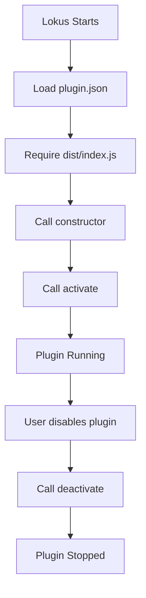

import { Callout, Tabs,  Steps } from 'nextra/components'

# Your First Plugin

Build a complete "Hello World" plugin from scratch. This tutorial covers the fundamentals of plugin development with detailed explanations.

## What You'll Build

A plugin that demonstrates:
- ✅ Plugin initialization and lifecycle
- ✅ Logging and debugging
- ✅ Command registration
- ✅ UI notifications
- ✅ Proper error handling
- ✅ Unit testing

**Time to complete:** 15 minutes

---

## Prerequisites

<Callout type="info">
Before starting:
- Node.js 18+ installed
- Lokus installed
- Basic TypeScript knowledge
- Code editor ready (VS Code recommended)
</Callout>

---

## Step 1: Create the Plugin Structure

<Steps>

### Create project directory

```bash
mkdir hello-world-plugin
cd hello-world-plugin
```

### Initialize npm

```bash
npm init -y
```

### Install dependencies

```bash
npm install --save-dev lokus-plugin-sdk typescript esbuild
```

</Steps>

---

## Step 2: Create the Manifest

Create `plugin.json`:

```json filename="plugin.json"
{
  "manifest": "2.0",
  "id": "hello-world-plugin",
  "name": "hello-world-plugin",
  "displayName": "Hello World Plugin",
  "version": "1.0.0",
  "description": "A simple Hello World plugin for Lokus",
  "author": "Your Name",
  "license": "MIT",
  "main": "./dist/index.js",
  "lokusVersion": ">=1.0.0",
  "permissions": [
    "commands:register",
    "ui:notifications"
  ],
  "activationEvents": [
    "onStartup"
  ]
}
```

### Manifest Explained

| Field | Value | Why? |
|-------|-------|------|
| `id` | `hello-world-plugin` | Unique identifier (must be lowercase with hyphens) |
| `main` | `./dist/index.js` | Entry point after compilation |
| `permissions` | `commands:register`, `ui:notifications` | APIs we'll use |
| `activationEvents` | `onStartup` | Load when Lokus starts |

<Callout type="warning">
**Important:** The `id` must match the folder name when you link the plugin. Use lowercase and hyphens only.
</Callout>

---

## Step 3: Configure TypeScript

Create `tsconfig.json`:

```json filename="tsconfig.json"
{
  "compilerOptions": {
    "target": "ES2020",
    "module": "ESNext",
    "lib": ["ES2020"],
    "moduleResolution": "node",
    "esModuleInterop": true,
    "skipLibCheck": true,
    "strict": true,
    "declaration": true,
    "outDir": "./dist",
    "rootDir": "./src"
  },
  "include": ["src/**/*"],
  "exclude": ["node_modules", "dist", "test"]
}
```

---

## Step 4: Configure Build

Create `esbuild.config.js`:

```javascript filename="esbuild.config.js"
const esbuild = require('esbuild');

esbuild.build({
  entryPoints: ['src/index.ts'],
  bundle: true,
  outfile: 'dist/index.js',
  platform: 'node',
  target: 'es2020',
  format: 'esm',
  sourcemap: true,
  external: ['lokus-plugin-sdk'],
}).catch(() => process.exit(1));
```

### Why These Settings?

- `bundle: true` - Bundles dependencies into one file
- `platform: 'node'` - Node.js environment
- `format: 'esm'` - ES modules (import/export)
- `external: ['lokus-plugin-sdk']` - Don't bundle the SDK (Lokus provides it)

---

## Step 5: Write the Plugin Code

Create `src/index.ts`:

```typescript filename="src/index.ts"
import { PluginContext } from 'lokus-plugin-sdk';

export default class HelloWorldPlugin {
  // Store the plugin context
  private context: PluginContext;
  private logger: PluginContext['logger'];

  /**
   * Constructor - Called when Lokus loads the plugin
   * This is synchronous - no async operations here!
   */
  constructor(context: PluginContext) {
    this.context = context;
    this.logger = context.logger;

    // Log initialization
    this.logger.info('HelloWorldPlugin initialized');
    this.logger.debug('Plugin ID:', context.pluginId);
    this.logger.debug('Plugin path:', context.pluginPath);
  }

  /**
   * Activate - Called after constructor
   * Register commands, UI elements, etc.
   */
  async activate(activationContext: any): Promise<void> {
    this.logger.info('Activating HelloWorldPlugin...');

    try {
      // Register a simple command
      activationContext.commands.registerCommand(
        'helloWorld.sayHello',
        {
          name: 'Hello World: Say Hello',
          description: 'Shows a friendly hello message',
          callback: () => {
            this.sayHello();
          }
        }
      );

      // Register a command with user input
      activationContext.commands.registerCommand(
        'helloWorld.greetUser',
        {
          name: 'Hello World: Greet User',
          description: 'Greets a specific user by name',
          callback: async () => {
            await this.greetUser();
          }
        }
      );

      this.logger.info('HelloWorldPlugin activated successfully');

      // Show startup notification
      this.context.ui.showInformationMessage(
        'Hello World plugin is ready!'
      );

    } catch (error) {
      this.logger.error('Failed to activate plugin:', error);
      throw error;
    }
  }

  /**
   * Deactivate - Called when plugin is disabled
   * Clean up resources here
   */
  async deactivate(): Promise<void> {
    this.logger.info('Deactivating HelloWorldPlugin...');
    // Cleanup code goes here (if needed)
    this.logger.info('HelloWorldPlugin deactivated');
  }

  /**
   * Command handler: Say Hello
   */
  private sayHello(): void {
    this.logger.info('Say Hello command executed');
    this.context.ui.showInformationMessage(
      'Hello from Hello World Plugin! 👋'
    );
  }

  /**
   * Command handler: Greet User
   */
  private async greetUser(): Promise<void> {
    this.logger.info('Greet User command executed');

    // In a real implementation, you'd show an input dialog
    // For now, we'll just show a message
    const userName = 'Developer'; // Placeholder

    this.context.ui.showInformationMessage(
      `Hello, ${userName}! Welcome to Lokus! 🎉`
    );

    this.logger.debug(`Greeted user: $\\{userName\\}`);
  }
}
```

### Code Explained

<Tabs items={['Constructor', 'Activate', 'Deactivate', 'Commands']}>
  <Tabs.Tab>
    **Constructor**

    Called when Lokus loads the plugin. Keep it fast and synchronous.

    ```typescript
    constructor(context: PluginContext) {
      this.context = context;
      this.logger = context.logger;
      this.logger.info('Plugin initialized');
    }
    ```

    - Store the `context` for later use
    - Initialize logger
    - Don't register commands here (use `activate`)
  </Tabs.Tab>

  <Tabs.Tab>
    **Activate**

    Called after constructor. This is where you register everything.

    ```typescript
    async activate(activationContext: any): Promise<void> {
      // Register commands
      activationContext.commands.registerCommand(...);

      // Show notifications
      this.context.ui.showInformationMessage(...);
    }
    ```

    - Can be async
    - Register commands, UI, shortcuts, etc.
    - Show startup notifications
  </Tabs.Tab>

  <Tabs.Tab>
    **Deactivate**

    Called when plugin is disabled. Clean up resources.

    ```typescript
    async deactivate(): Promise<void> {
      // Close open panels
      // Cancel timers
      // Dispose listeners
    }
    ```

    - Cleanup resources
    - Cancel ongoing operations
    - Can be async
  </Tabs.Tab>

  <Tabs.Tab>
    **Commands**

    Command handlers are methods called when user runs a command.

    ```typescript
    private sayHello(): void {
      this.logger.info('Command executed');
      this.context.ui.showInformationMessage('Hello!');
    }
    ```

    - Use `private` for organization
    - Log command execution
    - Handle errors gracefully
  </Tabs.Tab>
</Tabs>

---

## Step 6: Add Build Scripts

Update `package.json`:

```json filename="package.json" {5-8}
{
  "name": "hello-world-plugin",
  "version": "1.0.0",
  "type": "module",
  "scripts": {
    "build": "node esbuild.config.js",
    "dev": "node esbuild.config.js --watch"
  },
  "devDependencies": {
    "esbuild": "^0.19.0",
    "lokus-plugin-sdk": "^1.0.0",
    "typescript": "^5.0.0"
  }
}
```

---

## Step 7: Build the Plugin

```bash
npm run build
```

**Expected output:**
```
dist/index.js      2.1kb
dist/index.js.map  3.4kb
```

<Callout type="success">
You should now have a `dist/index.js` file. This is what Lokus will load!
</Callout>

---

## Step 8: Link for Development

```bash
npx lokus-plugin link
```

Or manually create the symlink:

```bash
ln -s "$(pwd)" ~/.lokus/plugins/hello-world-plugin
```

**Verify:**
```bash
ls -la ~/.lokus/plugins/
# Should show: hello-world-plugin -> /path/to/your/plugin
```

---

## Step 9: Test in Lokus

### Start Lokus

1. Quit Lokus completely (Cmd/Ctrl + Q)
2. Start Lokus

### Check Developer Console

Open Developer Tools (View → Developer → Toggle Developer Tools):

```
[hello-world-plugin] HelloWorldPlugin initialized
[hello-world-plugin] Activating HelloWorldPlugin...
[hello-world-plugin] HelloWorldPlugin activated successfully
```

You should also see the startup notification: "Hello World plugin is ready!"

### Test Commands

<Steps>

### Open Command Palette
Press `Cmd/Ctrl + Shift + P`

### Type "Hello World"
You should see two commands:
- **Hello World: Say Hello**
- **Hello World: Greet User**

### Run "Say Hello"
You should see: "Hello from Hello World Plugin! 👋"

### Check the logs
In Developer Console:
```
[hello-world-plugin] Say Hello command executed
```

</Steps>

<Callout type="success">
🎉 **It works!** You've built a complete plugin from scratch!
</Callout>

---

## Understanding the Plugin Lifecycle



### Lifecycle Methods

| Method | When Called | Purpose |
|--------|-------------|---------|
| `constructor()` | Plugin loaded | Initialize state, store context |
| `activate()` | After constructor | Register commands, UI, start services |
| `deactivate()` | Plugin disabled | Cleanup, stop services, dispose resources |

---

## Adding Error Handling

Let's improve our plugin with better error handling:

```typescript filename="src/index.ts" {8-15}
private sayHello(): void {
  try {
    this.logger.info('Say Hello command executed');
    this.context.ui.showInformationMessage(
      'Hello from Hello World Plugin! 👋'
    );
  } catch (error) {
    this.logger.error('Error in sayHello:', error);
    this.context.ui.showErrorMessage(
      'Oops! Something went wrong. Check the console for details.'
    );
  }
}
```

**Best practices:**
- ✅ Wrap command handlers in try/catch
- ✅ Log errors with `logger.error()`
- ✅ Show user-friendly error messages
- ✅ Don't let errors crash the plugin

---

## Writing Tests

Create `test/index.test.ts`:

```typescript filename="test/index.test.ts"
import { describe, it, expect, beforeEach, afterEach, vi } from 'vitest';
import HelloWorldPlugin from '../src/index';

// Mock the plugin context
const createMockContext = () => ({
  pluginId: 'hello-world-plugin',
  pluginPath: '/mock/path',
  logger: {
    info: vi.fn(),
    warn: vi.fn(),
    error: vi.fn(),
    debug: vi.fn(),
  },
  ui: {
    showInformationMessage: vi.fn(),
    showWarningMessage: vi.fn(),
    showErrorMessage: vi.fn(),
  },
});

// Mock activation context
const createMockActivationContext = () => ({
  commands: {
    registerCommand: vi.fn(),
  },
});

describe('HelloWorldPlugin', () => {
  let plugin: HelloWorldPlugin;
  let mockContext: any;
  let mockActivationContext: any;

  beforeEach(() => {
    mockContext = createMockContext();
    mockActivationContext = createMockActivationContext();
    plugin = new HelloWorldPlugin(mockContext);
  });

  afterEach(async () => {
    await plugin.deactivate();
  });

  it('should initialize with context', () => {
    expect(plugin).toBeDefined();
    expect(mockContext.logger.info).toHaveBeenCalledWith(
      'HelloWorldPlugin initialized'
    );
  });

  it('should activate and register commands', async () => {
    await plugin.activate(mockActivationContext);

    // Should register 2 commands
    expect(mockActivationContext.commands.registerCommand).toHaveBeenCalledTimes(2);

    // Should show startup notification
    expect(mockContext.ui.showInformationMessage).toHaveBeenCalledWith(
      'Hello World plugin is ready!'
    );
  });

  it('should execute sayHello command', async () => {
    await plugin.activate(mockActivationContext);

    // Get the registered callback
    const [, options] = mockActivationContext.commands.registerCommand.mock.calls[0];

    // Execute the command
    options.callback();

    // Should show hello message
    expect(mockContext.ui.showInformationMessage).toHaveBeenCalledWith(
      'Hello from Hello World Plugin! 👋'
    );
  });

  it('should log on deactivation', async () => {
    await plugin.deactivate();

    expect(mockContext.logger.info).toHaveBeenCalledWith(
      'Deactivating HelloWorldPlugin...'
    );
    expect(mockContext.logger.info).toHaveBeenCalledWith(
      'HelloWorldPlugin deactivated'
    );
  });
});
```

### Install test dependencies

```bash
npm install --save-dev vitest @types/node
```

### Add test script

Update `package.json`:

```json filename="package.json" {4}
{
  "scripts": {
    "build": "node esbuild.config.js",
    "test": "vitest run",
    "test:watch": "vitest"
  }
}
```

### Run tests

```bash
npm test
```

**Expected output:**
```
✓ test/index.test.ts (4 tests) 45ms
  ✓ HelloWorldPlugin
    ✓ should initialize with context
    ✓ should activate and register commands
    ✓ should execute sayHello command
    ✓ should log on deactivation

Test Files  1 passed (1)
Tests  4 passed (4)
```

---

## Common Pitfalls

<Callout type="warning">
**Avoid These Mistakes**

1. **Async constructor**: Never use `async` in constructor
   ```typescript
   // ❌ Wrong
   async constructor(context) { }

   // ✅ Correct
   constructor(context) { }
   async activate(ctx) { }
   ```

2. **Forgetting to rebuild**: Always rebuild after changes
   ```bash
   npm run build
   ```

3. **Not restarting Lokus**: Changes require a full restart

4. **Missing permissions**: Add permissions to `plugin.json`
   ```json
   "permissions": ["commands:register"]
   ```
</Callout>

---

## Next Steps

You've built a complete plugin! Here's what to explore next:

<Callout>
**Continue Learning**

- **[Adding Commands](/developers/plugins/guides/command-plugin)** - Learn about keyboard shortcuts, command categories, and editor integration
- **[UI Components](/developers/plugins/guides/ui-plugin)** - Create custom panels, status bar items, and progress indicators

**Dive Deeper**

- [API Reference](/developers/plugins/api-reference) - Complete API docs
- [Editor Plugins](/developers/plugins/editor-plugins) - Build editor extensions
- [Publishing](/developers/plugins/publishing) - Share your plugin
</Callout>

---

## Complete Code

<details>
<summary>Full project structure</summary>

```
hello-world-plugin/
├── src/
│   └── index.ts
├── test/
│   └── index.test.ts
├── dist/
│   ├── index.js
│   └── index.js.map
├── plugin.json
├── package.json
├── tsconfig.json
├── esbuild.config.js
└── README.md
```

</details>

---

## Summary

You learned how to:
- ✅ Create a plugin from scratch
- ✅ Set up TypeScript and build tools
- ✅ Write the plugin manifest
- ✅ Implement constructor, activate, and deactivate
- ✅ Register commands
- ✅ Use logging and notifications
- ✅ Handle errors properly
- ✅ Write unit tests
- ✅ Build and test in Lokus

**Time completed:** 15 minutes ⏱️

Ready to add more features? Continue to **[Adding Commands](/developers/plugins/guides/command-plugin)**!
