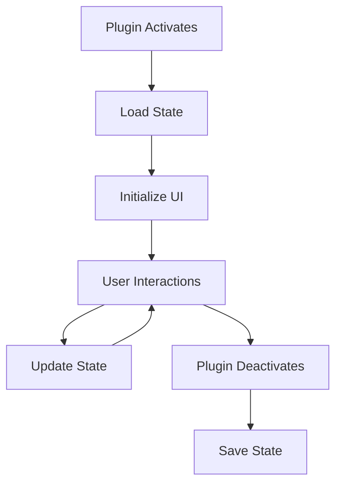

import { Callout, Tabs,  Steps } from 'nextra/components'

# UI Components Tutorial

Build a productivity timer plugin (Pomodoro technique) that demonstrates custom UI panels, status bar items, progress indicators, and state management.

## What You'll Build

A "Pomodoro Timer" plugin with:
- ✅ Custom sidebar panel with timer display
- ✅ Status bar item showing current timer
- ✅ Progress indicator for timer countdown
- ✅ Start/stop/reset commands
- ✅ Notifications on timer complete
- ✅ Persistent state between sessions

**Time to complete:** 30 minutes

---

## Prerequisites

<Callout type="info">
Before starting:
- Complete [Adding Commands](/developers/plugins/guides/command-plugin)
- Basic React knowledge (optional but helpful)
- Understanding of timers and intervals
</Callout>

---

## Step 1: Create the Plugin

```bash
mkdir pomodoro-timer-plugin
cd pomodoro-timer-plugin
npm init -y
npm install --save-dev lokus-plugin-sdk typescript esbuild
```

---

## Step 2: Create the Manifest

Create `plugin.json`:

```json filename="plugin.json"
{
  "manifest": "2.0",
  "id": "pomodoro-timer",
  "name": "pomodoro-timer",
  "displayName": "Pomodoro Timer",
  "version": "1.0.0",
  "description": "Productivity timer using the Pomodoro Technique",
  "author": "Your Name",
  "license": "MIT",
  "main": "./dist/index.js",
  "lokusVersion": ">=1.0.0",
  "permissions": [
    "commands:register",
    "ui:panels",
    "ui:statusbar",
    "ui:notifications",
    "ui:progress",
    "storage:read",
    "storage:write"
  ],
  "activationEvents": ["onStartup"],
  "contributes": {
    "commands": [
      {
        "id": "pomodoroTimer.start",
        "title": "Pomodoro: Start Timer",
        "category": "Productivity"
      },
      {
        "id": "pomodoroTimer.pause",
        "title": "Pomodoro: Pause Timer",
        "category": "Productivity"
      },
      {
        "id": "pomodoroTimer.reset",
        "title": "Pomodoro: Reset Timer",
        "category": "Productivity"
      },
      {
        "id": "pomodoroTimer.openPanel",
        "title": "Pomodoro: Open Timer Panel",
        "category": "Productivity"
      }
    ],
    "keybindings": [
      {
        "command": "pomodoroTimer.start",
        "key": "Ctrl+Alt+P",
        "mac": "Cmd+Alt+P"
      }
    ]
  }
}
```

### Permissions Explained

| Permission | Usage |
|------------|-------|
| `ui:panels` | Create custom sidebar panels |
| `ui:statusbar` | Add items to status bar |
| `ui:notifications` | Show notifications |
| `ui:progress` | Display progress indicators |
| `storage:read/write` | Save timer state between sessions |

---

## Step 3: Configure Build

Create the build files (same as previous tutorials):

<details>
<summary>tsconfig.json</summary>

```json filename="tsconfig.json"
{
  "compilerOptions": {
    "target": "ES2020",
    "module": "ESNext",
    "lib": ["ES2020"],
    "moduleResolution": "node",
    "esModuleInterop": true,
    "skipLibCheck": true,
    "strict": true,
    "declaration": true,
    "outDir": "./dist",
    "rootDir": "./src"
  },
  "include": ["src/**/*"],
  "exclude": ["node_modules", "dist"]
}
```

</details>

<details>
<summary>esbuild.config.js</summary>

```javascript filename="esbuild.config.js"
const esbuild = require('esbuild');

esbuild.build({
  entryPoints: ['src/index.ts'],
  bundle: true,
  outfile: 'dist/index.js',
  platform: 'node',
  target: 'es2020',
  format: 'esm',
  sourcemap: true,
  external: ['lokus-plugin-sdk'],
}).catch(() => process.exit(1));
```

</details>

Update `package.json`:

```json filename="package.json"
{
  "name": "pomodoro-timer",
  "version": "1.0.0",
  "type": "module",
  "scripts": {
    "build": "node esbuild.config.js"
  }
}
```

---

## Step 4: Create the Timer Logic

Create `src/timer.ts`:

```typescript filename="src/timer.ts"
export interface TimerState {
  duration: number;       // Total duration in seconds
  remaining: number;      // Remaining seconds
  isRunning: boolean;     // Is timer active?
  type: 'work' | 'break'; // Timer type
}

export class PomodoroTimer {
  private state: TimerState;
  private intervalId: NodeJS.Timeout | null = null;
  private onTick: ((state: TimerState) => void) | null = null;
  private onComplete: (() => void) | null = null;

  constructor() {
    this.state = {
      duration: 25 * 60, // 25 minutes
      remaining: 25 * 60,
      isRunning: false,
      type: 'work',
    };
  }

  /**
   * Start the timer
   */
  start(): void {
    if (this.state.isRunning) return;

    this.state.isRunning = true;

    this.intervalId = setInterval(() => {
      this.state.remaining -= 1;

      // Notify listener
      if (this.onTick) {
        this.onTick({ ...this.state });
      }

      // Check if timer completed
      if (this.state.remaining <= 0) {
        this.complete();
      }
    }, 1000);
  }

  /**
   * Pause the timer
   */
  pause(): void {
    if (!this.state.isRunning) return;

    this.state.isRunning = false;

    if (this.intervalId) {
      clearInterval(this.intervalId);
      this.intervalId = null;
    }
  }

  /**
   * Reset the timer
   */
  reset(): void {
    this.pause();
    this.state.remaining = this.state.duration;

    if (this.onTick) {
      this.onTick({ ...this.state });
    }
  }

  /**
   * Complete the timer
   */
  private complete(): void {
    this.pause();
    this.state.remaining = 0;

    if (this.onComplete) {
      this.onComplete();
    }
  }

  /**
   * Set timer type and duration
   */
  setType(type: 'work' | 'break'): void {
    this.state.type = type;
    this.state.duration = type === 'work' ? 25 * 60 : 5 * 60;
    this.reset();
  }

  /**
   * Get current state
   */
  getState(): TimerState {
    return { ...this.state };
  }

  /**
   * Register tick callback
   */
  setOnTick(callback: (state: TimerState) => void): void {
    this.onTick = callback;
  }

  /**
   * Register completion callback
   */
  setOnComplete(callback: () => void): void {
    this.onComplete = callback;
  }

  /**
   * Format time as MM:SS
   */
  static formatTime(seconds: number): string {
    const minutes = Math.floor(seconds / 60);
    const secs = seconds % 60;
    return `${minutes.toString().padStart(2, '0')}:$\\{secs.toString().padStart(2, '0')\\}`;
  }

  /**
   * Calculate progress percentage
   */
  static getProgress(state: TimerState): number {
    return ((state.duration - state.remaining) / state.duration) * 100;
  }

  /**
   * Cleanup
   */
  dispose(): void {
    this.pause();
    this.onTick = null;
    this.onComplete = null;
  }
}
```

---

## Step 5: Write the Plugin Code

Create `src/index.ts`:

```typescript filename="src/index.ts"
import { PluginContext } from 'lokus-plugin-sdk';
import { PomodoroTimer, TimerState } from './timer';

export default class PomodoroTimerPlugin {
  private context: PluginContext;
  private logger: PluginContext['logger'];
  private timer: PomodoroTimer;
  private statusBarItem: any = null;
  private progressId: string | null = null;

  constructor(context: PluginContext) {
    this.context = context;
    this.logger = context.logger;
    this.timer = new PomodoroTimer();

    this.logger.info('PomodoroTimerPlugin initialized');
  }

  async activate(activationContext: any): Promise<void> {
    this.logger.info('Activating PomodoroTimerPlugin...');

    try {
      // Register commands
      this.registerCommands(activationContext);

      // Create status bar item
      this.createStatusBarItem();

      // Set up timer callbacks
      this.setupTimerCallbacks();

      // Load saved state
      await this.loadState();

      this.logger.info('PomodoroTimerPlugin activated successfully');
      this.context.ui.showInformationMessage(
        'Pomodoro Timer ready! Use Cmd/Ctrl+Alt+P to start'
      );
    } catch (error) {
      this.logger.error('Failed to activate plugin:', error);
      throw error;
    }
  }

  async deactivate(): Promise<void> {
    this.logger.info('Deactivating PomodoroTimerPlugin...');

    // Save state
    await this.saveState();

    // Cleanup
    this.timer.dispose();
    if (this.statusBarItem) {
      this.statusBarItem.dispose();
    }

    this.logger.info('PomodoroTimerPlugin deactivated');
  }

  /**
   * Register all commands
   */
  private registerCommands(activationContext: any): void {
    const commands = [
      {
        id: 'pomodoroTimer.start',
        name: 'Pomodoro: Start Timer',
        handler: () => this.startTimer(),
      },
      {
        id: 'pomodoroTimer.pause',
        name: 'Pomodoro: Pause Timer',
        handler: () => this.pauseTimer(),
      },
      {
        id: 'pomodoroTimer.reset',
        name: 'Pomodoro: Reset Timer',
        handler: () => this.resetTimer(),
      },
      {
        id: 'pomodoroTimer.switchType',
        name: 'Pomodoro: Switch Timer Type',
        handler: () => this.switchTimerType(),
      },
    ];

    for (const command of commands) {
      activationContext.commands.registerCommand(command.id, {
        name: command.name,
        callback: command.handler,
      });
    }
  }

  /**
   * Create status bar item
   */
  private createStatusBarItem(): void {
    this.statusBarItem = this.context.ui.registerStatusBarItem({
      id: 'pomodoro-timer-status',
      text: '🍅 25:00',
      tooltip: 'Pomodoro Timer - Click to start',
      alignment: 2, // Right alignment
      priority: 100,
      command: {
        id: 'pomodoroTimer.start',
        title: 'Start Pomodoro Timer',
      },
    });

    this.statusBarItem.show();
    this.logger.debug('Status bar item created');
  }

  /**
   * Set up timer event callbacks
   */
  private setupTimerCallbacks(): void {
    // Update UI on each tick
    this.timer.setOnTick((state: TimerState) => {
      this.updateStatusBar(state);
      this.updateProgress(state);
    });

    // Handle timer completion
    this.timer.setOnComplete(() => {
      this.onTimerComplete();
    });
  }

  /**
   * Update status bar with current time
   */
  private updateStatusBar(state: TimerState): void {
    if (!this.statusBarItem) return;

    const icon = state.type === 'work' ? '🍅' : '☕';
    const timeStr = PomodoroTimer.formatTime(state.remaining);
    const status = state.isRunning ? '▶' : '⏸';

    this.statusBarItem.text = `${icon} ${status} $\\{timeStr\\}`;
    this.statusBarItem.tooltip = state.isRunning
      ? `${state.type === 'work' ? 'Work' : 'Break'} timer running - Click to pause`
      : 'Click to start timer';
  }

  /**
   * Update progress indicator
   */
  private updateProgress(state: TimerState): void {
    const progress = PomodoroTimer.getProgress(state);

    if (state.isRunning && !this.progressId) {
      // Start progress
      this.context.ui.withProgress(
        {
          location: 'notification',
          title: `Pomodoro ${state.type === 'work' ? 'Work' : 'Break'} Session`,
          cancellable: true,
        },
        async (progress, token) => {
          this.progressId = 'pomodoro-progress';

          // Update progress
          progress.report({
            message: PomodoroTimer.formatTime(state.remaining),
            increment: progress,
          });

          // Wait for timer to complete
          return new Promise((resolve) => {
            const checkInterval = setInterval(() => {
              const currentState = this.timer.getState();
              if (!currentState.isRunning) {
                clearInterval(checkInterval);
                this.progressId = null;
                resolve(undefined);
              }
            }, 1000);
          });
        }
      );
    }
  }

  /**
   * Handle timer completion
   */
  private onTimerComplete(): void {
    const state = this.timer.getState();
    const message = state.type === 'work'
      ? '🎉 Work session complete! Time for a break!'
      : '✨ Break is over! Ready to focus?';

    this.logger.info('Timer completed:', state.type);

    // Show notification
    this.context.ui.showInformationMessage(message);

    // Auto-switch to break/work
    this.timer.setType(state.type === 'work' ? 'break' : 'work');
    this.updateStatusBar(this.timer.getState());

    // Clear progress
    this.progressId = null;
  }

  /**
   * Command: Start timer
   */
  private startTimer(): void {
    this.logger.info('Starting timer');
    this.timer.start();

    const state = this.timer.getState();
    this.updateStatusBar(state);

    this.context.ui.showInformationMessage(
      `Started ${state.type === 'work' ? 'work' : 'break'} timer! Focus time! 🎯`
    );
  }

  /**
   * Command: Pause timer
   */
  private pauseTimer(): void {
    this.logger.info('Pausing timer');
    this.timer.pause();

    const state = this.timer.getState();
    this.updateStatusBar(state);

    this.context.ui.showInformationMessage('Timer paused ⏸');
  }

  /**
   * Command: Reset timer
   */
  private resetTimer(): void {
    this.logger.info('Resetting timer');
    this.timer.reset();

    const state = this.timer.getState();
    this.updateStatusBar(state);

    this.context.ui.showInformationMessage('Timer reset 🔄');
  }

  /**
   * Command: Switch timer type
   */
  private switchTimerType(): void {
    const currentState = this.timer.getState();
    const newType = currentState.type === 'work' ? 'break' : 'work';

    this.logger.info(`Switching timer type: ${currentState.type} -> $\\{newType\\}`);
    this.timer.setType(newType);

    const state = this.timer.getState();
    this.updateStatusBar(state);

    this.context.ui.showInformationMessage(
      `Switched to ${newType === 'work' ? 'work' : 'break'} timer (${newType === 'work' ? '25' : '5'} minutes)`
    );
  }

  /**
   * Save timer state to storage
   */
  private async saveState(): Promise<void> {
    try {
      const state = this.timer.getState();
      await this.context.storage.set('timerState', state);
      this.logger.debug('Timer state saved');
    } catch (error) {
      this.logger.error('Failed to save state:', error);
    }
  }

  /**
   * Load timer state from storage
   */
  private async loadState(): Promise<void> {
    try {
      const savedState = await this.context.storage.get('timerState');
      if (savedState) {
        // Restore state (but don't auto-start)
        this.timer.setType(savedState.type);
        this.updateStatusBar(this.timer.getState());
        this.logger.debug('Timer state loaded');
      }
    } catch (error) {
      this.logger.error('Failed to load state:', error);
    }
  }
}
```

### Code Explained

<Tabs items={['Status Bar', 'Progress', 'State Management', 'Timer Events']}>
  <Tabs.Tab>
    **Status Bar Item**

    ```typescript
    this.statusBarItem = this.context.ui.registerStatusBarItem({
      id: 'pomodoro-timer-status',
      text: '🍅 25:00',           // Display text
      tooltip: 'Click to start',  // Hover tooltip
      alignment: 2,               // Right side
      priority: 100,              // Order position
      command: {                  // Click action
        id: 'pomodoroTimer.start',
        title: 'Start Timer',
      },
    });
    ```

    **Features:**
    - Shows current time
    - Updates every second
    - Click to start/pause
    - Icon changes with state
  </Tabs.Tab>

  <Tabs.Tab>
    **Progress Indicator**

    ```typescript
    this.context.ui.withProgress(
      {
        location: 'notification',  // Where to show
        title: 'Pomodoro Session',  // Title
        cancellable: true,          // Can cancel
      },
      async (progress, token) => {
        // Update progress
        progress.report({
          message: '15:30',         // Status message
          increment: 50,            // Percentage
        });
      }
    );
    ```

    **When to use:**
    - Long-running operations
    - Background tasks
    - Timer countdowns
    - File processing
  </Tabs.Tab>

  <Tabs.Tab>
    **State Persistence**

    ```typescript
    // Save state
    await this.context.storage.set('timerState', {
      duration: 1500,
      remaining: 1200,
      type: 'work',
    });

    // Load state
    const state = await this.context.storage.get('timerState');
    ```

    **Benefits:**
    - State survives restarts
    - User preferences saved
    - Resume where left off
    - Plugin-specific storage
  </Tabs.Tab>

  <Tabs.Tab>
    **Timer Events**

    ```typescript
    // Called every second
    this.timer.setOnTick((state) => {
      this.updateStatusBar(state);
      this.updateProgress(state);
    });

    // Called when timer completes
    this.timer.setOnComplete(() => {
      this.showNotification();
      this.autoSwitch();
    });
    ```

    **Event-driven updates:**
    - Decouple timer from UI
    - Testable separately
    - Easy to add listeners
  </Tabs.Tab>
</Tabs>

---

## Step 6: Build and Link

```bash
# Build
npm run build

# Link
npx lokus-plugin link

# Verify
ls -la ~/.lokus/plugins/pomodoro-timer
```

---

## Step 7: Test in Lokus

### Restart Lokus

Quit and restart Lokus completely.

### Check Status Bar

Look at the bottom-right corner. You should see:
```
🍅 25:00
```

### Start the Timer

<Steps>

### Click the status bar item
Or press `Cmd/Ctrl + Alt + P`

### Watch it count down
```
🍅 ▶ 24:59
🍅 ▶ 24:58
🍅 ▶ 24:57
...
```

### Pause/Resume
Click the status bar item again to pause

### Reset the timer
Open Command Palette → "Pomodoro: Reset Timer"

</Steps>

### Test Timer Completion

For testing, modify the timer duration temporarily:

```typescript filename="src/timer.ts" {4}
constructor() {
  this.state = {
    duration: 5, // 5 seconds for testing
    remaining: 5,
    isRunning: false,
    type: 'work',
  };
}
```

Rebuild, restart Lokus, and start the timer. After 5 seconds:
- ✅ You'll see a notification: "Work session complete! Time for a break!"
- ✅ Timer auto-switches to break mode (5 seconds)
- ✅ Status bar updates: `☕ 00:05`

<Callout type="info">
Don't forget to change the duration back to 25 minutes for production!
</Callout>

---

## Step 8: Add Custom Panel (Advanced)

Let's add a custom sidebar panel with a visual timer:

```typescript filename="src/index.ts"
private createTimerPanel(): void {
  // Note: Full panel implementation requires React components
  // This is a simplified version showing the API

  const panelId = this.context.ui.registerPanel({
    id: 'pomodoro-timer-panel',
    title: 'Pomodoro Timer',
    location: 'sidebar',
    icon: '🍅',
    // In a real implementation, you'd provide a React component here
    initialState: {
      timer: this.timer.getState(),
    },
  });

  this.logger.debug('Timer panel created:', panelId);
}
```

<Callout type="warning">
**React UI Panels**

Full panel implementation with React components is covered in the [UI Plugins](/developers/plugins/ui-plugins) guide. This requires additional setup with React and JSX.
</Callout>

---

## Understanding UI Components

### Available UI Components

| Component | API | Usage |
|-----------|-----|-------|
| **Status Bar Item** | `ui.registerStatusBarItem()` | Always-visible status |
| **Panel** | `ui.registerPanel()` | Custom sidebar views |
| **Progress** | `ui.withProgress()` | Long-running tasks |
| **Notification** | `ui.showInformationMessage()` | User alerts |
| **Dialog** | `ui.showDialog()` | User confirmations |
| **Quick Pick** | `ui.showQuickPick()` | Option selection |
| **Input Box** | `ui.showInputBox()` | User text input |

### Status Bar Alignment

```typescript
alignment: 1  // Left side
alignment: 2  // Right side (recommended)
```

### Progress Locations

```typescript
location: 'notification'  // Shows in notification area
location: 'window'        // Shows in window title
```

---

## State Management Best Practices

### Using Storage API

```typescript
// Simple values
await this.context.storage.set('key', 'value');
const value = await this.context.storage.get('key');

// Objects
await this.context.storage.set('timerState', {
  duration: 1500,
  remaining: 1200,
});

// Arrays
await this.context.storage.set('history', [
  { date: '2025-01-01', completed: true },
  { date: '2025-01-02', completed: false },
]);

// Delete
await this.context.storage.delete('key');

// Get all keys
const keys = await this.context.storage.keys();

// Clear all
await this.context.storage.clear();
```

### State Lifecycle



---

## Adding Settings

Let's add customizable timer durations:

```typescript filename="src/index.ts"
interface Settings {
  workDuration: number;  // Minutes
  breakDuration: number; // Minutes
  autoStart: boolean;
}

private async loadSettings(): Promise<Settings> {
  const defaults: Settings = {
    workDuration: 25,
    breakDuration: 5,
    autoStart: false,
  };

  const saved = await this.context.storage.get('settings');
  return { ...defaults, ...saved };
}

private async saveSettings(settings: Settings): Promise<void> {
  await this.context.storage.set('settings', settings);
}

// Add command to change settings
{
  id: 'pomodoroTimer.changeWorkDuration',
  name: 'Pomodoro: Change Work Duration',
  handler: async () => {
    // In a real implementation, show input dialog
    const newDuration = 30; // minutes

    const settings = await this.loadSettings();
    settings.workDuration = newDuration;
    await this.saveSettings(settings);

    this.context.ui.showInformationMessage(
      `Work duration set to ${newDuration} minutes`
    );
  },
}
```

---

## Testing UI Components

Create `test/ui.test.ts`:

```typescript filename="test/ui.test.ts"
import { describe, it, expect, beforeEach, vi } from 'vitest';
import PomodoroTimerPlugin from '../src/index';

const createMockContext = () => ({
  pluginId: 'pomodoro-timer',
  pluginPath: '/mock',
  logger: {
    info: vi.fn(),
    warn: vi.fn(),
    error: vi.fn(),
    debug: vi.fn(),
  },
  ui: {
    registerStatusBarItem: vi.fn(() => ({
      show: vi.fn(),
      hide: vi.fn(),
      dispose: vi.fn(),
      text: '',
      tooltip: '',
    })),
    showInformationMessage: vi.fn(),
    withProgress: vi.fn(),
  },
  storage: {
    get: vi.fn(),
    set: vi.fn(),
  },
});

describe('PomodoroTimerPlugin UI', () => {
  let plugin: PomodoroTimerPlugin;
  let mockContext: any;

  beforeEach(() => {
    mockContext = createMockContext();
    plugin = new PomodoroTimerPlugin(mockContext);
  });

  it('should create status bar item on activation', async () => {
    const mockActivationContext = {
      commands: { registerCommand: vi.fn() },
    };

    await plugin.activate(mockActivationContext);

    expect(mockContext.ui.registerStatusBarItem).toHaveBeenCalledWith(
      expect.objectContaining({
        id: 'pomodoro-timer-status',
        text: expect.stringContaining('25:00'),
      })
    );
  });

  it('should update status bar when timer starts', async () => {
    const mockActivationContext = {
      commands: { registerCommand: vi.fn() },
    };

    await plugin.activate(mockActivationContext);

    // Get the start command
    const startCommand = mockActivationContext.commands.registerCommand.mock.calls
      .find(([id]) => id === 'pomodoroTimer.start');

    expect(startCommand).toBeDefined();

    // Execute start command
    const [, options] = startCommand;
    options.callback();

    // Should show notification
    expect(mockContext.ui.showInformationMessage).toHaveBeenCalledWith(
      expect.stringContaining('Started')
    );
  });

  it('should save state on deactivation', async () => {
    const mockActivationContext = {
      commands: { registerCommand: vi.fn() },
    };

    await plugin.activate(mockActivationContext);
    await plugin.deactivate();

    expect(mockContext.storage.set).toHaveBeenCalledWith(
      'timerState',
      expect.any(Object)
    );
  });
});
```

Run tests:
```bash
npm test
```

---

## Common Pitfalls

<Callout type="warning">
**Avoid These Mistakes**

1. **Not cleaning up timers**
   ```typescript
   // ❌ Wrong - timer keeps running after deactivate
   async deactivate() { }

   // ✅ Correct
   async deactivate() {
     this.timer.dispose();
     if (this.statusBarItem) {
       this.statusBarItem.dispose();
     }
   }
   ```

2. **Not disposing status bar items**
   ```typescript
   // ❌ Wrong - status bar item persists
   this.statusBarItem = this.context.ui.registerStatusBarItem(...);

   // ✅ Correct
   this.statusBarItem.dispose(); // In deactivate()
   ```

3. **Forgetting to await storage operations**
   ```typescript
   // ❌ Wrong
   this.context.storage.set('key', 'value');

   // ✅ Correct
   await this.context.storage.set('key', 'value');
   ```

4. **Not handling timer errors**
   ```typescript
   // ❌ Wrong - crash on error
   setInterval(() => { this.tick(); }, 1000);

   // ✅ Correct
   setInterval(() => {
     try {
       this.tick();
     } catch (error) {
       this.logger.error('Timer error:', error);
     }
   }, 1000);
   ```
</Callout>

---

## Performance Tips

<Callout type="info">
**Optimize Your Plugin**

1. **Debounce frequent updates**
   ```typescript
   // Don't update status bar every millisecond
   // Update every second instead
   setInterval(() => this.updateStatusBar(), 1000);
   ```

2. **Lazy load panels**
   ```typescript
   // Only create panel when user opens it
   if (userOpensPanel) {
     this.createPanel();
   }
   ```

3. **Clean up listeners**
   ```typescript
   // Remove event listeners on deactivate
   this.timer.setOnTick(null);
   this.timer.setOnComplete(null);
   ```

4. **Use storage efficiently**
   ```typescript
   // Save on timer stop, not every second
   private pauseTimer() {
     this.timer.pause();
     await this.saveState(); // Save here, not on tick
   }
   ```
</Callout>

---

## Next Steps

<Callout>
**Continue Learning**

- **[UI Plugins](/developers/plugins/ui-plugins)** - Build complex React-based panels
- **[Data Providers](/developers/plugins/data-providers)** - Implement tree views
- **[Advanced Topics](/developers/plugins/advanced)** - Performance, security, publishing

**API Reference**

- [UI API](/developers/plugins/api-reference/ui-api) - Complete UI API docs
- [Storage API](/developers/plugins/api-reference/storage-api) - State management
- [Commands API](/developers/plugins/api-reference/commands-api) - Command system

**Examples**

- [Example Plugins](https://github.com/lokus-ai/plugins) - Real-world examples
- [Plugin Templates](https://github.com/lokus-ai/plugin-templates) - Starter templates
</Callout>

---

## Complete Code

<details>
<summary>Full project structure</summary>

```
pomodoro-timer-plugin/
├── src/
│   ├── index.ts         # Main plugin
│   └── timer.ts         # Timer logic
├── test/
│   └── ui.test.ts       # UI tests
├── dist/
│   ├── index.js
│   └── index.js.map
├── plugin.json
├── package.json
├── tsconfig.json
├── esbuild.config.js
└── README.md
```

</details>

---

## Summary

You learned how to:
- ✅ Create status bar items with click handlers
- ✅ Display progress indicators for long tasks
- ✅ Show notifications and messages
- ✅ Manage plugin state with storage API
- ✅ Handle timers and intervals properly
- ✅ Clean up resources on deactivation
- ✅ Test UI components
- ✅ Optimize performance

**Time completed:** 30 minutes ⏱️

Congratulations! You've completed all the core plugin development tutorials. Ready for advanced topics? Check out **[Editor Plugins](/developers/plugins/editor-plugins)** or **[UI Plugins](/developers/plugins/ui-plugins)**!
