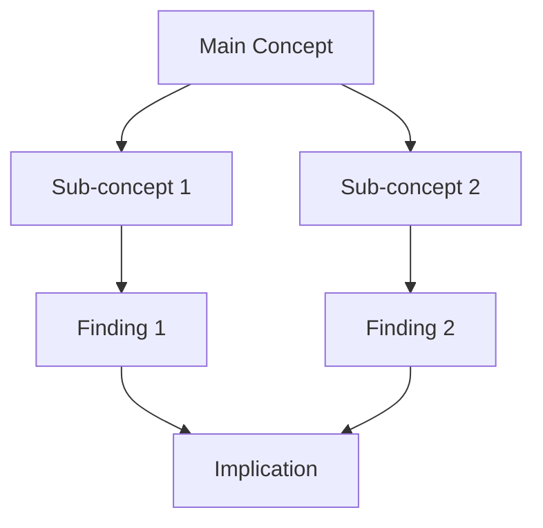
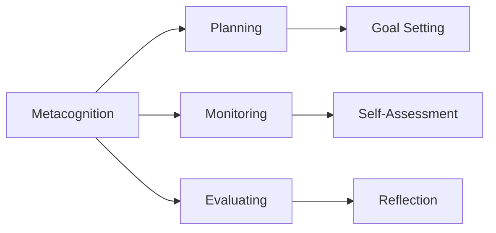
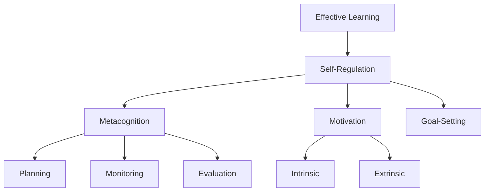
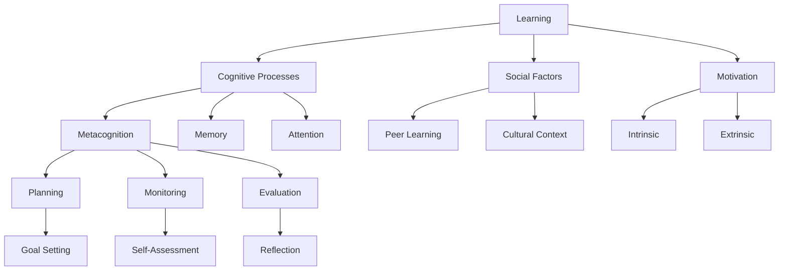
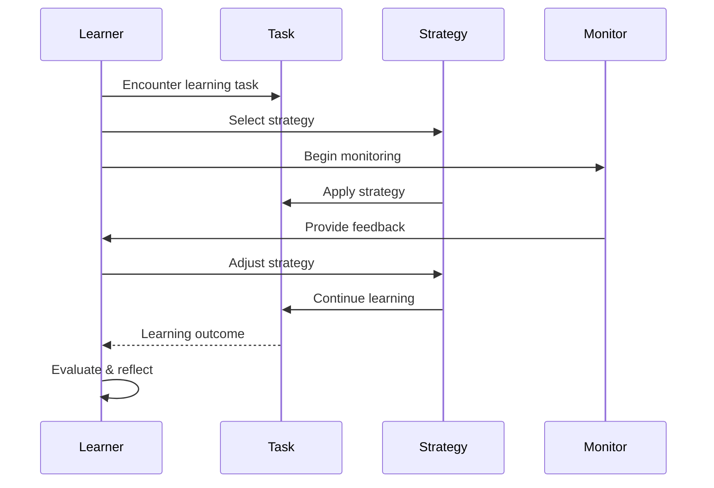

# Academic Research Setup

A complete Lokus workspace for academic research, dissertation writing, and literature management. This setup combines literature notes, atomic notes, block references, Mermaid diagrams, and templates into a cohesive research system.

## Overview

This setup is designed for:
- Graduate students writing dissertations
- Researchers conducting literature reviews
- Academics writing papers and grants
- Anyone doing serious research and synthesis

**Time to Setup:** 30-45 minutes

**What's Included:**
- Folder structure for research workflow
- Literature note templates
- Citation management system
- Block references for precise quoting
- Concept maps with Mermaid
- Writing templates for papers
- Daily research log template

---

## Folder Structure

Create this folder structure in your Lokus workspace:

```
Research Workspace/
├── 0-Inbox/
│   └── Quick captures and fleeting notes
├── 1-Literature/
│   ├── Books/
│   ├── Papers/
│   ├── Articles/
│   └── Lectures/
├── 2-Permanent/
│   ├── Concepts/
│   ├── Methods/
│   ├── Theories/
│   └── Arguments/
├── 3-Structure/
│   ├── Topic Maps/
│   └── Literature Reviews/
├── 4-Writing/
│   ├── Drafts/
│   ├── Outlines/
│   └── Published/
├── 5-Data/
│   ├── Datasets/
│   └── Analysis/
└── Meta/
    ├── Templates/
    ├── Research Questions/
    └── Methodology/
```

### Folder Purposes

| Folder | Purpose | When to Use |
|--------|---------|-------------|
| **0-Inbox** | Quick capture | While reading, meetings, ideas |
| **1-Literature** | Source notes | One note per book/paper |
| **2-Permanent** | Atomic concepts | Refined ideas in own words |
| **3-Structure** | Topic organization | Maps of content (MOCs) |
| **4-Writing** | Actual writing | Papers, chapters, drafts |
| **5-Data** | Research data | Datasets, analysis results |
| **Meta** | System files | Templates, methods |

---

## Templates

### Template 1: Literature Note

Create `Templates/Literature Note - Paper`:

```markdown
---
name: Literature Note - Academic Paper
description: Template for academic paper notes
type: template
category: research
variables:
  - name: title
    type: text
    required: true
    prompt: "Paper title"
  - name: authors
    type: text
    required: true
    prompt: "Authors (comma-separated)"
  - name: year
    type: number
    prompt: "Publication year"
  - name: journal
    type: text
    prompt: "Journal or conference name"
---

# {{title}}

## Metadata

**Authors:** {{authors}}
**Year:** {{year}}
**Journal:** {{journal}}
**DOI:**
**URL:**
**Type:** Academic Paper

**Added:** {{date.format('YYYY-MM-DD')}}
**Status:** 🔴 Unread / 🟡 In Progress / 🟢 Completed

---

## Citation

> {{authors}}. ({{year}}). {{title}}. *{{journal}}*.

**BibTeX:**
```bibtex
@article{citation_key,
  author = { {{authors}} },
  title = { {{title}} },
  journal = { {{journal}} },
  year = { {{year}} }
}
```

---

## Abstract

[Paste or summarize abstract here]

---

## Research Question

**Main Question:**

**Sub-questions:**
1.
2.
3.

---

## Methodology

**Research Design:**

**Sample:**

**Methods:**

**Limitations:**

---

## Key Findings

### Finding 1: [Title]

[Description in own words]

**Evidence:** ^finding-1

**My thoughts:**

**Related:** [[Concept Name]]

---

### Finding 2: [Title]

[Description in own words]

**Evidence:** ^finding-2

**My thoughts:**

**Related:** [[Concept Name]]

---

### Finding 3: [Title]

[Description in own words]

**Evidence:** ^finding-3

**My thoughts:**

**Related:** [[Concept Name]]

---

## Important Quotes

### Quote 1
> "Exact quote here" (p. X) ^quote-1

**Context:**

**Significance:**

**Use in:**

---

### Quote 2
> "Exact quote here" (p. X) ^quote-2

**Context:**

**Significance:**

**Use in:**

---

## Theoretical Framework

**Main Theory:**

**Key Concepts:**
- [[Concept 1]]
- [[Concept 2]]
- [[Concept 3]]

---

## Contributions

**To Field:**

**To My Research:**

**Novel Insights:**

---

## Critiques & Questions

### Strengths
-

### Weaknesses
-

### Unanswered Questions
-

### Future Research Directions
-

---

## Connections

### Agrees With
-  [[Source]] on [[Topic]]

### Contradicts
- [[Source]] on [[Topic]]

### Extends
- [[Source]] by [[How]]

### Related Papers
- [[Paper 1]] - Similar methodology
- [[Paper 2]] - Related findings
- [[Paper 3]] - Contrasting view

---

## Concept Map



---

## Application to My Research

**Relevance:**

**How I'll Use This:**

**Citation Plan:**

---

## To-Do

- [ ] Extract key concepts into permanent notes
- [ ] Add to literature review structure note
- [ ] Create concept map
- [ ] Cite in [[Chapter/Section]]

---

**Tags:** #paper #literature #{{year}} #{{authors | slug}}

**Topics:** [[Topic 1]] | [[Topic 2]] | [[Topic 3]]

**Review Date:** {{date.addMonths(3).format('YYYY-MM-DD')}}
```

### Template 2: Book Note

Create `Templates/Literature Note - Book`:

```markdown
---
name: Literature Note - Book
description: Template for academic book notes
type: template
category: research
---

# {{title}}

## Metadata

**Author:** {{author}}
**Year:** {{year}}
**Publisher:** {{publisher}}
**ISBN:**
**Pages:** {{pages}}

**Added:** {{date.format('YYYY-MM-DD')}}
**Reading Status:** Not Started / In Progress (p. __) / Completed
**Rating:** ⭐⭐⭐⭐⭐

---

## Citation

> {{author}}. ({{year}}). *{{title}}*. {{publisher}}.

---

## Overview

### Central Argument

[Book's main thesis in one paragraph]

### Structure

{{#each (range 1 11)}}
**Chapter {{this}}:** [Title]
- Main point:
- Key concepts:

{{/each}}

---

## Chapter Notes

### Chapter 1: [Title]

**Summary:**

**Key Concepts:**
- [[Concept]] ^ch1-concept1
- [[Concept]] ^ch1-concept2

**Important Quotes:**
> "Quote" (p. X) ^ch1-quote1

**My Thoughts:**

---

[Repeat for each chapter]

---

## Key Concepts

### Concept 1: [Name]

**Definition:** ^concept1-def

**Examples:**

**Related to:** [[Other Concepts]]

---

### Concept 2: [Name]

**Definition:** ^concept2-def

**Examples:**

**Related to:** [[Other Concepts]]

---

## Synthesis

### Main Takeaways

1.
2.
3.

### How This Changes My Thinking

### Critiques

**Strengths:**

**Weaknesses:**

---

## Application

**To My Research:**

**To My Writing:**

**To My Teaching:**

---

## Connections

**Builds on:** [[Previous Work]]
**Contradicts:** [[Opposing Views]]
**Complements:** [[Related Work]]

---

**Tags:** #book #{{year}} #{{author | slug}}

**Topics:** [[Topic 1]] | [[Topic 2]]
```

### Template 3: Permanent Note

Create `Templates/Permanent Note - Concept`:

```markdown
---
name: Permanent Note - Concept
description: Atomic concept note for research
type: template
---

# {{concept_name}}

**Type:** Concept / Theory / Method / Argument
**Field:** [Academic field]
**Created:** {{date.format('YYYY-MM-DD')}}

---

## Definition

[Clear, concise definition in own words]

---

## Explanation

[Detailed explanation - 2-3 paragraphs]

**Key characteristics:**
1.
2.
3.

---

## Examples

### Example 1: [Context]

[Description]

**Source:** [[Literature Note]]

---

### Example 2: [Context]

[Description]

**Source:** [[Literature Note]]

---

## Theoretical Foundation

**Originated from:** [[Source Theory]]

**Built upon:**
- [[Foundational Concept 1]]
- [[Foundational Concept 2]]

**Key thinkers:**
- [[Scholar 1]] - [[Work]]
- [[Scholar 2]] - [[Work]]

---

## Evidence

### Supporting Evidence

![[Paper Name^finding-1]]

![[Book Name^concept-evidence]]

### Counter-evidence

- [[Paper]] questions this by...
- [[Study]] found contrasting results...

---

## Applications

**In Research:**

**In Practice:**

**In My Work:**

---

## Relationships

### Related Concepts

```mermaid
graph TD
    A[{{concept_name}}] --> B[Related Concept 1]
    A --> C[Related Concept 2]
    B --> D[Sub-concept]
    C --> D
```

**Similar to:** [[Concept A]] - [How similar]
**Different from:** [[Concept B]] - [How different]
**Part of:** [[Larger Framework]]
**Composed of:** [[Component 1]], [[Component 2]]

---

## Critical Analysis

**Strengths:**
-

**Limitations:**
-

**Open questions:**
-

**My perspective:**

---

## Usage in My Research

**Relevant to:** [[Research Question]]

**How I'm using it:**

**Citations needed:**
- [[Source 1]]
- [[Source 2]]

---

**Tags:** #permanent #concept #[field]

**Sources:** [[Source 1]] | [[Source 2]] | [[Source 3]]
```

### Template 4: Daily Research Log

Create `Templates/Daily Research Log`:

```markdown
---
name: Daily Research Log
description: Track daily research activities
type: template
---

# Research Log - {{date.format('dddd, MMMM D, YYYY')}}

**Week {{date.getWeek}}** | **Day {{date.differenceInDays(date.startOfYear, date.now)}}** of {{date.getYear}}

---

## Reading

### Papers Read
- [ ] [Paper Title] - [[Literature Note]]
- [ ] [Paper Title] - [[Literature Note]]

### Books/Chapters Read
- [Book Title] - Chapter X (pp. X-X) - [[Book Note]]

### Pages Read Today: ___

---

## Writing

### Words Written: ___

### Sections Worked On
- [[Chapter/Section]] - [What you did]
- [[Chapter/Section]] - [What you did]

### Writing Goals for Tomorrow
- [ ]
- [ ]

---

## Analysis

### Data Analyzed


### Methods Used


### Findings/Insights


---

## Concepts Developed

### New Permanent Notes Created
- [[Concept 1]] - [Brief description]
- [[Concept 2]] - [Brief description]

### Connections Made
- Linked [[Concept A]] to [[Concept B]] because...
- Realized [[Theory X]] explains [[Finding Y]]...

---

## Meetings & Discussions

### Advisor Meeting


### Lab Group


### Informal Discussions


---

## To-Do Completed
- [x]
- [x]

## Tomorrow's Priorities
1.
2.
3.

---

## Challenges & Solutions

**Challenge:**

**Solution/Next Steps:**

---

## Insights & Questions

### Today's Breakthrough


### Questions to Explore


### Ideas for Future Research


---

## Time Tracking

- Reading: ___ hours
- Writing: ___ hours
- Analysis: ___ hours
- Meetings: ___ hours
- Admin: ___ hours

**Total Research Time:** ___ hours

---

## Energy & Well-being

**Focus Level:** ___/10
**Productivity:** ___/10
**Stress Level:** ___/10

**Self-care:**
- [ ] Exercise
- [ ] Breaks
- [ ] Stopped at reasonable time

---

**Yesterday:** [[{{date.subDays(1).format('YYYY-MM-DD')}} Research Log]]
**Tomorrow:** [[{{date.addDays(1).format('YYYY-MM-DD')}} Research Log]]

**Weekly Summary:** [[Week {{date.getWeek}} - {{date.getYear}} Research]]

#research-log #{{date.format('yyyy-MM')}}
```

---

## Example Workflow

Let's walk through a complete research workflow.

### Week 1: Literature Review

**Monday - Reading Papers**

1. Read paper on learning theory
2. Create literature note using template
3. Extract 3 key findings with block IDs
4. Add important quotes with block IDs
5. Create concept map in Mermaid

**Literature Note Example:**

```markdown
# Self-Regulated Learning: A Review

## Key Findings

### Finding 1: Metacognitive Strategies

Students who use metacognitive strategies show 20% better performance.

**Evidence:** Multiple studies (Zimmerman, 2002; Schunk & Zimmerman, 2008) demonstrate the correlation between metacognitive awareness and academic achievement. ^metacog-evidence

**Related:** [[Metacognition]], [[Self-Regulation]]

---

### Finding 2: Goal Setting

Specific, challenging goals lead to higher performance than easy or "do your best" goals.

**Key mechanism:** Goals direct attention and mobilize effort. ^goal-setting-mechanism

**Related:** [[Goal-Setting Theory]], [[Motivation]]
```

**Tuesday - Create Permanent Notes**

Extract concepts from literature note:

```markdown
# Metacognitive Strategies

Clear, self-contained definition of metacognitive strategies.

## Evidence

![[Self-Regulated Learning^metacog-evidence]]

![[Another Paper^supporting-finding]]

## Related Concepts


```

**Wednesday - Build Connections**

Create structure note organizing the topic:

```markdown
# Structure Note: Learning Theory

## Core Concepts

- [[Self-Regulation]] - ability to control one's learning
- [[Metacognition]] - thinking about thinking
- [[Motivation]] - drive to learn

## Relationships



## Key Studies

- [[Zimmerman 2002]] - foundational work
- [[Schunk & Zimmerman 2008]] - empirical evidence
- [[Winne & Hadwin 1998]] - model development
```

### Week 2-3: Writing

**Create Outline:**

```markdown
# Dissertation Chapter 2 - Literature Review

## 2.1 Theoretical Framework

### 2.1.1 Self-Regulated Learning

![[Self-Regulation^definition]]

Historical development:
- [[Zimmerman 1989]] introduced the concept
- [[Pintrich 2000]] expanded the model

### 2.1.2 Metacognitive Strategies

![[Metacognitive Strategies^definition]]

Evidence:
- ![[Self-Regulated Learning Review^metacog-evidence]]
- ![[Study 2^finding-1]]

## 2.2 Empirical Evidence

### 2.2.1 Goal Setting Effects

![[Goal-Setting Theory^mechanism]]

Studies showing effectiveness:
- [[Locke & Latham 1990]] - [[#^finding-1]]
- [[Zimmerman et al 1992]] - [[#^finding-2]]
```

**Draft Chapter:**

Use block embeds to include evidence from literature notes directly in your writing. When you update the source note, the embedded content updates automatically.

---

## Advanced Techniques

### 1. Concept Map Gallery

Create `Structure/Concept Map - Learning Theory`:

```markdown
# Learning Theory Concept Map

## Big Picture



## Detailed View: Self-Regulation


```

### 2. Literature Matrix

Track multiple sources on same topic:

```markdown
# Literature Matrix - Self-Regulated Learning

| Author | Year | Method | Sample | Key Finding | Supports/Contradicts |
|--------|------|--------|--------|-------------|---------------------|
| [[Zimmerman]] | 2002 | Review | Meta-analysis | [[#^finding]] | Foundational |
| [[Pintrich]] | 2000 | Theory | Conceptual | [[#^model]] | Extends Zimmerman |
| [[Winne]] | 1998 | Model | Framework | [[#^process]] | Alternative view |
| [[Schunk]] | 2008 | Empirical | 250 students | [[#^evidence]] | Supports Zimmerman |
```

### 3. Research Questions Evolution

Track how your research questions develop:

```markdown
# Research Questions - Evolution

## January 2024

**Initial Question:**
How do metacognitive strategies affect learning?

**Too broad - refined to:**

## February 2024

**Refined Question:**
What specific metacognitive strategies improve self-regulated learning in online environments?

**After literature review:**
- [[Study 1]] showed context matters
- [[Study 2]] highlighted strategy types

**Further refined to:**

## March 2024

**Final Question:**
How do planning and monitoring strategies affect self-regulated learning outcomes in asynchronous online courses among undergraduate students?

**Sub-questions:**
1. Which planning strategies are most effective?
2. How do monitoring behaviors correlate with outcomes?
3. What moderating factors influence strategy effectiveness?
```

---

## Tips for Success

### 1. Daily Routine

**Morning (15 min):**
- Review yesterday's research log
- Set today's priorities
- Check advisor emails

**Throughout Day:**
- Capture fleeting notes in Inbox
- Use daily research log
- Add block IDs to key passages

**Evening (30 min):**
- Process inbox notes
- Create/update permanent notes
- Update daily research log
- Plan tomorrow

### 2. Weekly Review

Every Sunday:
- Review week's reading (15 papers target)
- Process all inbox notes
- Update structure notes
- Track writing progress
- Plan next week

### 3. Monthly Check-in

- Review research questions
- Update literature matrix
- Check progress toward milestones
- Meet with advisor
- Adjust workflow as needed

---

## Troubleshooting

### "I have too many fleeting notes"

- Set aside 30 min daily to process
- Delete ruthlessly - not everything is important
- If a note is >3 days old and not processed, probably delete it

### "My permanent notes feel disconnected"

- Create more structure notes
- Use block references to connect evidence
- Build concept maps regularly
- Review backlinks panel

### "Writing is slow"

- Use block embeds from permanent notes
- Create detailed outlines first
- Write daily, even just 200 words
- Don't aim for perfect first drafts

---

## Download

> **Note:** You can copy these templates directly into your workspace at `Templates/` folder.

All templates are available in this setup and ready to use. Customize them for your specific research needs.

---

**See Also:**
- [Zettelkasten Tutorial](/tutorials/zettelkasten) - Atomic note-taking system
- [Block References Tutorial](/tutorials/using-block-references) - Precise linking
- [Template Workflows](/tutorials/template-workflows) - Template mastery

**Time to Setup:** 30-45 minutes
**Difficulty:** Intermediate
**Best For:** Graduate students, researchers, academics
**Last Updated:** November 2024
