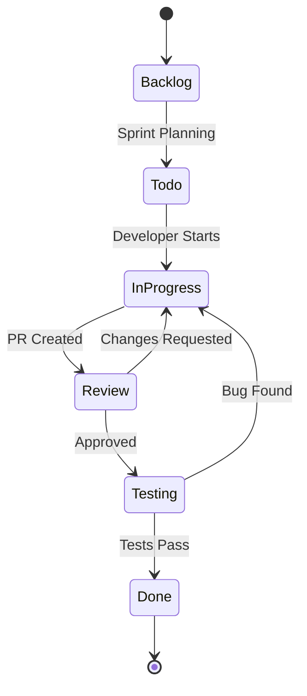
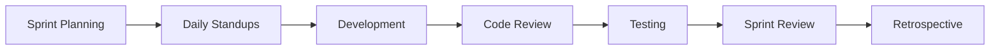
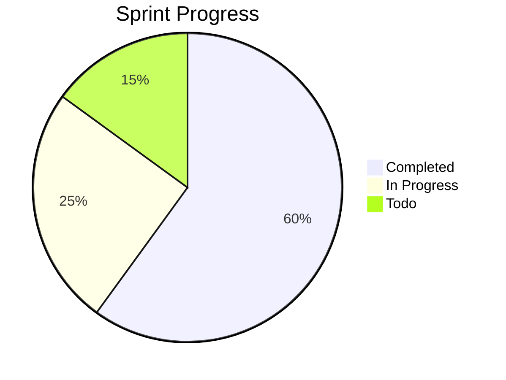
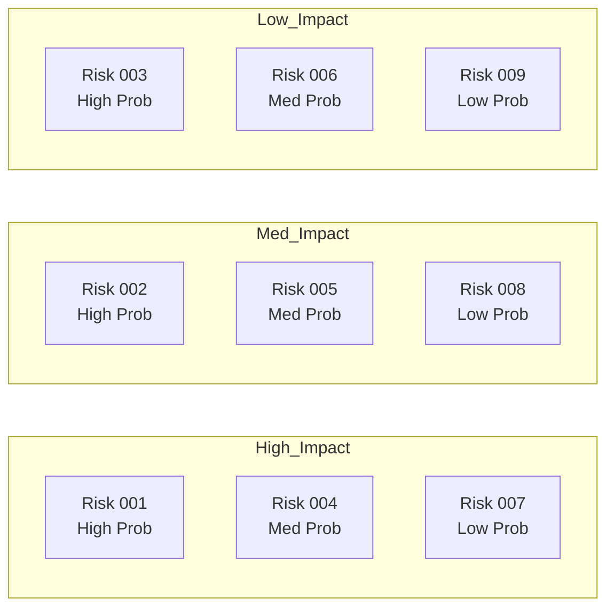

# Project Management Setup

A complete Lokus workspace for managing projects, tracking tasks, planning sprints, and collaborating with teams. This setup uses Mermaid diagrams, templates, and Bases for a comprehensive PM system.

## Overview

**Perfect for:**
- Project managers tracking multiple projects
- Agile teams running sprints
- Solo entrepreneurs managing work
- Teams needing centralized documentation

**Time to Setup:** 30 minutes

**Features:**
- Project tracking with Gantt charts
- Sprint planning templates
- Meeting notes automation
- Status update templates
- Risk and decision logs

---

## Folder Structure

```
PM Workspace/
├── Projects/
│   ├── Active/
│   ├── Planning/
│   ├── On-Hold/
│   └── Completed/
├── Sprints/
│   └── Sprint-XX/
├── Meetings/
│   ├── Standups/
│   ├── Retros/
│   └── Planning/
├── Team/
│   ├── Members/
│   └── 1-on-1s/
├── Resources/
│   ├── Templates/
│   ├── Processes/
│   └── Guidelines/
└── Reports/
    ├── Status-Updates/
    └── Metrics/
```

---

## Core Templates

### 1. Project Brief

```markdown
---
name: Project Brief
description: Complete project documentation
type: template
---

# Project: {{project_name}}

**Status:** {{status}}
**Priority:** {{priority}}
**Owner:** {{owner}}
**Team:** {{team_members}}

**Start Date:** {{date.format('YYYY-MM-DD')}}
**Target Date:** {{date.addMonths(3).format('YYYY-MM-DD')}}

---

## Executive Summary

**Problem:**

**Solution:**

**Success Criteria:**
1.
2.
3.

---

## Timeline

```mermaid
gantt
    title {{project_name}} Timeline
    dateFormat YYYY-MM-DD

    section Planning
    Requirements     :a1, {{date.format('YYYY-MM-DD')}}, 7d
    Design          :a2, after a1, 10d

    section Development
    Phase 1         :crit, b1, after a2, 21d
    Phase 2         :b2, after b1, 21d

    section Testing
    QA Testing      :c1, after b2, 10d
    Bug Fixes       :c2, after c1, 5d

    section Launch
    Deployment      :d1, after c2, 2d
    Go-Live         :milestone, after d1, 0d
```

---

## Team

{{#each team_members.split(',')}}
### {{this | trim | capitalizeAll}}

- **Role:**
- **Responsibilities:**
- **Capacity:** __% allocated

{{/each}}

---

## Milestones

| Milestone | Target Date | Status | Owner |
|-----------|-------------|--------|-------|
| Kickoff | {{date.format('YYYY-MM-DD')}} | [ ] | |
| Phase 1 | {{date.addMonths(1).format('YYYY-MM-DD')}} | [ ] | |
| Phase 2 | {{date.addMonths(2).format('YYYY-MM-DD')}} | [ ] | |
| Launch | {{date.addMonths(3).format('YYYY-MM-DD')}} | [ ] | |

---

## Risks & Mitigation

| Risk | Probability | Impact | Mitigation | Owner |
|------|-------------|--------|------------|-------|
|      | L/M/H       | L/M/H  |            |       |

---

## Status Updates

### Week {{date.getWeek}} - {{date.format('MMM DD')}}

**Progress:**
- [ ]
- [ ]

**Blockers:**
-

**Next Week:**
- [ ]
- [ ]

---

#project #{{status | slug}} #{{priority | slug}}
```

### 2. Sprint Planning

```markdown
---
name: Sprint Planning
description: Agile sprint planning template
type: template
---

# Sprint {{sprint_number}} Planning

**Sprint Goal:** {{sprint_goal}}
**Duration:** {{date.format('MMM DD')}} - {{date.addWeeks(2).format('MMM DD, YYYY')}}
**Team:** {{team_name}}

---

## Sprint Overview

**Capacity:** {{capacity}} points
**Focus Areas:**
1.
2.
3.

---

## Sprint Backlog

### User Stories

| Story | Points | Owner | Status |
|-------|--------|-------|--------|
| As a user, I want... | 5 | | 🔴 Not Started |
| As a user, I want... | 3 | | 🔴 Not Started |
| As a user, I want... | 8 | | 🔴 Not Started |

**Total Points:** __ / {{capacity}}

---

## Sprint Board



---

## Daily Standup Notes

### {{date.format('MMM DD')}} - Day 1

**Yesterday:**
-

**Today:**
-

**Blockers:**
-

---

[Repeat for each day]

---

## Sprint Metrics

**Velocity:** __ points completed
**Carryover:** __ stories
**Bugs Found:** __
**Bugs Fixed:** __

---

## Sprint Review

**Completed:**
- [x]
- [x]

**Not Completed:**
- [ ] (Reason:)

**Demos:**
1.
2.

---

## Sprint Retrospective

### What Went Well 😊
-

### What Could Improve 🤔
-

### Action Items for Next Sprint
- [ ]
- [ ]

---

**Previous Sprint:** [[Sprint {{subtract sprint_number 1}}]]
**Next Sprint:** [[Sprint {{add sprint_number 1}}]]

#sprint #sprint-{{sprint_number}} #{{team_name | slug}}
```

### 3. Meeting Notes - Standup

```markdown
---
name: Daily Standup
description: Quick daily sync template
type: template
---

# Daily Standup - {{date.format('dddd, MMM DD')}}

**Team:** {{team_name}}
**Sprint:** {{sprint_number}}
**Day:** {{sprint_day}} of 10

---

## Team Updates

{{#each team_members.split(',')}}
### {{this | trim | capitalizeAll}}

**Yesterday:**
-

**Today:**
-

**Blockers:**
-

---

{{/each}}

---

## Parking Lot

Issues to discuss offline:
-

---

## Action Items

- [ ] **Task** - Owner - Due Date

---

**Yesterday:** [[{{date.subDays(1).format('YYYY-MM-DD')}} Standup]]
**Tomorrow:** [[{{date.addDays(1).format('YYYY-MM-DD')}} Standup]]

#standup #sprint-{{sprint_number}}
```

### 4. Status Update

```markdown
---
name: Weekly Status Update
description: Project status update template
type: template
---

# Status Update - Week {{date.getWeek}}

**Project:** {{project_name}}
**Period:** {{date.startOfWeek.format('MMM DD')}} - {{date.format('MMM DD, YYYY')}}
**Status:** 🟢 On Track / 🟡 At Risk / 🔴 Blocked

---

## Executive Summary

[2-3 sentence overview]

---

## Progress This Week

### Completed ✅
- [x]
- [x]
- [x]

### In Progress 🔄
- [ ] **Task** - 75% complete - On track
- [ ] **Task** - 50% complete - Delayed

### Blocked 🚫
- [ ] **Task** - Waiting on: [Dependency]

---

## Metrics

| Metric | Target | Actual | Status |
|--------|--------|--------|--------|
| Tasks Completed | 10 | 8 | 🟡 |
| Story Points | 20 | 18 | 🟢 |
| Bug Count | <5 | 3 | 🟢 |
| Test Coverage | >80% | 85% | 🟢 |

---

## Timeline

```mermaid
gantt
    title Project Timeline
    dateFormat YYYY-MM-DD

    section Completed
    Phase 1    :done, a1, 2024-01-01, 30d
    Phase 2    :done, a2, after a1, 20d

    section Current
    Phase 3    :active, b1, {{date.format('YYYY-MM-DD')}}, 15d

    section Upcoming
    Phase 4    :c1, after b1, 20d
    Launch     :milestone, after c1, 0d
```

---

## Risks & Issues

### 🔴 Critical
-

### 🟡 Medium
-

### 🟢 Low
-

---

## Next Week Plans

**Goals:**
1.
2.
3.

**Deliverables:**
- [ ]
- [ ]

---

## Support Needed

**From Leadership:**
-

**From Other Teams:**
-

**Resources:**
-

---

**Last Update:** [[Week {{date.subWeeks(1).getWeek}} Status]]
**Next Update:** [[Week {{date.addWeeks(1).getWeek}} Status]]
**Project Brief:** [[Projects/{{project_name}}]]

#status-update #{{project_name | slug}} #week-{{date.getWeek}}
```

---

## Real-World Workflow

### Month 1: Project Kickoff

**Week 1: Planning**
```markdown
# Phase: Planning

1. Create project brief using template
2. Set up folder structure
3. Add team members
4. Create initial Gantt chart
5. Define milestones

**Deliverable:** [[Project Brief - Product Launch]]
```

**Week 2-3: Sprint 1**
```markdown
# Sprint 1 - Foundation

**Sprint Goal:** Set up infrastructure and core features

## Workflow



**Daily Routine:**
- 9:00 AM - Standup (use template)
- Throughout day - Update task status
- 5:00 PM - Update sprint board

**End of Sprint:**
- Sprint review meeting
- Demo completed features
- Retrospective
- Plan Sprint 2
```

**Week 4: Status Update**
```markdown
# Month 1 Review

**Completed:**
- ✅ Sprint 1 - 18/20 points
- ✅ Infrastructure setup
- ✅ Core features (3/5)

**Metrics:**
- Velocity: 18 points/sprint
- Bug count: 5 (acceptable)
- Team satisfaction: 8/10

**Next Month:**
- Sprint 2 & 3
- Feature completion
- Beta testing prep
```

---

## Advanced Features

### 1. Project Dashboard

Create a master dashboard note:

```markdown
# Project Dashboard

## Active Projects (3)

### 🔴 Critical Priority
- [[Project Alpha]] - Behind schedule by 1 week
- [[Project Beta]] - At risk - resource conflict

### 🟡 High Priority
- [[Project Gamma]] - On track

## Sprint Overview

**Current Sprint:** [[Sprint 12]]
**Sprint Goal:** User authentication & authorization
**Days Remaining:** {{date.differenceInDays(date.now, date.addDays(5))}}
**Velocity:** 18/20 points



## This Week

### Monday - {{date.format('MMM DD')}}
- [[Standup]]
- [[Team Meeting]]

### Tuesday - {{date.format('MMM DD')}}
- [[Standup]]
- [[1-on-1 with Sarah]]

[Continue for each day]

## Upcoming Deadlines

| Project | Milestone | Date | Days Left |
|---------|-----------|------|-----------|
| [[Project Alpha]] | Phase 2 | {{date.addWeeks(2).format('MMM DD')}} | {{date.differenceInDays(date.now, date.addWeeks(2))}} |
| [[Project Beta]] | Launch | {{date.addMonths(1).format('MMM DD')}} | {{date.differenceInDays(date.now, date.addMonths(1))}} |

## Team Capacity

```mermaid
gantt
    title Team Allocation (This Week)
    dateFormat YYYY-MM-DD

    section Sarah
    Project Alpha    :a1, {{date.format('YYYY-MM-DD')}}, 3d
    Project Beta     :a2, after a1, 2d

    section Mike
    Project Alpha    :b1, {{date.format('YYYY-MM-DD')}}, 5d

    section Lisa
    Project Beta     :c1, {{date.format('YYYY-MM-DD')}}, 4d
    Project Gamma    :c2, after c1, 1d
```
```

### 2. Risk Register

```markdown
# Risk Register - {{project_name}}

## Active Risks

### RISK-001: Resource Constraint

**Category:** Resource
**Probability:** High (80%)
**Impact:** High (Schedule delay of 2 weeks)
**Risk Score:** 8/10

**Description:**
Lead developer on vacation for 2 weeks during critical phase.

**Mitigation:**
- [ ] Cross-train backup developer
- [ ] Adjust timeline
- [ ] Hire contractor if needed

**Owner:** [[Project Manager]]
**Status:** 🟡 Monitoring

**Updates:**
- {{date.format('MMM DD')}}: Identified risk
- {{date.addDays(2).format('MMM DD')}}: Started cross-training

---

[Add more risks]

---

## Risk Matrix


```

### 3. Decision Log

```markdown
# Decision Log - {{project_name}}

## DEC-001: Technology Stack

**Date:** {{date.format('YYYY-MM-DD')}}
**Decision Maker:** [[Tech Lead]]
**Status:** ✅ Approved

**Context:**
Need to choose between React and Vue for frontend.

**Options Considered:**
1. React - More ecosystem, team familiar
2. Vue - Simpler learning curve
3. Angular - Full framework

**Decision:**
**Selected: React**

**Rationale:**
- Team already knows React
- Larger ecosystem for plugins
- Better tooling

**Consequences:**
- Need Redux for state management
- Steeper learning for juniors

**Impact:**
- Timeline: No change
- Cost: No change
- Risk: Reduced (familiar tech)

---

[Add more decisions]
```

---

## Tips for Success

### Daily Habits
- Morning: Review dashboard, check blockers
- Throughout: Update task status in real-time
- Evening: Prepare tomorrow's standup notes

### Weekly Practices
- Monday: Sprint planning (new sprint) or standup
- Daily: Standup notes using template
- Friday: Status update, week review
- Retrospective: End of each sprint

### Monthly Reviews
- Project health check
- Update roadmaps and Gantt charts
- Team capacity planning
- Risk register review

---

## Troubleshooting

**"Too many meetings, not enough docs"**
- Use templates to capture meeting notes quickly
- Block embed key decisions into project briefs
- Daily standups should be 15 min max

**"Status updates take forever"**
- Track progress daily in sprint board
- Use metrics template
- Copy-paste from daily standups
- Automate with templates

**"Team not using the system"**
- Make it dead simple with templates
- Show value (better meetings, less repeat questions)
- Lead by example
- Iterate based on feedback

---

**See Also:**
- [Template Workflows](/tutorials/template-workflows) - Master templates
- [Mermaid Diagrams](/tutorials/creating-mermaid-diagrams) - Gantt charts
- [Team Collaboration](/examples/workflows#team) - Collaboration patterns

**Time to Setup:** 30 minutes
**Difficulty:** Intermediate
**Best For:** Project managers, teams, solo entrepreneurs
**Last Updated:** November 2024
