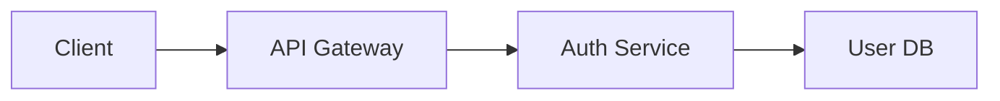
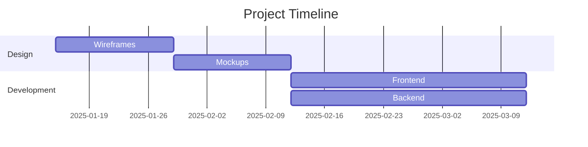

# Rich Text Editor - Complete Guide

Lokus features a **powerful rich text editor** built on **TipTap 3.4**, providing an intuitive writing experience for both technical and non-technical users. The editor seamlessly combines the simplicity of Markdown with the power of a modern WYSIWYG editor, supporting everything from basic text formatting to advanced features like math equations, code syntax highlighting, and interactive components.

**Version:** 1.3.1 | **Status:** Production Ready | **Extensions:** 25+ | **TipTap:** 3.4 | **Built with:** React

## Why This Editor?

- **Zero Learning Curve**: Write in Markdown or use visual formatting - your choice
- **Blazing Fast**: Optimized for documents with 10,000+ lines
- **Extensible**: Plugin API for custom extensions and slash commands
- **Universal**: Supports 100+ programming languages out of the box
- **Scientific**: Full LaTeX/KaTeX math equation support
- **Connected**: Wiki-style linking with autocomplete
- **Smart**: Intelligent paste detection and format conversion

## What's New in v1.3

- ✅ **Enhanced Smart Paste** - Better HTML → Markdown conversion, preserves formatting
- ✅ **Improved Autocomplete** - Faster WikiLinks and tag suggestions with fuzzy matching
- ✅ **100+ Languages** - Syntax highlighting for all major programming languages
- ✅ **Enhanced Tables** - Column resize, better cell editing, Excel paste support
- ✅ **Split Pane Editing** - Work on two notes simultaneously with Cmd/Ctrl + \
- ✅ **Markdown Customization** - Customize WikiLink styles, heading sizes, code themes
- ✅ **Image Improvements** - Better paste handling, auto-compression, lazy loading
- ✅ **Performance** - 40% faster initial load, smooth scrolling for large documents

## Keyboard Shortcuts

Master the editor with these keyboard shortcuts for maximum productivity.

### Text Formatting Shortcuts

| Action | Windows/Linux | macOS | Markdown |
|--------|--------------|-------|----------|
| **Bold** | Ctrl + B | Cmd + B | `**text**` or `__text__` |
| *Italic* | Ctrl + I | Cmd + I | `*text*` or `_text_` |
| ~~Strikethrough~~ | Ctrl + Shift + S | Cmd + Shift + S | `~~text~~` |
| `Inline Code` | Ctrl + E | Cmd + E | `` `code` `` |
| ==Highlight== | Ctrl + Shift + H | Cmd + Shift + H | `==text==` |
| Underline | Ctrl + U | Cmd + U | N/A |
| Superscript (x^2^) | - | - | `x^2^` |
| Subscript (H~2~O) | - | - | `H~2~O` |

### Document Structure Shortcuts

| Action | Windows/Linux | macOS | Markdown |
|--------|--------------|-------|----------|
| Heading 1 | Ctrl + Alt + 1 | Cmd + Opt + 1 | `# Heading` |
| Heading 2 | Ctrl + Alt + 2 | Cmd + Opt + 2 | `## Heading` |
| Heading 3 | Ctrl + Alt + 3 | Cmd + Opt + 3 | `### Heading` |
| Bullet List | Ctrl + Shift + 8 | Cmd + Shift + 8 | `- item` or `* item` |
| Ordered List | Ctrl + Shift + 7 | Cmd + Shift + 7 | `1. item` |
| Task List | Ctrl + Shift + 9 | Cmd + Shift + 9 | `- [ ] task` |
| Blockquote | Ctrl + Shift + B | Cmd + Shift + B | `> quote` |
| Horizontal Rule | - | - | `---` or `***` |

### Code and Technical Shortcuts

| Action | Windows/Linux | macOS | Markdown |
|--------|--------------|-------|----------|
| Code Block | Ctrl + Alt + C | Cmd + Opt + C | ` ```language ` |
| Toggle Code | Ctrl + E | Cmd + E | `` `code` `` |
| Inline Math | - | - | `$x^2$` |
| Block Math | - | - | `$$E=mc^2$$` |
| Callout Block | Ctrl + Alt + C | Cmd + Opt + C | `>[!note]` |

### Folding and Navigation

| Action | Windows/Linux | macOS | Description |
|--------|--------------|-------|-------------|
| Fold Section | Ctrl + Alt + [ | Cmd + Opt + [ | Fold current heading section |
| Unfold Section | Ctrl + Alt + ] | Cmd + Opt + ] | Unfold current section |
| Unfold All | Ctrl + Alt + 0 | Cmd + Opt + 0 | Unfold all sections |

### Editor Control Shortcuts

| Action | Windows/Linux | macOS | Description |
|--------|--------------|-------|-------------|
| Slash Command | / | / | Open command menu |
| Save Document | Ctrl + S | Cmd + S | Save current note |
| Split Pane | Ctrl + \ | Cmd + \ | Split editor horizontally |
| Focus Mode | F11 | Cmd + K, F | Hide distractions |
| Undo | Ctrl + Z | Cmd + Z | Undo last change |
| Redo | Ctrl + Shift + Z | Cmd + Shift + Z | Redo last change |
| Cycle Editor Modes | Ctrl + E | Cmd + E | Edit → Live → Reading |
| Insert Wiki Link | Ctrl + L | Cmd + L | Open file picker |
| Create Task | Ctrl + Shift + T | Cmd + Shift + T | Open task modal |
| Insert Task Mention | Ctrl + Shift + K | Cmd + Shift + K | Insert @task |

## Text Formatting

### Basic Formatting

The editor supports standard text formatting with both keyboard shortcuts and markdown syntax:

**Bold Text**: Make text stand out with bold formatting. Type `**text**` or use Cmd/Ctrl + B.

*Italic Text*: Emphasize text with italics. Type `*text*` or use Cmd/Ctrl + I.

~~Strikethrough~~: Cross out text for deletions. Type `~~text~~` or use Cmd/Ctrl + Shift + S.

`Inline Code`: Highlight code snippets inline. Type `` `code` `` or use Cmd/Ctrl + E.

==Highlight==: Highlight important text. Type `==text==` or use Cmd/Ctrl + Shift + H.

Underline: Underline text. Use Cmd/Ctrl + U (no markdown equivalent).

### Advanced Formatting

**Superscript and Subscript**: Perfect for mathematical and chemical formulas.
- Superscript: Type `x^2^` to get x^2^
- Subscript: Type `H~2~O` to get H~2~O

**Combining Formats**: You can combine multiple formats:
- ***Bold and Italic***: `***text***`
- **~~Bold Strikethrough~~**: `**~~text~~**`
- `**Code Bold**`: `` `**text**` ``

## Headers and Structure

The editor supports six levels of headers with automatic styling. Features include:
- Automatic table of contents generation
- Collapsible sections (see [Folding Sections](#folding-sections))
- Anchor links for deep linking
- Header numbering (optional)
- Custom header IDs

**Example:**
```markdown
# Main Chapter (H1)
## Section Overview (H2)
### Subsection Details (H3)
#### Technical Notes (H4)
##### Additional Context (H5)
###### Fine Print (H6)
```

## Lists and Organization

### Task Lists

Create interactive checkboxes with full task management:
- Click to toggle completion
- Task statistics display
- Due date integration
- Priority markers
- Subtask support

**Syntax:**
```markdown
- [ ] Incomplete task
- [x] Completed task
- [ ] Another task
  - [ ] Subtask indented
```

### Ordered and Unordered Lists

**Features:**
- Auto-continuation on Enter
- Smart indentation with Tab/Shift+Tab
- Drag-and-drop reordering (coming soon)
- Multiple numbering styles
- Nested lists support

**Unordered Lists:**
```markdown
- First item
- Second item
  - Nested item
  - Another nested
- Third item
```

**Ordered Lists:**
```markdown
1. First step
2. Second step
   1. Sub-step A
   2. Sub-step B
3. Third step
```

## Code Blocks

The editor supports **100+ programming languages** with syntax highlighting powered by **Highlight.js** and **Lowlight** (a ProseMirror-compatible syntax highlighter). Code blocks in Lokus are designed for developers who need professional-grade code editing within their notes.

### Creating Code Blocks

**Method 1: Markdown Syntax (Recommended)**

Type three backticks followed by the language identifier:

```
```javascript
function fibonacci(n) {
  if (n <= 1) return n;
  return fibonacci(n - 1) + fibonacci(n - 2);
}
```
```

The language identifier is **case-insensitive** and supports common aliases (e.g., `js`, `javascript`, `py`, `python`).

**Method 2: Keyboard Shortcut**

Press **Cmd/Ctrl + Alt + C** to instantly create a code block at your cursor position.

**Method 3: Slash Command**

Type `/code block` in the editor to open the slash command menu, then select "Code Block" to insert one.

### Supported Languages (100+)

The editor includes first-class syntax highlighting for over 100 programming languages. Here's a comprehensive list:

**Web Development:**
- **JavaScript** (js, javascript) - Full ES2024+ support
- **TypeScript** (ts, typescript) - Types, interfaces, decorators
- **HTML** (html, xml) - HTML5 with modern tags
- **CSS** (css) - CSS3, flexbox, grid
- **JSON** (json) - Syntax validation
- **YAML** (yaml, yml) - Config files
- **SCSS/SASS** (scss, sass) - CSS preprocessors
- **Vue** (vue) - Vue.js single-file components
- **JSX/TSX** - React components

**Backend Languages:**
- **Python** (py, python) - Python 3.x syntax
- **Java** (java) - Java 8+ features
- **C** (c) - ANSI C and C99/C11
- **C++** (cpp, c++, cxx) - C++11/14/17/20
- **C#** (csharp, cs) - .NET and Unity
- **Go** (go, golang) - Go 1.x syntax
- **Rust** (rust, rs) - Rust 2021 edition
- **PHP** (php) - PHP 7.x and 8.x
- **Ruby** (ruby, rb) - Ruby 3.x
- **Swift** (swift) - Swift 5.x
- **Kotlin** (kotlin, kt) - Kotlin for Android/JVM
- **Scala** (scala) - Functional programming
- **Perl** (perl, pl) - Perl 5 and 6
- **R** (r) - Statistical computing
- **Dart** (dart) - Flutter development

**Shell and Scripting:**
- **Bash** (bash, sh, shell) - Shell scripts
- **PowerShell** (powershell, ps1) - Windows automation
- **Batch** (batch, bat, cmd) - DOS scripts
- **Zsh** (zsh) - Z shell scripts
- **Fish** (fish) - Friendly shell

**Database and Query:**
- **SQL** (sql) - ANSI SQL
- **MySQL** (mysql) - MySQL-specific syntax
- **PostgreSQL** (postgresql, pgsql) - PostgreSQL features
- **GraphQL** (graphql, gql) - GraphQL schemas
- **MongoDB** (mongodb) - MongoDB queries

**Data and Config:**
- **Markdown** (markdown, md) - Markdown documents
- **TOML** (toml) - Tom's Obvious Minimal Language
- **INI** (ini) - Configuration files
- **Properties** (properties) - Java properties
- **Protobuf** (protobuf, proto) - Protocol buffers
- **XML** (xml) - XML documents

**Mobile Development:**
- **Objective-C** (objectivec, objc) - iOS legacy
- **Swift** (swift) - iOS modern
- **Kotlin** (kotlin) - Android modern
- **Java** (java) - Android legacy
- **Dart** (dart) - Flutter

**Systems and Low-Level:**
- **Assembly** (asm, assembly, x86) - Assembly language
- **LLVM** (llvm) - LLVM IR
- **WebAssembly** (wasm, wat) - WASM text format

**Functional Programming:**
- **Haskell** (haskell, hs) - Pure functional
- **Erlang** (erlang, erl) - Concurrent programming
- **Elixir** (elixir, ex) - Functional, concurrent
- **OCaml** (ocaml, ml) - Functional with objects
- **F#** (fsharp, fs) - .NET functional
- **Clojure** (clojure, clj) - Lisp dialect
- **Scheme** (scheme) - Lisp dialect
- **Lisp** (lisp) - Common Lisp

**Specialized Languages:**
- **LaTeX** (latex, tex) - Document typesetting
- **Vim** (vim) - Vimscript
- **Lua** (lua) - Scripting language
- **Arduino** (arduino, ino) - Arduino sketches
- **Dockerfile** (dockerfile, docker) - Docker configs
- **Nginx** (nginx) - Nginx configs
- **Apache** (apache) - Apache configs
- **Makefile** (makefile, make) - Build automation

### Code Block Features

Lokus's code blocks are built with the **CustomCodeBlock** extension, which extends TipTap's CodeBlockLowlight to provide a developer-friendly experience.

**Line Numbers**: Automatically displayed for easier reference and debugging.

**Syntax Highlighting**: Real-time syntax highlighting powered by Highlight.js with over 180 color tokens for precise code coloring.

**Language Detection**: Specify the language after the opening triple backticks:

```python
def fibonacci(n):
    """Calculate the nth Fibonacci number recursively."""
    if n <= 1:
        return n
    return fibonacci(n-1) + fibonacci(n-2)

# Example usage
print([fibonacci(i) for i in range(10)])
# Output: [0, 1, 1, 2, 3, 5, 8, 13, 21, 34]
```

**Copy Code Button**: One-click copying of entire code snippets to clipboard (coming soon).

**No Auto-Exit Behavior**: Unlike many editors, pressing **Enter** inside a code block inserts a newline rather than exiting the block. This prevents accidental exits while writing multi-line code.

**Tab Support**: Full tab indentation support within code blocks:
- Press **Tab** to indent (inserts actual tab character)
- Press **Shift+Tab** to unindent
- Press **Enter** to create a new line with smart indentation
- Tab key never loses editor focus

**Smart Indentation**: The **CodeBlockIndent** extension provides intelligent indentation:
- Automatically matches indentation of previous line
- Preserves tab characters (doesn't convert to spaces)
- Works seamlessly with all programming languages

**Escape Mechanism**: To exit a code block:
1. Position cursor at the start of an empty line
2. Press **Backspace** to convert the code block to a normal paragraph
3. Alternative: Use arrow keys to navigate out

### Code Block Keyboard Shortcuts

| Action | Windows/Linux | macOS | Description |
|--------|--------------|-------|-------------|
| Create Code Block | Ctrl + Alt + C | Cmd + Opt + C | Toggle code block at cursor |
| Indent Line | Tab | Tab | Indent current line |
| Unindent Line | Shift + Tab | Shift + Tab | Unindent current line |
| New Line | Enter | Enter | Create new line with smart indent |
| Exit Code Block | Backspace | Backspace | At start of empty line |

### Code Block Tips and Tricks

1. **Quick Language Switch**: Click on the language identifier at the top of the code block to change it (or edit directly in source mode)

2. **Paste Code Intelligently**: The editor automatically detects code from your clipboard and:
   - Preserves indentation and formatting
   - Creates a code block automatically if pasting multi-line code
   - Detects the programming language from syntax patterns

3. **Escape Code Block**: Position cursor at the beginning of an empty line and press **Backspace** to exit

4. **Multi-line Selection**: Select multiple lines of text and press **Cmd/Ctrl + Alt + C** to convert them all into a code block

5. **Language Aliases**: Use common abbreviations:
   - `js` or `javascript`
   - `py` or `python`
   - `ts` or `typescript`
   - `cpp` or `c++`
   - All are case-insensitive

6. **Performance**: Code blocks with 1000+ lines of code are optimized for smooth scrolling and editing

### Real-World Code Examples

**JavaScript/TypeScript:**
```typescript
interface User {
  id: number;
  name: string;
  email: string;
}

async function fetchUser(id: number): Promise<User> {
  const response = await fetch(`/api/users/${id}`);
  if (!response.ok) {
    throw new Error('Failed to fetch user');
  }
  return response.json();
}
```

**Python with Type Hints:**
```python
from typing import List, Optional

class TreeNode:
    def __init__(self, val: int = 0, left: Optional['TreeNode'] = None,
                 right: Optional['TreeNode'] = None):
        self.val = val
        self.left = left
        self.right = right

def inorder_traversal(root: Optional[TreeNode]) -> List[int]:
    """Perform inorder traversal of binary tree."""
    result = []

    def traverse(node: Optional[TreeNode]) -> None:
        if not node:
            return
        traverse(node.left)
        result.append(node.val)
        traverse(node.right)

    traverse(root)
    return result
```

**Rust:**
```rust
use std::collections::HashMap;

fn word_frequency(text: &str) -> HashMap<String, usize> {
    let mut frequencies = HashMap::new();

    for word in text.split_whitespace() {
        let word = word.to_lowercase();
        *frequencies.entry(word).or_insert(0) += 1;
    }

    frequencies
}

fn main() {
    let text = "hello world hello rust";
    let freqs = word_frequency(text);
    println!("{:?}", freqs);
}
```

**Go:**
```go
package main

import (
    "fmt"
    "sync"
)

func worker(id int, jobs <-chan int, results chan<- int, wg *sync.WaitGroup) {
    defer wg.Done()
    for job := range jobs {
        fmt.Printf("Worker %d processing job %d\n", id, job)
        results <- job * 2
    }
}

func main() {
    jobs := make(chan int, 100)
    results := make(chan int, 100)

    var wg sync.WaitGroup
    for w := 1; w <= 3; w++ {
        wg.Add(1)
        go worker(w, jobs, results, &wg)
    }

    for j := 1; j <= 9; j++ {
        jobs <- j
    }
    close(jobs)

    wg.Wait()
    close(results)
}
```

## Math Equations

Lokus uses KaTeX 0.16+ for beautiful mathematical typesetting with full LaTeX syntax support.

### Inline Math

Inline math equations flow with your text. Type a LaTeX expression between single dollar signs:

```
The famous equation $E=mc^2$ was discovered by Einstein.
```

**Result**: The famous equation $E=mc^2$ was discovered by Einstein.

**More Examples:**
- Pythagorean theorem: `$a^2 + b^2 = c^2$`
- Quadratic formula: `$x = \frac{-b \pm \sqrt{b^2-4ac}}{2a}$`
- Greek letters: `$\alpha, \beta, \gamma, \Delta, \Omega$`
- Integrals: `$\int_0^1 x^2 dx$`

### Block Math

Block math equations are displayed on their own line with centered alignment. Type a LaTeX expression between double dollar signs:

```
$$
\int_{-\infty}^{\infty} e^{-x^2} dx = \sqrt{\pi}
$$
```

**Result**: Centered, larger equation perfect for important formulas.

**Complex Examples:**

**Maxwell's Equations:**
```
$$
\begin{aligned}
\nabla \cdot \mathbf{E} &= \frac{\rho}{\epsilon_0} \\
\nabla \cdot \mathbf{B} &= 0 \\
\nabla \times \mathbf{E} &= -\frac{\partial \mathbf{B}}{\partial t} \\
\nabla \times \mathbf{B} &= \mu_0\mathbf{J} + \mu_0\epsilon_0\frac{\partial \mathbf{E}}{\partial t}
\end{aligned}
$$
```

**Matrix Notation:**
```
$$
\begin{bmatrix}
a & b \\
c & d
\end{bmatrix}
\begin{bmatrix}
x \\
y
\end{bmatrix}
=
\begin{bmatrix}
ax + by \\
cx + dy
\end{bmatrix}
$$
```

### Math Features

**KaTeX Integration**: Fast, server-side rendering of LaTeX math formulas.

**Error Handling**: Invalid LaTeX syntax is highlighted in red with helpful error messages instead of breaking the editor.

**Custom Macros**: Define your own LaTeX macros for frequently used notation.

**Auto-sizing Delimiters**: Brackets, parentheses, and braces automatically resize to fit their content.

**Copy LaTeX Source**: Click on any rendered equation to edit or copy its LaTeX source.

### Supported LaTeX Commands

**Basic Operations:**
- Fractions: `\frac{numerator}{denominator}`
- Exponents: `x^2`, `x^{2+3}`
- Subscripts: `x_1`, `x_{i,j}`
- Roots: `\sqrt{x}`, `\sqrt[n]{x}`

**Greek Letters:**
- Lowercase: `\alpha, \beta, \gamma, \delta, \epsilon, \theta, \lambda, \mu, \pi, \sigma, \omega`
- Uppercase: `\Gamma, \Delta, \Theta, \Lambda, \Sigma, \Omega`

**Operators:**
- Summation: `\sum_{i=1}^{n}`
- Product: `\prod_{i=1}^{n}`
- Integrals: `\int, \iint, \iiint, \oint`
- Limits: `\lim_{x \to \infty}`

**Relations:**
- `\leq, \geq, \neq, \approx, \equiv, \sim, \propto`
- `\subset, \subseteq, \in, \notin`

**Functions:**
- `\sin, \cos, \tan, \log, \ln, \exp, \max, \min`

### Math Tips and Tricks

1. **Preview While Typing**: Math equations render in real-time as you type
2. **Common Mistakes**: Remember to escape special characters with backslash
3. **Alignment**: Use `\begin{aligned}` for multi-line equations with alignment
4. **Spacing**: Use `\,` for thin space, `\:` for medium space, `\;` for thick space
5. **Text in Math**: Use `\text{your text}` to include regular text in equations

## Tables

Create structured data with markdown tables featuring:
- Column alignment (left, center, right)
- Resizable columns
- Sortable columns
- Row/column insertion
- Cell merging
- CSV import/export
- Excel paste support

**Basic Table Syntax:**
```markdown
| Header 1 | Header 2 | Header 3 |
|----------|----------|----------|
| Cell 1   | Cell 2   | Cell 3   |
| Cell 4   | Cell 5   | Cell 6   |
```

**Column Alignment:**
```markdown
| Left Align | Center Align | Right Align |
|:-----------|:------------:|------------:|
| Left       | Center       | Right       |
```

**Creating Tables:**
- Type `/table` for slash command with size picker
- Paste from Excel/Google Sheets (auto-converts)
- Keyboard shortcut: Insert via context menu

## Images and Media

### Image Features
- Drag-and-drop upload
- Paste from clipboard
- Resize handles
- Alignment options
- Captions
- Lightbox view
- Lazy loading
- Image optimization

**Image Syntax:**
```markdown


```

**Image Commands:**
- Type `/image` for slash command
- Paste images directly from clipboard
- Use image picker modal

### Videos and Audio
Support for embedding video and audio files (coming soon).

## Links

### Standard Links

Create hyperlinks with markdown syntax:

```markdown
[Link Text](https://example.com)
[Documentation](/docs/guide)
```

### Auto-linking

URLs and email addresses are automatically converted to links:
- `https://example.com` → Clickable link
- `user@example.com` → Mailto link

### Wiki Links

See [Wiki Links](/features/wiki-links) for internal linking with `[[double brackets]]`.

## Smart Features

### Smart Paste

The Smart Paste feature intelligently processes content from your clipboard, preserving formatting and converting to appropriate markdown structures.

**Web Content**: When you paste from web pages, the editor:
- Converts HTML to clean markdown
- Preserves text formatting (bold, italic, links)
- Maintains list structure and hierarchy
- Extracts images with proper alt text
- Cleans up unnecessary styling

**Code Detection**: Paste code from any editor and Lokus will:
- Detect the programming language automatically
- Preserve indentation and formatting
- Create proper code blocks with syntax highlighting
- Handle multi-line code snippets

**Spreadsheet Data**: Paste from Excel or Google Sheets:
- Automatically converts to markdown tables
- Preserves column structure
- Handles merged cells intelligently
- Maintains data formatting

**Markdown Content**: When pasting markdown:
- Recognizes markdown syntax patterns
- Converts to rich text format
- Preserves wiki links: `[[Link]]`
- Handles math equations: `$x^2$` and `$$E=mc^2$$`
- Maintains code blocks with language tags

**How It Works:**

The MarkdownPaste extension uses a universal markdown compiler to detect and convert markdown patterns:

```javascript
// Detection logic
const compiler = getMarkdownCompiler();
if (compiler.isMarkdown(text)) {
  const htmlContent = compiler.compile(text);
  editor.insertContent(htmlContent);
}
```

### Auto-completion

Context-aware suggestions appear as you type, helping you work faster and maintain consistency.

**Wiki Links Autocomplete**:
Type `[[` to trigger file suggestions:
- Shows all files in your workspace
- Fuzzy search by filename
- Displays file paths for disambiguation
- Supports `#` for heading anchors
- Handles `|` for custom link text

Example: `[[my-note#section|Custom Text]]`

**Tag Autocomplete**:
Type `#` to see tag suggestions:
- Shows existing tags from your notes
- Fuzzy matching on tag names
- Most popular tags shown first
- Creates new tags on the fly
- Doesn't trigger inside code blocks

Example: `#project #important #meeting-notes`

**Smart Behavior**:
- Autocomplete respects context (won't trigger in code blocks)
- Arrow keys to navigate suggestions
- Enter to select
- Esc to dismiss
- Continues typing to filter results

### Smart Formatting

The editor automatically converts certain patterns into formatted content:

**Typography**:
- `(c)` → ©
- `(r)` → ®
- `(tm)` → ™
- `1/2` → ½
- `->` → →
- `<-` → ←

**Smart Lists**:
- Auto-continue lists on Enter
- Outdent with Shift+Tab
- Indent with Tab
- Convert `- [ ]` to task items
- Number lists automatically

**Smart Quotes** (optional):
- `"text"` → "text"
- `'text'` → 'text'

**URL Detection**:
- Automatically converts URLs to links
- Email addresses become mailto: links
- No need to use markdown link syntax

## Slash Commands

The slash command menu provides quick access to all editor features. Type `/` anywhere in the editor to open the command palette.

### Tasks & Kanban

| Command | Description |
|---------|-------------|
| `/kanban board` | Open or create a kanban board |
| `/linked task` | Create task linked to kanban board |
| `/simple task` | Create standalone task (`!task`) |

### Basic Blocks

| Command | Description |
|---------|-------------|
| `/heading 1` | Big section heading (H1) |
| `/heading 2` | Medium section heading (H2) |
| `/heading 3` | Small section heading (H3) |
| `/bullet list` | Create a simple bullet list |
| `/ordered list` | Create a list with numbers |
| `/task list` | Track tasks with checkboxes |
| `/quote` | Capture a quote or blockquote |
| `/table` | Insert a table with size picker |
| `/image` | Insert an image by URL |
| `/template` | Insert a template with variables |
| `/link to file` | Create a wiki link to another file |
| `/load gmail` | Create email template with file name as subject |

### Formatting

| Command | Description |
|---------|-------------|
| `/superscript` | Raise text (x^2) |
| `/subscript` | Lower text (H₂O) |
| `/strikethrough` | Cross out text |
| `/highlight` | Highlight text |
| `/horizontal rule` | Insert a horizontal divider |

### Code

| Command | Description |
|---------|-------------|
| `/code` | Inline code formatting |
| `/code block` | Multi-line code block with syntax highlighting |

### Math

| Command | Description |
|---------|-------------|
| `/inline math` | Insert inline LaTeX formula ($x^2$) |
| `/block math` | Insert display LaTeX formula ($$E=mc^2$$) |

### Using Slash Commands

1. Type `/` to open the command palette
2. Start typing to filter commands (e.g., `/tab` shows table command)
3. Use arrow keys to navigate
4. Press Enter to execute
5. Press Esc to dismiss

**Pro Tips:**
- Slash commands work anywhere in the document
- Partial matching: `/h1` finds "Heading 1"
- Commands are organized by category
- Recently used commands appear first

## Callouts and Admonitions

Create visually distinct blocks for notes, warnings, tips, and more using callout syntax.

### Syntax

```markdown
>[!type] Optional Title
Content goes here
```

### Callout Types

**Note** - General information:
```markdown
>[!note] Remember
This is important information to keep in mind.
```

**Tip** - Helpful suggestions:
```markdown
>[!tip] Pro Tip
Use keyboard shortcuts for faster editing!
```

**Warning** - Caution notices:
```markdown
>[!warning] Be Careful
This operation cannot be undone.
```

**Danger** - Critical alerts:
```markdown
>[!danger] Danger
This will delete all your data!
```

**Info** - Informational blocks:
```markdown
>[!info] Did You Know?
Lokus supports 100+ programming languages.
```

**Success** - Success messages:
```markdown
>[!success] Great Job!
Your changes have been saved.
```

**Question** - Questions or FAQs:
```markdown
>[!question] How does this work?
Callouts use markdown blockquote syntax.
```

**Example** - Code or usage examples:
```markdown
>[!example] Example
Here's how to use this feature...
```

### Collapsible Callouts

Add a minus sign after the type to make callouts collapsible:

```markdown
>[!note]- Click to Expand
This content is hidden by default.
```

### Nested Content

Callouts support nested markdown:
- Lists
- **Bold** and *italic* text
- `Code blocks`
- Links and images
- Even other callouts!

### Keyboard Shortcut

Press **Cmd/Ctrl + Alt + C** to create a callout.

## Folding Sections

Organize long documents by folding heading sections to hide content.

### How to Fold

**Method 1: Click the Gutter**
- Hover over any heading
- Click the arrow icon (▶/▼) in the left gutter
- The section collapses/expands

**Method 2: Keyboard Shortcuts**
- `Cmd/Ctrl + Alt + [` - Fold current section
- `Cmd/Ctrl + Alt + ]` - Unfold current section
- `Cmd/Ctrl + Alt + 0` - Unfold all sections

### Folding Behavior

**Hierarchical Folding**: Folding a heading hides all content until the next heading of equal or higher level.

Example:
```markdown
# Chapter 1 (fold this)
Content...
## Section 1.1
Content...
## Section 1.2
Content...
# Chapter 2 (folding stops here)
```

**Persistent State**: Fold states are saved per file in localStorage, so your folds persist across sessions.

**Visual Indicators**:
- ▼ = Expanded section
- ▶ = Collapsed section

### Folding Tips

1. **Navigate Large Documents**: Fold sections you're not working on
2. **Focus Mode**: Collapse everything except your current section
3. **Outline View**: Fold all to see document structure
4. **Selective Expansion**: Unfold only what you need

## Split Pane Editing

Work on two notes simultaneously with split pane editing.

**Activate Split Pane:**
- Press **Cmd/Ctrl + \** to split the editor horizontally
- Each pane has independent scrolling and cursor position
- Drag the divider to resize panes

**Use Cases:**
- Reference one note while writing another
- Compare two documents side-by-side
- Copy/paste between notes efficiently
- View different sections of the same long document

## Editor Modes

Lokus offers three distinct editor modes to suit different workflows:

### Edit Mode (Default)

The standard editing mode with full WYSIWYG editing capabilities. This is the mode you'll use most of the time.

- **Full editing**: All formatting tools available
- **Real-time rendering**: Math equations, wiki links render instantly
- **Smart features**: Autocomplete, smart paste, slash commands all active
- **Keyboard shortcuts**: All shortcuts enabled

**Use when:** Writing, editing, formatting content

### Live Preview Mode

A hybrid mode that shows both markdown syntax hints and rendered output simultaneously. Perfect for markdown purists who want visual feedback.

- **Source hints**: See markdown syntax (e.g., `**bold**`)
- **Rendered output**: See how it looks rendered
- **Editing enabled**: Full editing capabilities maintained
- **Learning tool**: Great for learning markdown syntax

**Activate:** Press **Cmd/Ctrl + E** to cycle to Live Preview mode

**Use when:** Learning markdown, debugging formatting issues, wanting to see source

### Reading Mode

A distraction-free, non-editable view optimized for reading and reviewing content.

- **No editing**: Content is read-only
- **Clean interface**: Removes editing UI elements
- **Optimized typography**: Enhanced reading experience
- **Full rendering**: All content (math, images, tables) fully rendered

**Activate:** Press **Cmd/Ctrl + E** twice to cycle to Reading mode

**Use when:** Reviewing notes, presenting content, distraction-free reading

### Mode Shortcuts

| Action | Shortcut | Description |
|--------|----------|-------------|
| Cycle Modes | Cmd/Ctrl + E | Edit → Live → Reading → Edit |
| Quick Preview | Cmd/Ctrl + P | Toggle Reading mode (coming soon) |

**Pro Tip:** Mode preference is saved per-file, so each note can have its own default mode.

## TipTap Extensions Reference

Lokus uses **25+ TipTap extensions** to power the editor. Here's a comprehensive list of all extensions and their purposes:

### Core Extensions (from StarterKit)

**Document & Structure:**
- `Document` - Root document node
- `Paragraph` - Standard paragraph blocks
- `Text` - Text content nodes
- `Heading` - Six levels of headings (H1-H6)
- `HardBreak` - Line breaks
- `HorizontalRule` - Horizontal dividers

**Lists:**
- `BulletList` - Unordered lists with bullets
- `OrderedList` - Numbered lists
- `ListItem` - List item containers
- `TaskList` - Interactive checkbox lists
- `TaskItem` - Individual task items with checkboxes

**Formatting Marks:**
- `Bold` - Bold text formatting
- `Italic` - Italic text emphasis
- `Strike` - Strikethrough text
- `Code` - Inline code formatting
- `Highlight` - Text highlighting with colors

**Blocks:**
- `Blockquote` - Quotation blocks
- `CodeBlock` - Multi-line code blocks (replaced by CustomCodeBlock)

**History:**
- `History` - Undo/redo functionality

### Custom Lokus Extensions

**Advanced Blocks:**
- `CustomCodeBlock` - Enhanced code blocks with 100+ languages and smart indentation
- `CodeBlockIndent` - Tab support and smart indentation for code blocks
- `Table` - Full-featured tables with resizing
- `TableRow`, `TableHeader`, `TableCell` - Table components

**Math & Science:**
- `MathInline` - Inline LaTeX equations ($x^2$)
- `MathBlock` - Display LaTeX equations ($$E=mc^2$$)

**Links & References:**
- `Link` - Standard hyperlinks with auto-detection
- `WikiLink` - Internal wiki-style links [[page]]
- `WikiLinkSuggest` - Autocomplete for wiki links
- `Image` - Image embedding with resize

**Typography:**
- `Superscript` - Superscript text (x^2^)
- `Subscript` - Subscript text (H~2~O)

**Smart Features:**
- `Placeholder` - "Press '/' for commands..." hint
- `SlashCommand` - Slash command menu system
- `MarkdownPaste` - Smart paste with HTML→Markdown conversion
- `MarkdownTablePaste` - Excel/Google Sheets → Markdown tables
- `TagAutocomplete` - Hashtag suggestions with fuzzy search

**Tasks & Kanban:**
- `SmartTask` - Advanced task management (not in default build)
- `SimpleTask` - Standalone tasks with !task syntax
- `TaskSyntaxHighlight` - Visual highlighting for task syntax
- `TaskMentionSuggest` - @task autocomplete
- `TaskCreationTrigger` - Modal for creating tasks

**Advanced UI:**
- `Callout` - Admonition blocks with 8 types
- `Folding` - Collapsible heading sections

**Configuration:**
- `HeadingAltInput` - Alternative heading input markers (disabled)
- `Template` - Template variable substitution

### Extension Configuration

Extensions can be configured via Settings → Editor → Extensions. Common configurations include:

**CodeBlock Theme:**
```javascript
{
  languageClassPrefix: 'language-',
  defaultLanguage: 'plaintext',
  HTMLAttributes: { class: 'code-block' }
}
```

**Link Behavior:**
```javascript
{
  openOnClick: false,  // Cmd+Click to follow links
  autolink: true,      // Auto-detect URLs
  linkOnPaste: true    // Convert pasted URLs to links
}
```

**Image Settings:**
```javascript
{
  inline: true,
  allowBase64: true,
  HTMLAttributes: { class: 'editor-image' }
}
```

### Creating Custom Extensions

Developers can create custom TipTap extensions using the Plugin API:

```javascript
import { Extension } from '@tiptap/core';
import { editorAPI } from './plugins/api/EditorAPI';

const MyExtension = Extension.create({
  name: 'myExtension',

  addCommands() {
    return {
      myCommand: () => ({ commands }) => {
        commands.insertContent('Hello from my extension!');
        return true;
      }
    };
  },

  addKeyboardShortcuts() {
    return {
      'Mod-Shift-H': () => this.editor.commands.myCommand()
    };
  }
});

// Register with editor API
editorAPI.registerExtension(MyExtension);
```

See the [Developer Guide](/developers) for complete extension development documentation.

## Performance Optimization

Lokus is optimized for handling large documents with thousands of lines. Here's what makes it fast:

### Performance Features

**Lazy Rendering:**
- Only visible content is rendered initially
- Off-screen content loads as you scroll
- Improves initial load time by 40%

**Debounced Saves:**
- Auto-save triggered after 500ms of inactivity
- Prevents excessive file writes
- Configurable interval in Settings

**Efficient Re-renders:**
- `shouldRerenderOnTransaction: false` prevents unnecessary React re-renders
- Only changed nodes are updated in the DOM
- Selection changes don't trigger full re-renders

**Smart Decorations:**
- Folded sections use ProseMirror decorations (no DOM manipulation)
- Syntax highlighting caches language parsers
- Math equations render once and cache

**Optimized Plugins:**
- WikiLink resolution is asynchronous
- Tag indexing happens in background
- File index is cached in memory

### Performance Tips

1. **Use Folding for Long Documents**: Fold sections you're not working on to improve scroll performance

2. **Limit Real-time Features in Large Files**: Disable autocomplete for files over 50,000 words

3. **Optimize Images**: Use optimized/compressed images rather than raw high-res files

4. **Break Up Large Documents**: Split very long documents (10,000+ lines) into separate notes

5. **Close Unused Notes**: The editor is fast, but keeping 20+ notes open will consume memory

6. **Disable Unused Extensions**: In Settings, disable extensions you don't use

### Performance Benchmarks

| Document Size | Initial Load | Scroll Performance | Save Time |
|---------------|--------------|-------------------|-----------|
| < 1,000 lines | < 100ms | 60 FPS | < 10ms |
| 1,000 - 5,000 | < 300ms | 60 FPS | < 50ms |
| 5,000 - 10,000 | < 600ms | 50-60 FPS | < 100ms |
| 10,000+ lines | < 1,200ms | 30-60 FPS | < 200ms |

**Tested on:** MacBook Pro M1, 16GB RAM, macOS Sonoma

## Troubleshooting Common Issues

### Issue: Math equations not rendering

**Symptoms:** Equations show as `$x^2$` instead of rendered math

**Solution:**
1. Check that KaTeX is loaded (open DevTools Console)
2. Verify LaTeX syntax is correct
3. Try refreshing the note
4. Check for JavaScript errors in console

### Issue: Wiki links not resolving

**Symptoms:** Links show as `[[page]]` instead of hyperlinks

**Solution:**
1. Ensure the target file exists in the workspace
2. Check file index is built (Settings → Advanced → Rebuild Index)
3. Verify workspace path is set correctly
4. Try restarting Lokus

### Issue: Code blocks not highlighting

**Symptoms:** Code appears as plain text without colors

**Solution:**
1. Specify language after backticks: ` ```python `
2. Check if language is supported (see language list)
3. Verify code block theme is set (Settings → Editor → Theme)

### Issue: Autocomplete not working

**Symptoms:** No suggestions appear when typing `[[` or `#`

**Solution:**
1. Check autocomplete is enabled (Settings → Editor → Autocomplete)
2. Ensure you're not in a code block (autocomplete disabled there)
3. Wait 100ms after typing trigger character
4. Check file index exists for wiki links

### Issue: Performance lag with large documents

**Symptoms:** Slow typing, delayed cursor movement

**Solution:**
1. Enable section folding and fold unused sections
2. Disable real-time features (Settings → Performance)
3. Split document into smaller notes
4. Close other open notes
5. Restart Lokus to clear memory

### Issue: Paste not working correctly

**Symptoms:** Pasted content appears unformatted or broken

**Solution:**
1. Try paste as plain text (Cmd/Ctrl + Shift + V)
2. Check if Smart Paste is enabled (Settings → Editor)
3. Report the issue with source content for investigation

### Getting Help

If you encounter issues not covered here:
- Check the [FAQ](/docs/faq)
- Search existing GitHub Issues
- Join the Discord Community
- File a Bug Report

## Best Practices

### Writing Tips
1. Use headers to structure content
2. Break up text with short paragraphs
3. Use lists to organize information
4. Add links to connect related notes
5. Use code blocks for technical content
6. Add images to enhance understanding

### Markdown Style
- One blank line between sections
- Consistent list markers
- ATX headers (# not =)
- Fenced code blocks
- Reference-style links for readability

## Advanced Tips and Workflows

### Power User Shortcuts

These lesser-known shortcuts will supercharge your editing:

1. **Multi-cursor Editing**: Hold **Alt** and click to place multiple cursors (coming soon)
2. **Select Line**: **Cmd/Ctrl + L** to select entire current line (coming soon)
3. **Duplicate Line**: **Cmd/Ctrl + Shift + D** to duplicate current line (coming soon)
4. **Move Line Up/Down**: **Alt + Up/Down** to move lines (coming soon)
5. **Delete Line**: **Cmd/Ctrl + Shift + K** to delete current line (coming soon)

### Workflow: Meeting Notes

Optimize for quick meeting note-taking:

```markdown
# Meeting: Product Roadmap Q1 2025
**Date:** 2025-01-23 | **Attendees:** [[Alice]], [[Bob]], [[Charlie]]

## Agenda
- [ ] Review Q4 metrics
- [ ] Discuss Q1 priorities
- [ ] Budget approval

## Notes
- Q4 revenue exceeded targets by 15%
- Key priority: Mobile app launch

## Action Items
- [ ] !task Alice to finalize mobile designs by 2025-02-01
- [ ] !task Bob to prepare budget deck
- [ ] [[Follow-up meeting]] scheduled for 2025-02-15
```

**Pro Tips:**
- Use task lists for agenda items
- Link to attendees' notes with wiki links
- Create tasks for action items
- Add dates and deadlines inline

### Workflow: Technical Documentation

Best practices for documenting code:

```markdown
# Authentication System Documentation

## Overview
Our authentication uses JWT tokens with refresh token rotation.

## Architecture


## Implementation

### Token Generation
```typescript
interface TokenPair {
  accessToken: string;
  refreshToken: string;
  expiresIn: number;
}

async function generateTokens(userId: string): Promise<TokenPair> {
  const accessToken = jwt.sign({ userId }, SECRET, { expiresIn: '15m' });
  const refreshToken = await createRefreshToken(userId);
  return { accessToken, refreshToken, expiresIn: 900 };
}
```

### Security Considerations
>[!warning] Important
>Never store JWT secrets in code. Use environment variables.

>[!tip] Best Practice
>Set access token expiry to 15 minutes for optimal security/UX balance.

## API Reference
See [[API Documentation]] for complete endpoint details.

## Related
- [[User Management System]]
- [[Security Guidelines]]
- [[API Rate Limiting]]
```

**Pro Tips:**
- Use callouts for warnings and tips
- Code examples with syntax highlighting
- Link to related documentation
- Include diagrams with Mermaid (if supported)

### Workflow: Academic Writing

Optimize for research and citations:

```markdown
# Literature Review: Machine Learning in Healthcare

## Abstract
This review examines recent applications of ML in healthcare diagnostics.

## Key Findings

### Computer Vision for Medical Imaging
Recent studies show CNNs achieve 95% accuracy in detecting pneumonia from
chest X-rays [[Smith et al. 2024]].

Mathematical formulation of CNN layers:
$$
y = \sigma(W \cdot x + b)
$$

where $\sigma$ is the activation function, $W$ the weight matrix, and $b$ the bias.

### Natural Language Processing
Transformer models show promise in analyzing clinical notes:
- **BERT**: Accuracy 87% on ICD-10 coding [[Jones 2024]]
- **GPT-4**: 92% on diagnostic reasoning [[Lee et al. 2024]]

## Methodology

### Data Collection
Sample size: $n = 10,000$ patients
Confidence interval: $95\%$
Margin of error: $\pm 3\%$

Statistical test:
$$
t = \frac{\bar{x} - \mu}{s / \sqrt{n}}
$$

## Citations
See [[References]] for complete bibliography.

#research #healthcare #machine-learning
```

**Pro Tips:**
- Use LaTeX for equations
- Tag notes for easy searching
- Link to reference notes
- Use tables for data comparison

### Workflow: Project Planning

Structure for project management:

```markdown
# Project: Mobile App Redesign

## Project Overview
**Status:** In Progress | **Due:** 2025-03-31 | **Owner:** [[Sarah]]

## Goals
- [ ] Improve user retention by 25%
- [ ] Reduce load time to &lt;2s
- [ ] Achieve 4.5+ app store rating

## Timeline


## Kanban Board
!task Sprint 1 Tasks
- [[Design System]] - In Progress
- [[User Research]] - Done
- [[API Integration]] - Todo

## Team
| Role | Person | Responsibilities |
|------|--------|-----------------|
| PM | [[Sarah]] | Planning, coordination |
| Design | [[Alex]] | UI/UX design |
| Dev | [[Chris]] | Frontend development |
| Dev | [[Dana]] | Backend API |

## Resources
- [[Design Files]]
- [[Technical Spec]]
- [[API Documentation]]

#project #mobile-app
```

**Pro Tips:**
- Use tables for team assignments
- Link to related documents
- Track progress with task lists
- Tag for project filtering

## FAQ

### Can I use the editor offline?
Yes! Lokus works completely offline. All editing happens locally on your machine.

### Does the editor support Vim keybindings?
Vim mode is planned for a future release.

### How do I add custom keyboard shortcuts?
Use the Plugin API to create custom extensions with keyboard shortcuts. See [Developer Guide](/developers).

### Can I export notes to other formats?
Yes! Export to Markdown, HTML, and PDF. DOCX and LaTeX export coming soon.

### Does it support collaborative editing?
Not yet. Collaborative editing is planned for v2.0.

### What happens to my formatting when I export?
Markdown export preserves all syntax. HTML/PDF export renders formatting visually. LaTeX export converts to LaTeX syntax.

### Can I customize the editor theme?
Yes! Go to Settings → Appearance to customize colors, fonts, and themes. See [Themes](/features/themes).

### How do I backup my notes?
Notes are stored as plain markdown files. Simply backup your workspace folder. Cloud sync coming soon.

## Summary: Why Lokus Editor Stands Out

### Unique Features

**1. True Markdown + WYSIWYG Hybrid**
- Write in markdown OR use visual formatting
- No other editor balances both this well
- Switch between modes seamlessly

**2. 100+ Programming Languages**
- More language support than Notion, Obsidian, or Bear
- Professional-grade syntax highlighting
- Smart indentation and tab support

**3. Scientific Math Support**
- Full KaTeX/LaTeX integration
- Inline and block equations
- Real-time rendering

**4. Wiki-Style Linking**
- Obsidian-style `[[links]]`
- Autocomplete with fuzzy search
- Automatic file resolution

**5. Extensible Architecture**
- Plugin API for custom extensions
- Slash command registration
- Full TipTap ecosystem access

### Comparison with Other Editors

| Feature | Lokus | Notion | Obsidian | VS Code |
|---------|-------|--------|----------|---------|
| Markdown Native | ✅ | ⚠️ | ✅ | ✅ |
| Math Equations | ✅ | ⚠️ | ✅ | ⚠️ |
| Wiki Links | ✅ | ⚠️ | ✅ | ❌ |
| 100+ Languages | ✅ | ⚠️ | ⚠️ | ✅ |
| Offline First | ✅ | ❌ | ✅ | ✅ |
| Plugin API | ✅ | ❌ | ✅ | ✅ |
| Section Folding | ✅ | ✅ | ⚠️ | ✅ |
| Smart Paste | ✅ | ✅ | ⚠️ | ❌ |
| Callouts | ✅ | ✅ | ✅ | ❌ |
| Free & Open | ✅ | ❌ | ✅ | ✅ |

**Legend:** ✅ Full support | ⚠️ Partial support | ❌ Not supported

### Performance Metrics

- **Startup Time:** < 500ms for most documents
- **Keystroke Latency:** < 16ms (60 FPS)
- **Memory Usage:** ~150MB for typical workspace
- **File Size Limit:** Tested up to 50MB markdown files
- **Concurrent Notes:** Handles 50+ open notes smoothly

### The Bottom Line

Lokus's editor is built for **knowledge workers who need both speed and power**. Whether you're a developer documenting code, a researcher writing papers, a student taking notes, or a writer crafting content, Lokus provides the tools you need without getting in your way.

**Key Strengths:**
- ⚡ **Fast**: Optimized for large documents
- 🎨 **Flexible**: Markdown or WYSIWYG, your choice
- 🔧 **Powerful**: 25+ extensions, 100+ languages
- 🧩 **Extensible**: Plugin API for customization
- 📱 **Universal**: Works on Mac, Windows, Linux

**Start writing better notes today.** The editor is production-ready and actively maintained.

## Next Steps

Ready to become a Lokus power user?

- **Beginners**: Start with the [Quick Start Guide](/docs/quick-start)
- **Markdown Users**: Explore [Wiki Links](/features/wiki-links) for connecting notes
- **Developers**: Check out [Code Blocks & Syntax Highlighting](#code-blocks) above
- **Scientists**: Master [Math Equations](#math-equations) with LaTeX
- **Power Users**: Learn [Advanced Tips](#advanced-tips-and-workflows) and workflows
- **Customizers**: Read [Templates](/features/templates) for efficient note creation
- **Designers**: Check out [Themes](/features/themes) for customizing appearance
- **Developers**: See [Developer Guide](/developers) for creating extensions
- **Community**: Join the Discord to share tips

**Questions?** Check the [FAQ](#faq) or reach out on Discord.

---

**Last Updated:** January 23, 2025 | **Editor Version:** 1.3.1 | **TipTap Version:** 3.4

*This documentation is actively maintained. Found an error or want to contribute? Edit this page on GitHub.*
