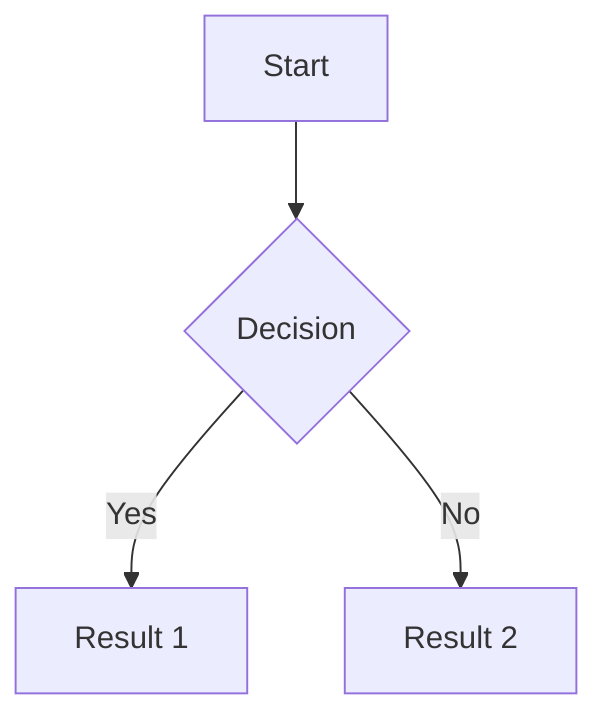
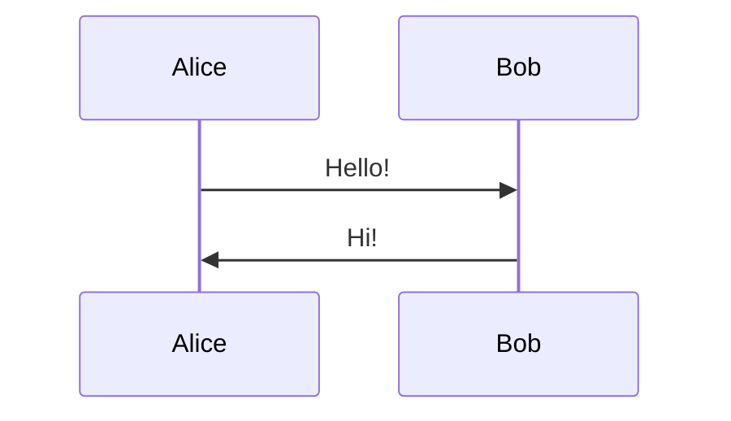
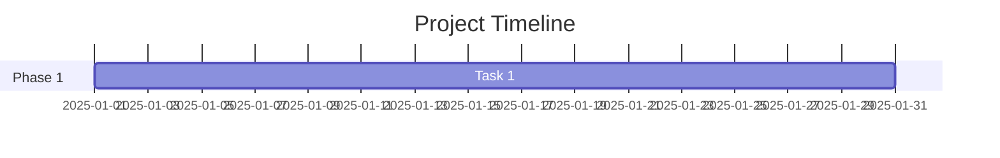

# Markdown - Complete Reference

Lokus supports extended markdown with powerful additions for note-taking. This guide covers standard markdown plus Lokus-specific extensions.

**Version:** 1.3.1 | **Flavor:** GitHub Flavored Markdown + Extensions

## Basic Formatting

### Headings

```markdown
# Heading 1
## Heading 2
### Heading 3
#### Heading 4
##### Heading 5
###### Heading 6
```

**Alternative Syntax:**
```markdown
Heading 1
=========

Heading 2
---------
```

**Custom Heading Marker (Optional):**
```markdown
^ Heading 1  (if enabled in settings)
^^ Heading 2
^^^ Heading 3
```

### Paragraphs

```markdown
This is a paragraph. Just write normally.

Leave a blank line to start a new paragraph.

This is another paragraph.
```

### Line Breaks

```markdown
Method 1: Two spaces at end of line
Then next line.

Method 2: Backslash at end\
Then next line.

Method 3: HTML break<br>Then next line.
```

### Emphasis

**Bold:**
```markdown
**bold text**
__also bold__
```

**Italic:**
```markdown
*italic text*
_also italic_
```

**Bold + Italic:**
```markdown
***bold and italic***
___also bold and italic___
**_mixed formatting_**
```

**Strikethrough:**
```markdown
~~strikethrough text~~
```

**Underline:**
```markdown
<u>underlined text</u>
```

**Highlight:**
```markdown
==highlighted text==
```

### Inline Code

```markdown
Use `backticks` for inline code.

Code with backticks: ``use `backtick` in code``
```

**With Syntax:**
```markdown
`var code = "javascript"`{.js}
`print("python")`{.python}
```

## Lists

### Unordered Lists

```markdown
- Item 1
- Item 2
  - Nested item 2.1
  - Nested item 2.2
    - Deeply nested 2.2.1
- Item 3

* Alternative syntax
* Works the same
  * Can mix styles
  - Like this
```

### Ordered Lists

```markdown
1. First item
2. Second item
   1. Nested item
   2. Another nested
3. Third item

Start from different number:
5. Fifth item
6. Sixth item
```

### Task Lists

```markdown
- [ ] Unchecked task
- [x] Checked task
- [>] Forwarded task
- [<] Scheduled task
- [-] Cancelled task
- [?] Question/Uncertain
- [!] Important task
- [*] Star/Bookmark
```

**Task Properties:**
```markdown
- [ ] Task @due(2025-01-30) #priority/high
- [x] Completed task @done(2025-01-23)
- [ ] Task with subtasks
  - [x] Subtask 1
  - [ ] Subtask 2
```

### Definition Lists

```markdown
Term 1
: Definition 1

Term 2
: Definition 2a
: Definition 2b

HTML Terms
: Hypertext Markup Language

CSS Terms
: Cascading Style Sheets
```

## Links

### Standard Links

```markdown
[Link text](https://example.com)
[Link with title](https://example.com "Link Title")
<https://autolink.com>
<email@example.com>
```

### Reference Links

```markdown
[Link text][reference]
[Another link][ref2]

[reference]: https://example.com
[ref2]: https://example2.com "Optional Title"
```

### WikiLinks

```markdown
[[Note Title]]
[[folder/Note Title]]
[[Note Title|Display Text]]
[[Note Title#Heading]]
[[Note Title#^block-id]]
```

**WikiLink Formats:**
```markdown
Shortest: [[note]]
Absolute: [[/folder/subfolder/note]]
Relative: [[../folder/note]]
With Alias: [[note|Alias Text]]
With Heading: [[note#Section]]
With Block: [[note#^block123]]
```

### Internal Links

```markdown
[Link to heading](#heading-id)
[Link to section](#section-name)
```

## Images

### Basic Images

```markdown


```

### Image Sizes

```markdown
{width=300px}
{height=200px}
{width=50%}
```

### Image Alignment

```markdown
{.center}
{.left}
{.right}
```

### WikiLink Images

```markdown
![[image.png]]
![[folder/image.png|Alt Text]]
![[image.png|300]]
![[image.png|300x200]]
```

### Image Captions

```markdown

*Image caption goes here*

Or with HTML:
<figure>
  
  <figcaption>Image caption</figcaption>
</figure>
```

## Code Blocks

### Fenced Code Blocks

````markdown
```
Basic code block
No syntax highlighting
```

```javascript
// JavaScript with highlighting
const greeting = "Hello, World!";
console.log(greeting);
```

```python
# Python with highlighting
def hello():
    print("Hello, World!")
```
````

### Supported Languages

```
100+ languages including:
- javascript, typescript, jsx, tsx
- python, java, c, cpp, csharp, go, rust
- html, css, scss, less
- sql, graphql, yaml, json, xml
- bash, shell, powershell
- markdown, latex, dockerfile
- ruby, php, swift, kotlin
- and many more...
```

### Code Block Options

````markdown
```javascript {1,3-5}
// Highlight lines 1, 3, 4, 5
const a = 1;
const b = 2;
const c = 3;
const d = 4;
const e = 5;
```

```python {numberLines: true}
# Show line numbers
def function():
    pass
```

```javascript title="filename.js"
// Show filename
console.log("code");
```
````

### Inline Code Execution

````markdown
```javascript exec
// Executable code block (if enabled)
return 2 + 2;
```
````

## Tables

### Basic Tables

```markdown
| Header 1 | Header 2 | Header 3 |
|----------|----------|----------|
| Cell 1   | Cell 2   | Cell 3   |
| Cell 4   | Cell 5   | Cell 6   |
```

### Alignment

```markdown
| Left    | Center  | Right   |
|:--------|:-------:|--------:|
| Left    | Center  | Right   |
| aligned | aligned | aligned |
```

### Complex Tables

```markdown
| Feature | Supported | Notes |
|---------|:---------:|-------|
| Bold | ✓ | Use **bold** |
| Italic | ✓ | Use *italic* |
| Code | ✓ | Use `code` |
| Links | ✓ | [link](url) |
| Images | ✗ | Not in tables |
```

### Spanning Columns

```markdown
| Col 1 | Col 2 | Col 3 |
|-------|-------|-------|
| Span across cols || |
| Normal | Cell | Cell |
```

## Blockquotes

### Basic Blockquotes

```markdown
> This is a blockquote.
> It can span multiple lines.

> Another blockquote.
>
> With multiple paragraphs.
```

### Nested Blockquotes

```markdown
> First level
>> Second level
>>> Third level

> Back to first level
```

### Blockquotes with Formatting

```markdown
> **Bold** and *italic* work.
>
> - Lists work too
> - Another item
>
> ```code
> Code blocks work
> ```
```

## Callouts / Admonitions

### Basic Callouts

```markdown
>[!note]
>This is a note callout.

>[!tip]
>Helpful tip here.

>[!warning]
>Important warning message.

>[!danger]
>Critical information!
```

### Callout Types

```markdown
>[!note] | >[!info] | >[!todo]
>[!tip] | >[!hint] | >[!success]
>[!question] | >[!help] | >[!faq]
>[!warning] | >[!caution] | >[!attention]
>[!danger] | >[!error] | >[!bug]
>[!example] | >[!quote] | >[!cite]
```

### Callout with Title

```markdown
>[!tip] Pro Tip
>Custom title for your callout.
>Multiple paragraphs supported.

>[!warning] Before You Proceed
>Read this carefully.
```

### Foldable Callouts

```markdown
>[!note]- Click to Expand
>This content is hidden by default.
>Click the title to reveal.

>[!tip]+ Expanded by Default
>This is visible.
>Can be collapsed.
```

## Math Equations

### Inline Math

```markdown
Einstein's equation: $E = mc^2$

Quadratic formula: $x = \frac{-b \pm \sqrt{b^2-4ac}}{2a}$

Greek letters: $\alpha, \beta, \gamma, \delta$
```

### Block Math

```markdown
$$
\int_0^\infty e^{-x^2} dx = \frac{\sqrt{\pi}}{2}
$$

$$
\begin{aligned}
f(x) &= x^2 + 2x + 1 \\
&= (x + 1)^2
\end{aligned}
$$
```

### Common LaTeX Syntax

```latex
Fractions: \frac{numerator}{denominator}
Square root: \sqrt{x}
Powers: x^2, x^{10}
Subscripts: x_1, x_{10}
Summation: \sum_{i=1}^{n} i
Integral: \int_a^b f(x) dx
Limits: \lim_{x \to \infty} f(x)
Matrices:
\begin{matrix}
a & b \\
c & d
\end{matrix}
```

## Horizontal Rules

```markdown
---

***

___

- - -

* * *
```

## Superscript & Subscript

```markdown
X^2^           Superscript
H~2~O          Subscript
E=mc^2^        Einstein
CH~3~CH~2~OH   Chemical formula
```

## Footnotes

```markdown
Here's a sentence with a footnote[^1].

Another sentence[^note].

[^1]: This is the footnote.
[^note]: Named footnotes work too.
```

## Abbreviations

```markdown
The HTML specification is maintained by W3C.

*[HTML]: Hyper Text Markup Language
*[W3C]: World Wide Web Consortium
```

## Custom Containers

```markdown
::: container-name
Content goes here
:::

::: warning
Important warning
:::

::: {.custom-class #custom-id}
With class and ID
:::
```

## HTML in Markdown

```markdown
<div class="custom">
  Markdown **still** works here
</div>

<span style="color: red">Red text</span>

<details>
  <summary>Click to expand</summary>
  Hidden content
</details>
```

## Escaping Characters

```markdown
\* Escaped asterisk
\_ Escaped underscore
\` Escaped backtick
\# Escaped hash
\[ Escaped bracket

Use backslash to escape markdown syntax
```

## Comments

```markdown
<!-- HTML comments work -->
<!-- They won't appear in rendered output -->

[//]: # (Alternative comment syntax)
[//]: # (Also hidden)

%%Obsidian-style comments%%
(If enabled in settings)
```

## Frontmatter

### YAML Frontmatter

```yaml
---
title: Note Title
date: 2025-01-23
tags:
  - tag1
  - tag2
author: Author Name
description: Note description
---
```

### TOML Frontmatter

```toml
+++
title = "Note Title"
date = 2025-01-23
tags = ["tag1", "tag2"]
+++
```

### JSON Frontmatter

```json
;;;
{
  "title": "Note Title",
  "date": "2025-01-23",
  "tags": ["tag1", "tag2"]
}
;;;
```

## Embeds

### Embed Notes

```markdown
![[Other Note]]
![[Other Note#Section]]
![[Other Note^block-id]]
```

### Embed PDFs

```markdown
![[document.pdf]]
![[document.pdf#page=5]]
```

### Embed Audio/Video

```markdown
![[audio.mp3]]
![[video.mp4]]

```

## Mermaid Diagrams

````markdown





````

## Markdown Extensions

### Auto-Linking

```markdown
URLs automatically become links:
https://example.com

Emails too:
email@example.com
```

### Smart Punctuation

```markdown
"Smart quotes"
'Single quotes'
en--dash
em---dash
ellipsis...
```

### Emoji

```markdown
:smile: :heart: :thumbsup:
:rocket: :fire: :star:

Or Unicode: 😊 ❤️ 👍
```

### Keyboard Keys

```markdown
Press <kbd>Cmd</kbd> + <kbd>K</kbd>

<kbd>Ctrl</kbd> + <kbd>C</kbd> to copy
```

## Preview Modes

### Editor Modes

```
1. Editing Mode: Edit raw markdown
2. Live Preview: WYSIWYG editing
3. Reading Mode: Rendered view only

Toggle: Cmd+E
```

### Split View

```
View markdown and preview side-by-side
- Left: Markdown source
- Right: Rendered preview
- Synchronized scrolling

Enable: Cmd+\
```

## Export Options

### Export Formats

```markdown
Export markdown to:
- PDF: Print-ready documents
- HTML: Web pages
- DOCX: Word documents
- Plain MD: Standard markdown
- With/without extensions
```

### Flavor Selection

```
Choose markdown flavor for export:
- Standard Markdown
- GitHub Flavored Markdown (GFM)
- CommonMark
- Pandoc Markdown
- Lokus Extended (all features)
```

## Best Practices

### Writing Tips

```
✓ Use headings hierarchically (don't skip levels)
✓ Leave blank lines between sections
✓ Use consistent list markers
✓ Close all code blocks properly
✓ Use descriptive link text
✓ Add alt text to images

✗ Don't over-nest lists (3 levels max)
✗ Don't use raw HTML excessively
✗ Don't forget to escape special characters
✗ Don't mix tab and space indentation
```

### Performance

```
For large documents:
- Use section folding
- Enable lazy image loading
- Minimize nested callouts
- Limit table complexity
- Use external images for large files
```

## Troubleshooting

### Common Issues

**Markdown not rendering:**
```
- Check for unclosed code blocks
- Verify proper syntax
- Look for special characters
- Try preview mode refresh
```

**Links not working:**
```
- Use correct WikiLink syntax [[]]
- Check file path is correct
- Verify file exists
- Update links after moving files
```

**Images not showing:**
```
- Check image path
- Verify image in attachments folder
- Use correct image syntax
- Check file permissions
```

## Related Documentation

- [Editor](/features/editor) - Editor features
- [Templates](/features/templates) - Markdown templates
- [Export](/features/import-export) - Export formats
- [WikiLinks](/features/wiki-links) - Linking system

---

**Last Updated:** January 23, 2025 | **Version:** 1.3.1
