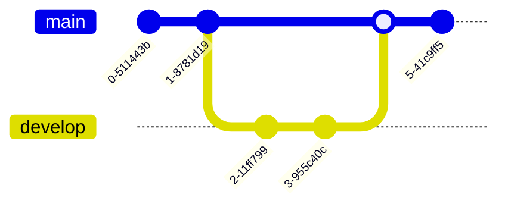

import { Steps, Callout } from 'nextra/components'

# Mermaid Diagrams

Create stunning visual diagrams directly in your notes using Mermaid.js syntax. Perfect for flowcharts, sequence diagrams, Gantt charts, and more—all rendered beautifully with automatic theme support.

<Callout type="info">
Mermaid diagrams automatically adapt to your theme (light/dark mode) for consistent, professional visualization.
</Callout>

## What is Mermaid?

[Mermaid](https://mermaid.js.org/) is a JavaScript-based diagramming tool that lets you create diagrams using text syntax. Instead of using complex diagramming software, you write simple text that describes your diagram, and Mermaid renders it beautifully.

### Why Use Mermaid in Lokus?

- **Text-based**: Diagrams are just text, making them version-controllable and searchable
- **Fast**: Create complex diagrams faster than with traditional diagramming tools
- **Consistent**: Automatic theme integration ensures diagrams match your notes
- **Portable**: Diagrams are stored as plain text in your markdown files
- **Professional**: Publication-ready visuals with minimal effort
- **Interactive**: Edit mode and view mode with fullscreen viewer

## Creating Your First Diagram

<Steps>

### Step 1: Insert a Mermaid Block

Use the slash command to insert a Mermaid diagram:

1. Type `/` to open the command menu
2. Search for "Mermaid"
3. Select "Mermaid Diagram"

Or use the code block syntax:

````markdown

````

### Step 2: Write Your Diagram Code

The Mermaid block opens in edit mode by default if empty. Enter your diagram code:

```
graph LR
    A[Write] --> B[Review]
    B --> C[Publish]
```

### Step 3: View Your Diagram

Press **Cmd/Ctrl + Enter** or click the **View** icon to render the diagram. Your text transforms into a beautiful visual:

```
┌─────────┐      ┌─────────┐      ┌─────────┐
│  Write  │ ───> │  Review │ ───> │ Publish │
└─────────┘      └─────────┘      └─────────┘
```

</Steps>

## Editing Diagrams

### Toggle Between Edit and View Modes

- **View Mode**: Double-click the diagram or click the pencil icon to enter edit mode
- **Edit Mode**: Press **Cmd/Ctrl + Enter** or click the eye icon to render the diagram
- **Quick Exit**: Click outside the diagram to save and exit edit mode

### Fullscreen Viewer

For complex diagrams, use the fullscreen viewer:

1. Click the **maximize icon** in the top-right corner of any rendered diagram
2. Pan, zoom, and explore your diagram in fullscreen
3. Press **ESC** or click the close button to return

<Callout type="tip">
The fullscreen viewer is perfect for presenting flowcharts during meetings or examining detailed diagrams.
</Callout>

## Diagram Types

Mermaid supports numerous diagram types. Here are the most commonly used in note-taking:

### 1. Flowcharts

Visualize processes, algorithms, and decision trees.


**Syntax:**

````markdown

````

**Direction options:**
- `graph TD` - Top Down
- `graph LR` - Left to Right
- `graph RL` - Right to Left
- `graph BT` - Bottom to Top

### 2. Sequence Diagrams

Document interactions, API flows, and communication patterns.


**Syntax:**

````markdown

````

### 3. Gantt Charts

Plan projects, track milestones, and visualize timelines.


**Syntax:**

````markdown

````

### 4. Class Diagrams

Document software architecture and object relationships.


**Syntax:**

````markdown

````

### 5. State Diagrams

Model system states and transitions.


**Syntax:**

````markdown

````

### 6. Entity Relationship Diagrams (ERD)

Design database schemas and data models.


**Syntax:**

````markdown

````

### 7. Pie Charts

Visualize proportions and distributions.


**Syntax:**

````markdown

````

### 8. Git Graphs

Document branching strategies and version history.



**Syntax:**

````markdown

````

## Theme Integration

Mermaid diagrams in Lokus automatically adapt to your active theme:

### Automatic Theme Switching

- **Light Mode**: Diagrams use clean, professional light colors
- **Dark Mode**: Diagrams automatically switch to dark-optimized colors
- **Custom Themes**: Diagrams inherit your custom theme's color variables

### How It Works

Lokus dynamically reads CSS custom properties from your theme and applies them to Mermaid:

- Background: `--bg`
- Primary elements: `--panel`
- Text: `--text`
- Borders: `--border`
- Edge labels: `--panel`

No manual configuration needed—diagrams always match your workspace aesthetics.

<Callout type="info">
When you switch themes, all Mermaid diagrams automatically re-render with the new theme colors.
</Callout>

## Error Handling

If there's a syntax error in your Mermaid code, Lokus displays a helpful error message:

```
⚠️ Mermaid Syntax Error:
Unexpected token on line 5
```

### Common Errors and Fixes

| Error | Cause | Fix |
|-------|-------|-----|
| "Unexpected token" | Invalid syntax | Check Mermaid syntax documentation |
| "Parse error" | Missing arrow or bracket | Verify all connections are properly formatted |
| "Unknown diagram type" | Typo in diagram declaration | Use valid types: `graph`, `sequenceDiagram`, `gantt`, etc. |

<Callout type="tip">
Keep the [Mermaid Live Editor](https://mermaid.live) open in a browser tab to test complex diagrams before adding them to your notes.
</Callout>

## Use Cases

### Academic Notes

- **Concept Maps**: Visualize relationships between ideas
- **Research Methodology**: Document study processes with flowcharts
- **Timeline**: Track historical events with Gantt charts

### Software Development

- **Architecture Diagrams**: Document system design with class or sequence diagrams
- **API Flows**: Map request/response cycles
- **Database Schema**: Design and document data models with ERDs

### Project Management

- **Process Documentation**: Create workflow diagrams
- **Project Timelines**: Plan milestones with Gantt charts
- **Decision Trees**: Map business logic and decisions

### Personal Knowledge Management

- **Habit Tracking**: Visualize habit formation cycles with state diagrams
- **Learning Paths**: Map skill dependencies with flowcharts
- **Goal Planning**: Break down objectives with hierarchical graphs

## Tips & Best Practices

### Keep It Simple

Start with simple diagrams and add complexity gradually. Overly complex diagrams are hard to maintain.

✅ **Good:**


❌ **Avoid:**


### Use Descriptive Labels

Make node labels clear and meaningful:

✅ `[User Authentication]`
❌ `[Step 1]`

### Add Comments

Document complex diagrams with markdown comments outside the Mermaid block:

```markdown
## System Architecture

The following diagram shows our microservices architecture:


Key components:
- **API Gateway**: Routes requests to appropriate services
- **Auth Service**: Handles authentication and authorization
- **User Service**: Manages user profiles and preferences
```

### Leverage Templates

Create template notes with common diagram structures for reuse:

```markdown
## Flowchart Template

```mermaid
graph TD
    Start[Start] --> Step1[Step 1]
    Step1 --> Decision{Decision?}
    Decision -->|Yes| Step2[Step 2]
    Decision -->|No| Step3[Step 3]
    Step2 --> End[End]
    Step3 --> End
```
```

## Keyboard Shortcuts

| Shortcut | Action |
|----------|--------|
| `/` + "mermaid" | Insert Mermaid diagram block |
| **Double-click** diagram | Enter edit mode |
| **Cmd/Ctrl + Enter** | Render diagram (in edit mode) |
| **Click maximize icon** | Open fullscreen viewer |
| **ESC** | Close fullscreen viewer |

## Advanced Features

### Subgraphs

Group related nodes together:

```mermaid
graph TB
    subgraph Frontend
        UI[User Interface]
        Router[Router]
    end
    subgraph Backend
        API[API]
        DB[(Database)]
    end
    UI --> Router
    Router --> API
    API --> DB
```

### Styling Nodes

Customize node appearance:

```mermaid
graph LR
    A[Normal] --> B[Important]
    B --> C[Critical]
    style B fill:#ffeb3b,stroke:#333,stroke-width:2px
    style C fill:#f44336,stroke:#333,stroke-width:4px,color:#fff
```

### Links and Click Events

While click events aren't interactive in static diagrams, you can document links:

```mermaid
graph LR
    A[Overview] --> B[Details]
    click B href "https://example.com/details" "View details"
```

## Performance Considerations

- **Large Diagrams**: Very complex diagrams (100+ nodes) may take longer to render
- **Multiple Diagrams**: Pages with many Mermaid diagrams may experience slower initial load
- **Fullscreen Viewer**: Use for large diagrams to improve performance by isolating rendering

<Callout type="warning">
If a diagram becomes too slow to render, consider splitting it into multiple smaller diagrams or simplifying the structure.
</Callout>

## Related Features

- [Code Blocks](/features/editor#code-blocks) - Syntax highlighting for code
- [Math Equations](/features/math) - Render mathematical notation with KaTeX
- [Tables](/features/editor#tables) - Create structured data displays
- [Images](/features/editor#images) - Embed visual content in notes

## Resources

- [Official Mermaid Documentation](https://mermaid.js.org/)
- [Mermaid Live Editor](https://mermaid.live) - Test diagrams online
- [Mermaid Syntax Cheatsheet](https://jojozhuang.github.io/tutorial/mermaid-cheat-sheet/)

---

Mermaid diagrams bring your notes to life with professional visualizations, making complex ideas clear and shareable. Start simple, experiment often, and watch your knowledge base transform into a visual thinking tool.
