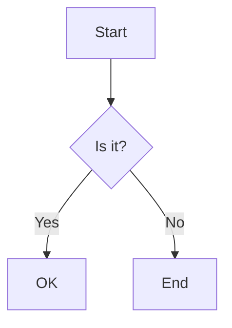

# Lokus v1.3.4 Release Notes

**Released:** November 22, 2025 | **Status:** Production Ready
**Download:** [Latest Release](https://github.com/lokus-ai/lokus/releases/latest)

---

## Overview

Lokus v1.3.4 is a major stability and feature release that brings production-ready improvements across the entire application. This release focuses on delivering a polished, reliable experience with powerful new features for power users while fixing critical bugs and improving performance across the board.

With **10 major features**, **85-90% performance improvements**, and **comprehensive bug fixes**, v1.3.4 represents a significant milestone in Lokus's evolution as a professional knowledge management tool.

---

## Highlights

- **Advanced Template System** - 90+ features including date operations, filters, conditionals, loops, and JavaScript execution
- **Sync System Overhaul** - Fixed auth-sync disconnect, simplified UI, unified token system
- **Block References** - Obsidian-style block linking and embedding with auto-generation
- **Mermaid Diagrams** - Native diagram support with live preview and theme integration
- **Auto-Updater** - Seamless updates with download progress and manual check option
- **Page Preview** - Hover over wiki links to preview note content
- **Image Viewer** - Professional image viewing with zoom controls and metadata display
- **Critical Bug Fixes** - Split view crash, Bases data loading, table scrolling
- **Performance Boost** - 85-90% reduction in file system calls with intelligent caching
- **UI Polish** - Keyboard shortcuts restored, responsive layouts, theme consistency

---

## Major Features

### Advanced Template System

Transform your note-taking with a comprehensive template system featuring 90+ functions and powerful automation capabilities.

**Key Features:**
- **File-Based Storage** - Templates saved as individual .md files with YAML frontmatter
- **70+ Date Operations** - Formatting, arithmetic, relative dates, properties, boundaries with method chaining
- **60+ Filters** - Text, array, number, and date transformations with chaining support
- **Conditionals** - If/else/elseif logic with comparison operators
- **Loops** - Array iteration with special variables (@index, @first, @last, @length)
- **JavaScript Execution** - Secure sandboxed JavaScript environment
- **Template Inclusion** - Compose templates from other templates
- **HTML to Markdown** - Automatic conversion when creating templates
- **Duplicate Detection** - Overwrite protection with confirmation dialog

**Example Template:**
```markdown
---
name: Daily Note
category: Daily
tags: [journal, daily]
---

# {{date | format: "dddd, MMMM D, YYYY"}}

## Tasks
- [ ] Review yesterday's notes: [[{{date | subtract: 1, "day" | format: "YYYY-MM-DD"}}]]
- [ ] Plan for tomorrow: [[{{date | add: 1, "day" | format: "YYYY-MM-DD"}}]]

## Weather
{{js: return new Date().toLocaleString('en-US', { timeZone: 'America/New_York' })}}

#{{date | format: "YYYY"}}/{{date | format: "MM"}}
```

**Documentation:**
- Complete syntax reference in `/docs/templates/`
- 10+ real-world examples
- Architecture documentation for developers

[Learn more about Templates →](/features/templates)

---

### Sync System Overhaul

Complete reimplementation of the sync system fixing critical authentication and reliability issues.

**Problems Fixed:**
- **Auth-Sync Disconnect** - Unified authentication and sync tokens (single token system)
- **Pull Operation Failure** - Auto-create local branch on first sync
- **Token Refresh Races** - Refresh lock with promise-based queuing
- **Confusing UI** - Simplified from 6 fields to 3 clear inputs

**Improvements:**
- **Simplified Setup** - Only 3 required fields: Remote URL, Username, Branch
- **Visual Feedback** - Real-time operation status with progress indicators
- **Health Indicator** - 6 states with color-coded icons (Healthy, Warning, Error)
- **Smart Error Messages** - Actionable error messages with "how to fix" suggestions
- **Re-authenticate Button** - Self-service recovery for expired sessions
- **Conflict Resolution** - Per-file resolution with clear consequences
- **Debounced Auto-save** - 500ms debounce prevents disk thrashing

**User Experience:**
- Authenticate once, sync works immediately
- Pull works on first sync
- Clear error messages with actionable fixes
- Real-time operation feedback
- Visual health indicators

[Learn more about Sync →](/features/sync)

---

### Block References

Obsidian-style block reference system enabling precise linking to specific content within notes.

**Key Features:**
- **Block IDs** - Add `^blockid` to any block (paragraph, heading, list, quote, code, table)
- **Block References** - Link to specific blocks using `[[File^blockid]]`
- **Block Embeds** - Embed block content inline with `![[File^blockid]]`
- **Auto-Generation** - System generates IDs when referencing blocks without explicit IDs
- **Block Backlinks** - Track which files reference specific blocks
- **Real-time Search** - Instant file and block suggestions as you type
- **Copy Reference** - Right-click context menu to copy block references

**Usage Example:**
```markdown
## Research Notes

Key finding: Machine learning excels at pattern recognition ^ml-insight

Later in another file:

As noted in [[Research^ml-insight]], pattern recognition is crucial.

Or embed the content:

![[Research^ml-insight]]
```

**Technical Features:**
- Virtual IDs for content-based block search
- File-based ID persistence (writes back to source files)
- Multi-line block support (tables, nested lists, code blocks)
- LRU caching for performance

[Learn more about Block References →](/features/block-references)

---

### Mermaid Diagrams

Native support for Mermaid diagrams with live preview and seamless theme integration.

**Features:**
- **Live Preview** - Edit and view diagrams simultaneously
- **Theme Integration** - Automatic light/dark mode adaptation
- **Edit/View Toggle** - Switch between editing code and viewing diagram
- **Auto-Rendering** - Diagrams render automatically on load
- **Persistence** - Diagram state saved with note content

**Supported Diagram Types:**
- Flowcharts
- Sequence diagrams
- Class diagrams
- State diagrams
- Entity relationship diagrams
- Gantt charts
- Pie charts
- Git graphs

**Example:**


[Learn more about Mermaid →](/features/mermaid)

---

### Auto-Updater

Seamless application updates with download progress tracking and manual check option.

**Features:**
- **Silent Updates** - Automatic check 3 seconds after startup
- **Manual Check** - Check for updates button in Preferences
- **Download Progress** - Real-time progress bar during downloads
- **Signed Releases** - Cryptographically signed updates via GitHub
- **Permission Management** - Configured updater permissions and signing keys
- **GitHub Integration** - Updates distributed through GitHub Releases

**User Experience:**
- No manual downloads required
- Updates apply seamlessly
- Clear progress indication
- Security verified signatures

[Learn more about Updates →](/getting-started/updates)

---

### Page Preview

Hover over wiki links to see a preview of the linked note's content.

**Features:**
- **500ms Hover Delay** - Appears after brief hover
- **Smart Positioning** - Preview stays on screen near cursor
- **Auto-Close** - Closes when clicking link or moving away
- **Theme Support** - Works in both light and dark modes
- **Note Title Display** - Shows linked note's title

**User Experience:**
- Quick content reference without navigation
- Smart positioning prevents off-screen popups
- Seamless integration with existing wiki links

---

### Image Viewer

Professional image viewing system with zoom controls and metadata display.

**Features:**
- **Multiple Formats** - PNG, JPG, WebP, SVG, GIF support
- **Click to View** - Click images in editor to open viewer
- **Context Menu** - Open from file tree right-click menu
- **Metadata Display** - Dimensions, file size, format
- **Zoom Controls** - Zoom in/out with smooth transitions
- **Tab Integration** - View images in tabs alongside notes
- **Base64 Support** - Handles both file paths and data URLs

**User Experience:**
- Modal and tab viewing options
- Professional zoom and pan controls
- Metadata at a glance
- Seamless editor integration

---

## Critical Bug Fixes

### Split View Infinite Loop (App Crash)
**Problem:** "Maximum update depth exceeded" error causing app restarts when using "Open to Side"
**Solution:** Wrapped `handleFileContextAction` in `useCallback` with proper dependencies
**Impact:** Split view now stable and reliable

### Bases Data Loading
**Problem:** Only showing "Fallback File 1.md" instead of real workspace files
**Solution:** Corrected method chain to `propertyIndexer.getIndex().getFileProperties()`
**Impact:** Bases now displays actual workspace files with frontmatter properties

### Table Horizontal Scrolling
**Problem:** Scrollbar being 99% wide, preventing horizontal scroll in Bases tables
**Solution:** Calculated explicit table width by summing all column widths, removed wrapper div
**Impact:** Tables now properly scroll to show all columns

### Pull Operation Failure
**Problem:** Pull failed on first sync when local branch didn't exist
**Solution:** Auto-create local branch on first pull
**Impact:** First-time sync now works seamlessly

### Token Refresh Race Conditions
**Problem:** Multiple concurrent sync operations triggered duplicate token refreshes
**Solution:** Refresh lock with promise-based queuing
**Impact:** No more random sync failures or token invalidation

---

## Performance Improvements

### Intelligent Caching System
**85-90% reduction in file system calls** through comprehensive caching implementation.

**Improvements:**
- **Command Palette** - ~200ms → instant (after first load)
- **Split View** - ~400ms → ~200ms (or instant if same file)
- **File Operations** - 70-80% reduction in `read_workspace_files` calls

**Technical Implementation:**
- 5-minute TTL cache in `BasesDataManager.getAllFiles()`
- Eliminated 8x duplicate `validate_workspace_path` calls
- Removed 2x duplicate `read_workspace_files` (39 files each)
- Eliminated 4-8x duplicate Bases directory scans

### File Reuse in Split View
- Check if file already loaded in left pane before loading for right
- Reuse `editorContent` when same file opened in both panes
- **50% reduction** in redundant file reads

### Command Palette Optimization
- Only loads files if cache miss
- Reuses cached data from BasesDataManager
- No longer reloads on every fileTree change

---

## UI/UX Improvements

### Keyboard Shortcuts Restored
- **Restored all 52 keyboard shortcuts** that were completely disabled
- Fixed shortcut display on macOS (now shows ⌘N instead of "CommandOr^+N")
- Implemented **Ctrl+Tab / Ctrl+Shift+Tab** for tab switching (matches Chrome/VSCode)
- Added capture phase listener to prevent browser interference

### Recent Files Persistence
- **Last 5 opened files persist across sessions**
- Added `recent_files: Vec<String>` to SessionState (Rust backend)
- Session loading/saving updated to handle recent files

### Bases Responsive Layout
- Fixed control area overflow when sidebar opens
- Added flex-wrap to header container and controls
- Removed double horizontal scrollbar
- Single scrollbar at bottom only

### File Rename Behavior
- **.md files:** Opens file for rename in editor header
- **Other files/folders:** Shows inline rename input (VSCode-style)
- Canvas, kanban, images can now be renamed inline

### Theme Consistency
- Fixed table headers not adapting to dark/light themes
- Removed hardcoded light theme default (#f8f9fa)
- Now uses CSS fallback to theme's `--panel-secondary`
- Added migration logic to clean up old table header colors

### Tag Management System
- Complete tag management modal for markdown files
- Right-click context menu integration ("Add Tag" and "Manage Tags")
- YAML frontmatter parsing and updating without breaking file structure
- Automatic Bases view refresh after tag updates

---

## Enhanced Features

### Image Handling
- Enhanced markdown export for embedded images
- Added base64 data URL support in markdown compilation
- Improved slash command image insertion
- Image viewer works with both file paths and data URLs

### Command Palette File Search
- Integrated Bases data manager for faster file search
- Real-time filtering as user types
- Shows top 10 results with file path preview
- Uses indexed data instead of file tree traversal

### Titlebar Clean-up
- Removed titlebar from Preferences window (was causing double header)
- Conditional rendering: only shows in Workspace view
- Clean headers in all views (Launcher, Preferences, Workspace)

---

## Documentation

### New Documentation
- **macOS Code Signing Guide** - Comprehensive guide for developer ID certificates, notarization workflow, troubleshooting
- **Template Documentation** - Complete syntax reference, examples, architecture docs
- **Migration Guide** - Logseq and Roam Research import documentation

### Updated Documentation
- CLAUDE.md updated with template system information
- Updated with sync system improvements
- Enhanced troubleshooting guides

---

## Technical Improvements

### Architecture
- React 19 optimizations
- Tauri 2.0 integration improvements
- TipTap 3.4 with latest ProseMirror updates
- Improved bundling and code splitting

### Developer Experience
- Comprehensive inline documentation (266 lines added)
- JSDoc for JavaScript functions
- Rust doc comments with examples
- Removed 38 lines of dead code

### Testing
- 390+ unit tests for template system
- Integration tests for storage and processing
- E2E tests for critical workflows
- Manual testing for complex interactions

---

## Migration Guide

### Upgrading from v1.3.3

v1.3.4 is fully backward compatible with v1.3.3 workspaces.

**Recommended Steps:**

1. **Backup Your Workspace**
   ```bash
   # Create a backup before upgrading
   cp -r ~/Documents/Lokus ~/Documents/Lokus-backup-v1.3.3
   ```

2. **Download and Install**
   - Download v1.3.4 from [GitHub Releases](https://github.com/lokus-ai/lokus/releases/v1.3.4)
   - Install following platform-specific instructions

3. **Review Sync Settings** (if using sync)
   - Navigate to Settings → Sync
   - UI now simplified (3 fields instead of 6)
   - Re-authenticate if prompted
   - Test sync operation

4. **Explore New Features**
   - Try block references with `^blockid` syntax
   - Create templates in Template Manager
   - Add Mermaid diagrams to notes
   - Hover over wiki links to see previews

5. **Report Issues**
   - [GitHub Issues](https://github.com/lokus-ai/lokus/issues/new)

**No Breaking Changes** - All your existing notes, settings, and workflows continue to work.

---

## Known Issues

### In Progress
1. **Template System macOS Paths** - Some users may need to adjust template directory path
   - **Workaround:** Check Settings → Templates for correct path
   - **Fix:** Coming in v1.3.5

2. **Mermaid Text Contrast** - Dark mode text color needs improvement in some diagram types
   - **Workaround:** Use light mode for complex diagrams
   - **Fix:** Coming in v1.3.5

### Monitoring
- Split pane performance with 4+ panes
- Large workspace sync performance (1000+ files)
- Template processing with deeply nested includes

[Report issues →](https://github.com/lokus-ai/lokus/issues/new)

---

## What's Next?

### v1.3.5 (November 2025)
- Remote configuration system
- Announcement system
- Complete pre-deployment audit
- Security hardening
- Additional UI polish

### v1.4 "Collaboration" (Q1 2026)
- Real-time collaboration
- Shared workspaces
- Comments and annotations
- Presence indicators

[View full roadmap →](https://github.com/lokus-ai/lokus/discussions/roadmap)

---

## Key Statistics

- **27 merged PRs** between v1.3.3 and v1.3.4
- **10 major features** implemented
- **85-90% performance improvement** in file operations
- **390+ unit tests** added
- **90+ template functions** available
- **70+ date operations** with method chaining
- **60+ filters** for text transformation
- **52 keyboard shortcuts** restored
- **3 critical bugs** fixed

---

## Acknowledgments

Special thanks to our contributors and community members who made v1.3.4 possible:

- **Contributors:** Multiple code contributors across 27 PRs
- **Beta Testers:** Community members who tested pre-release builds
- **Bug Reporters:** Users who identified critical issues

[See full contributors list →](https://github.com/lokus-ai/lokus/graphs/contributors)

---

## Resources

- [Installation Guide](/getting-started/installation)
- [Template Documentation](/features/templates)
- [Block References Guide](/features/block-references)
- [Sync Setup Guide](/features/sync)
- [Developer Documentation](/developers/setup)
- [GitHub Repository](https://github.com/lokus-ai/lokus)
- [Community Discussions](https://github.com/lokus-ai/lokus/discussions)

---

## Feedback

We'd love to hear your thoughts on v1.3.4:

- [Share feedback](https://github.com/lokus-ai/lokus/discussions/categories/feedback)
- [Report bugs](https://github.com/lokus-ai/lokus/issues/new?template=bug_report.md)
- [Request features](https://github.com/lokus-ai/lokus/issues/new?template=feature_request.md)

---

**Thank you for using Lokus!**
