import { Steps } from 'nextra/components'

# Creating Mermaid Diagrams

Visualize ideas, processes, and relationships with Mermaid diagrams directly in your notes. Create flowcharts, sequence diagrams, Gantt charts, and more using simple text-based syntax.

**Time Estimate:** 20 minutes

## What You'll Learn

By the end of this tutorial, you'll be able to:
- Create flowcharts to visualize processes
- Build sequence diagrams for interactions
- Design Gantt charts for project planning
- Use class diagrams and entity-relationship diagrams
- Customize diagram themes and styling
- Troubleshoot common Mermaid issues

## Prerequisites

- Lokus v1.3.5 or later
- Basic understanding of flowcharts (helpful but not required)
- 20 minutes of focused time

---

<Steps>

### Step 1: Your First Mermaid Diagram

Let's start by creating a simple flowchart.

#### 1.1 Create a Test Note

1. Create a new note called `Mermaid Tutorial - Practice`
2. This is where we'll practice creating diagrams

#### 1.2 Insert a Mermaid Block

Type ``mm and press Space or Enter. This creates a Mermaid diagram block.

Alternatively, you can use the code fence syntax:
````markdown
```mermaid
[diagram code here]
```
````

#### 1.3 Your First Flowchart

Let's create a simple morning routine flowchart:

````markdown
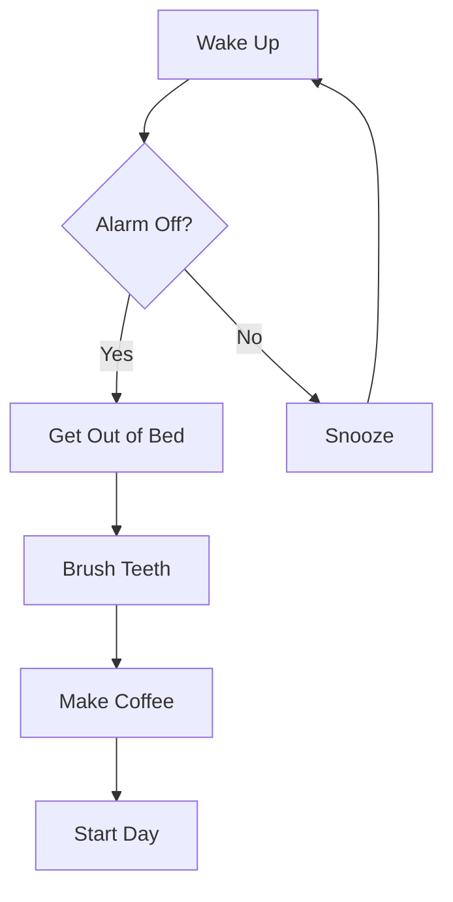
````

This creates a top-to-bottom flowchart with:
- Rectangles `[]` for steps
- Diamonds `{}` for decisions
- Arrows `-->` for flow
- Labels `|text|` on arrows

> **Note:**
**Success:** You've created your first Mermaid diagram! The diagram updates in real-time as you type.


#### 1.4 Diagram Direction

Change the flow direction:

```mermaid
graph LR  // Left to Right
graph TD  // Top to Bottom
graph BT  // Bottom to Top
graph RL  // Right to Left
```

Try changing `TD` to `LR` in your diagram and see how it changes!

---

### Step 2: Flowchart Shapes and Connections

Let's explore different shapes and connection types.

#### 2.1 Node Shapes

Create a new diagram showcasing all shapes:

````markdown
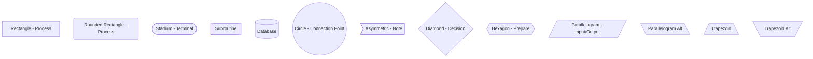
````

#### 2.2 Connection Types

````markdown
```mermaid
graph LR
    A -->|Solid Arrow| B
    C ---|Solid Line| D
    E -.->|Dotted Arrow| F
    G -.-|Dotted Line| H
    I ==>|Thick Arrow| J
    K ==|Thick Line| L
```
````

#### 2.3 Practical Example: Decision Process

Let's create a bug fix workflow:

````markdown
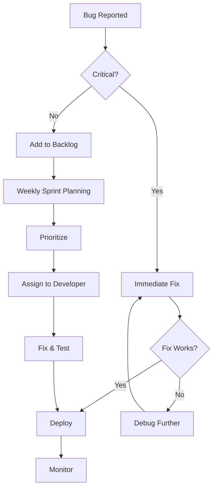
````

> **Note:**
**Pro Tip:** Use descriptive node IDs (A, B, C) consistently. You can reference the same node multiple times to create complex flows.


---

### Step 3: Sequence Diagrams

Sequence diagrams show interactions between actors or systems over time.

#### 3.1 Basic Sequence Diagram

Create a user authentication flow:

````markdown
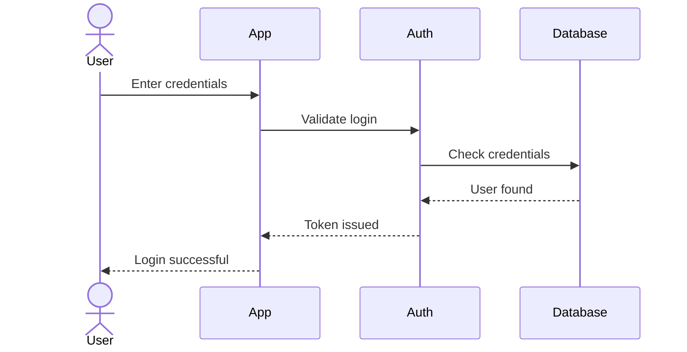
````

#### 3.2 Sequence Diagram Elements

````markdown
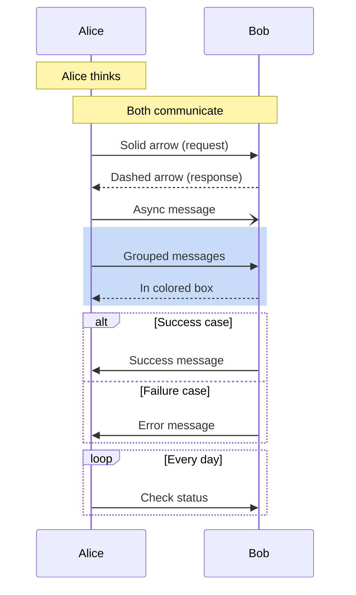
````

#### 3.3 Practical Example: API Call

````markdown
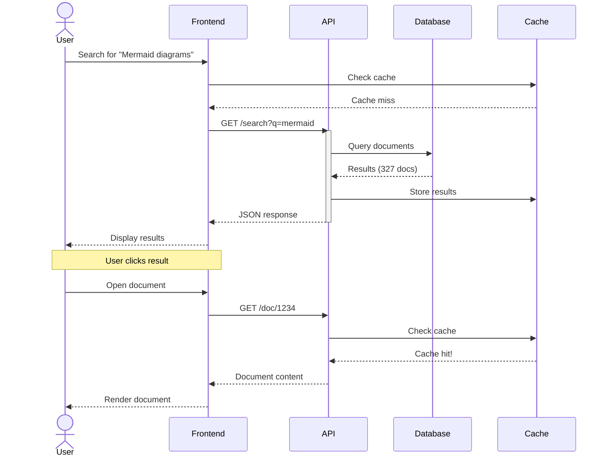
````

---

### Step 4: Gantt Charts for Projects

Gantt charts visualize project timelines and dependencies.

#### 4.1 Basic Gantt Chart

Create a simple project timeline:

````markdown
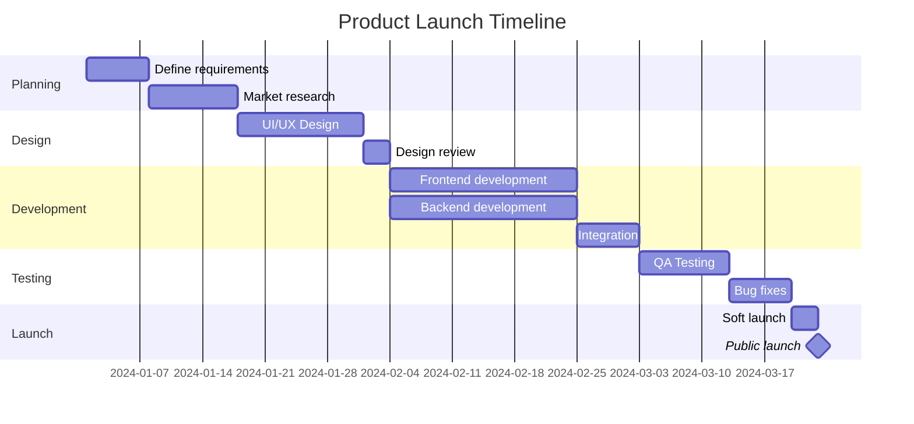
````

#### 4.2 Gantt Chart with Task States

````markdown
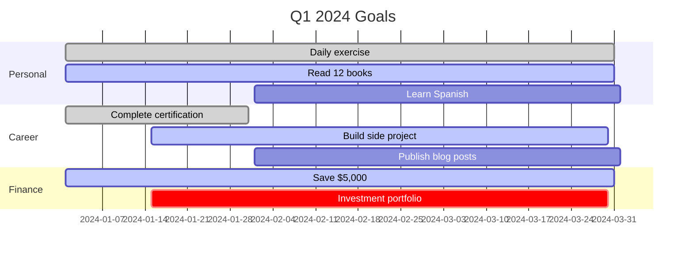
````

Task states:
- `done` - Completed (green)
- `active` - In progress (blue)
- `crit` - Critical path (red)
- No marker - Not started (gray)

---

### Step 5: Other Diagram Types

Lokus supports many Mermaid diagram types. Let's explore more.

#### 5.1 Class Diagram

Perfect for software architecture:

````markdown
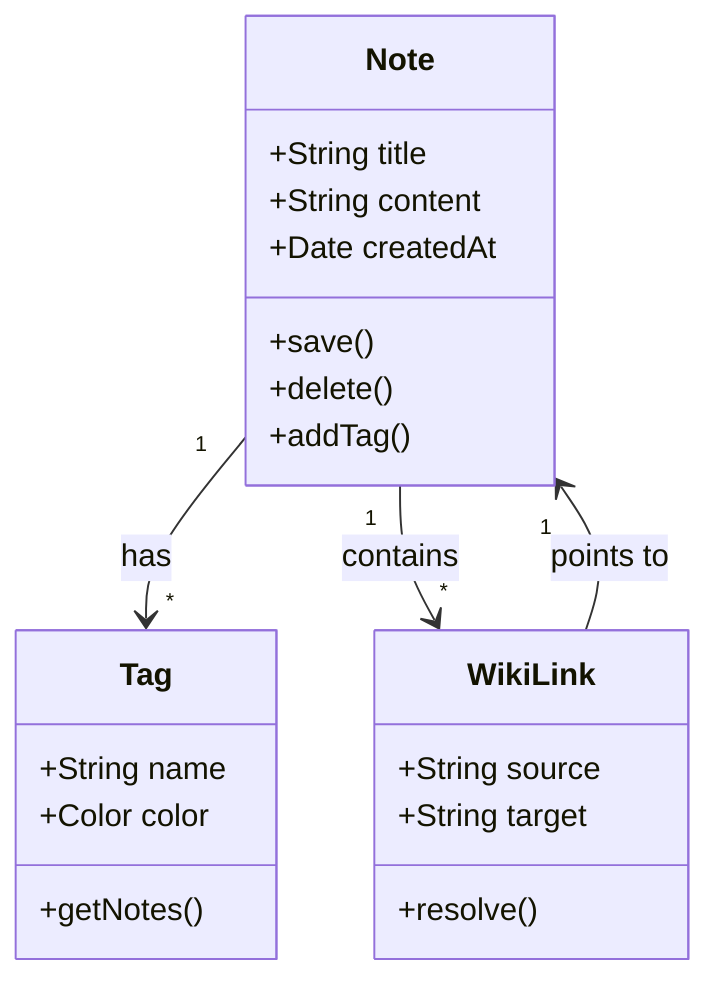
````

#### 5.2 Entity-Relationship Diagram

For database design:

````markdown
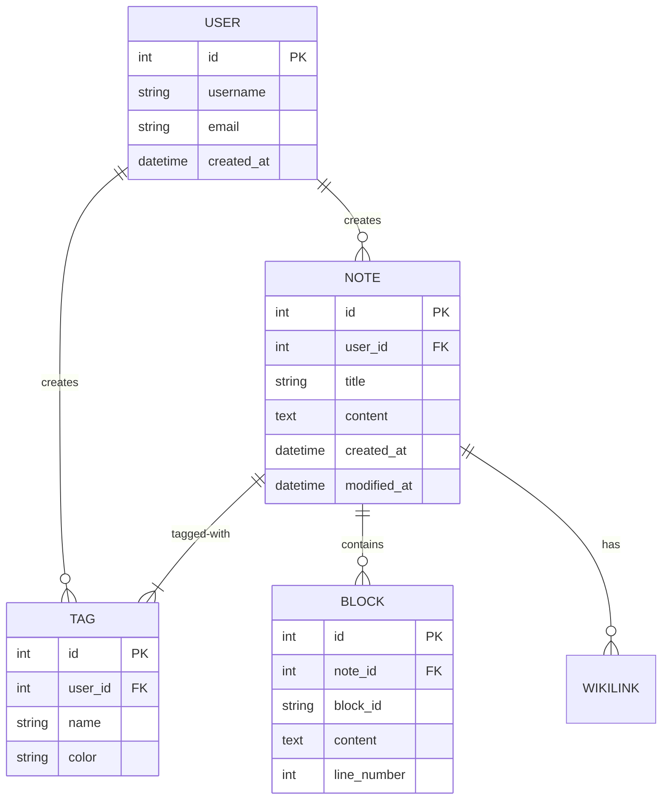
````

#### 5.3 State Diagram

For workflows and states:

````markdown
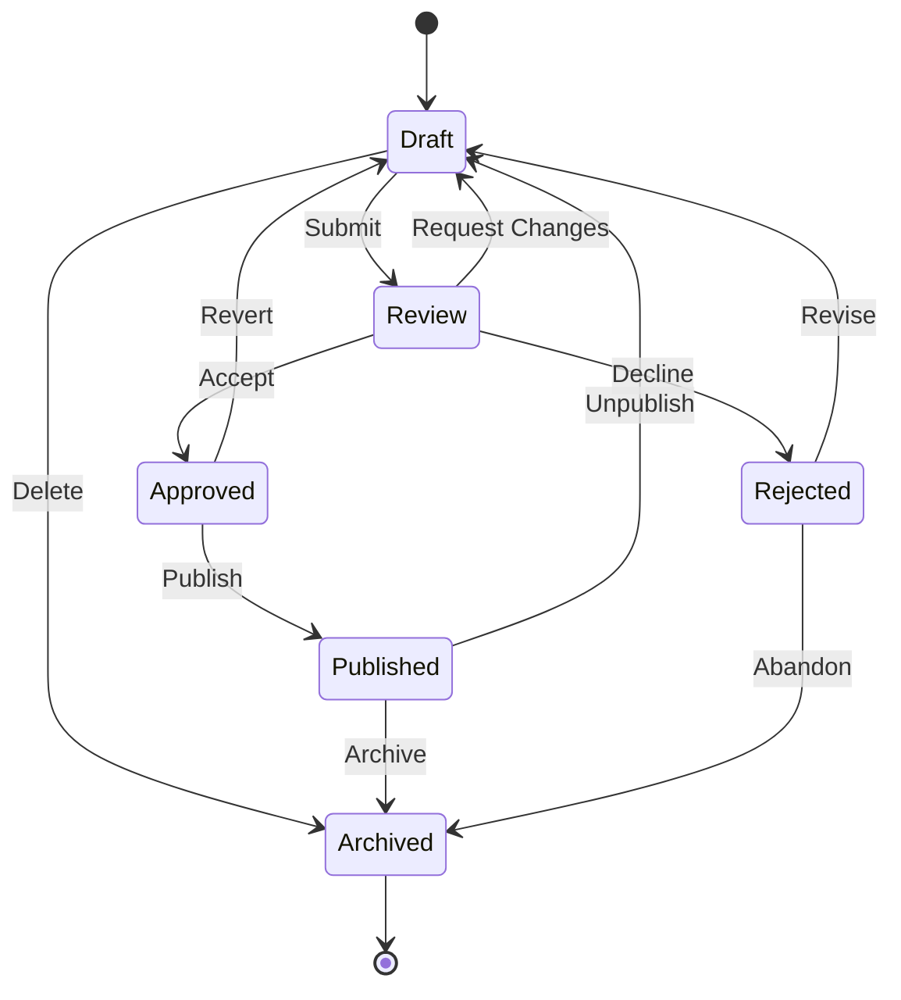
````

#### 5.4 Pie Chart

For data visualization:

````markdown
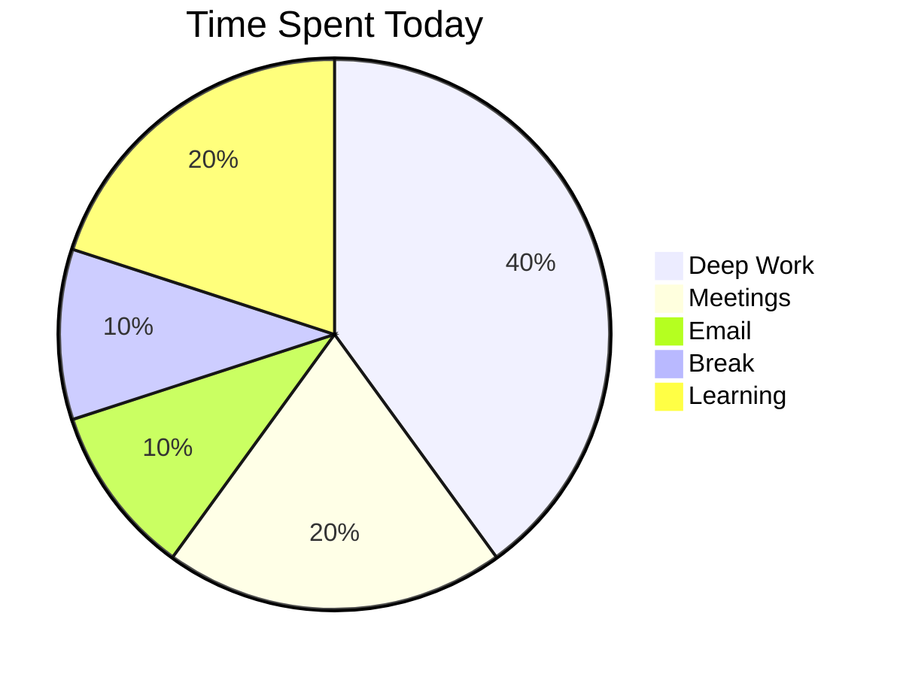
````

---

### Step 6: Styling and Theming

Customize your diagrams to match your aesthetic.

#### 6.1 Inline Styling

````markdown
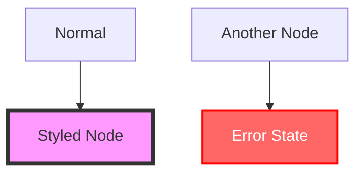
````

#### 6.2 Class Styling

````markdown
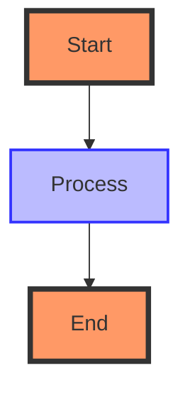
````

#### 6.3 Theme Configuration

Lokus respects your system theme (light/dark mode) and applies appropriate Mermaid themes automatically.

You can also set themes explicitly:

````markdown
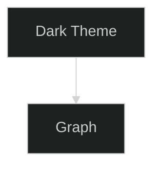
````

Available themes:
- `default` - Standard theme
- `dark` - Dark mode
- `forest` - Green palette
- `neutral` - Minimal colors
- `base` - Minimal styling

---

### Step 7: Real-World Applications

Let's apply Mermaid diagrams to practical scenarios.

#### 7.1 Project Planning

Create `Project - Website Redesign`:

````markdown
# Website Redesign Project

## Timeline

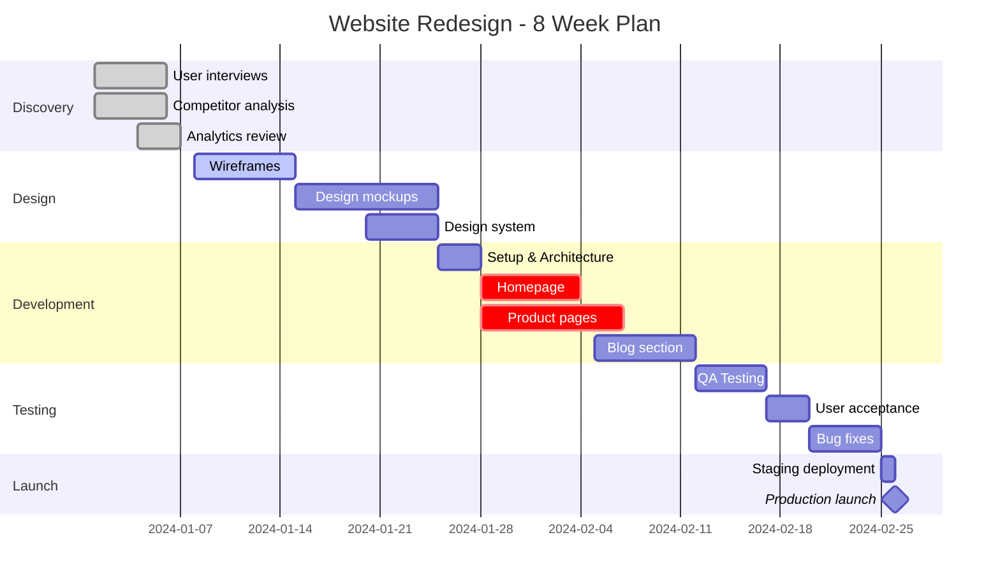

## Decision Flow

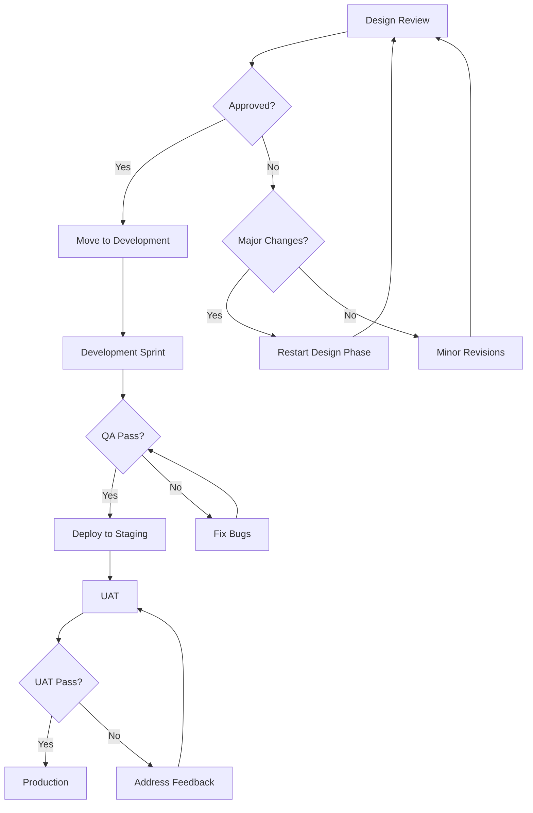

## System Architecture

```mermaid
graph LR
    User[User Browser]
    CDN[CDN]
    LB[Load Balancer]
    Web1[Web Server 1]
    Web2[Web Server 2]
    API[API Server]
    DB[(Database)]
    Cache[(Redis Cache)]

    User --> CDN
    CDN --> LB
    LB --> Web1
    LB --> Web2
    Web1 --> API
    Web2 --> API
    API --> Cache
    API --> DB
```
````

#### 7.2 Learning Workflow

Create `Learning - React Mastery`:

````markdown
# React Mastery Learning Path

## Learning Sequence

```mermaid
graph TD
    A[JavaScript Fundamentals] --> B[ES6+ Features]
    B --> C[React Basics]
    C --> D[Components & Props]
    D --> E[State & Lifecycle]
    E --> F[Hooks]
    F --> G{Choose Path}
    G -->|State Management| H[Redux/Zustand]
    G -->|Routing| I[React Router]
    G -->|Styling| J[CSS-in-JS]
    H --> K[Advanced Patterns]
    I --> K
    J --> K
    K --> L[Testing]
    L --> M[Performance Optimization]
    M --> N[Production Ready]
```

## Daily Practice Schedule

```mermaid
gantt
    title 30-Day React Learning Plan
    dateFormat YYYY-MM-DD

    section Week 1: Basics
    JavaScript review     :done, w1a, 2024-01-01, 4d
    React fundamentals    :done, w1b, 2024-01-05, 3d

    section Week 2: Components
    Component patterns    :active, w2a, 2024-01-08, 4d
    Props & state         :w2b, 2024-01-12, 3d

    section Week 3: Hooks
    useState & useEffect  :w3a, 2024-01-15, 3d
    Custom hooks          :w3b, 2024-01-18, 4d

    section Week 4: Advanced
    Context API           :w4a, 2024-01-22, 3d
    Performance          :w4b, 2024-01-25, 2d
    Build project        :crit, w4c, 2024-01-27, 4d
```
````

#### 7.3 Meeting Notes

Create `Meeting - Sprint Planning`:

````markdown
# Sprint Planning - January 15, 2024

## Attendees
- Sarah (PM)
- Mike (Dev Lead)
- Lisa (Design)
- Tom (QA)

## Sprint Flow

```mermaid
graph LR
    A[Backlog Review] --> B[Story Estimation]
    B --> C[Sprint Commitment]
    C --> D[Task Breakdown]
    D --> E[Assignment]
    E --> F[Sprint Start]
```

## User Story Flow

```mermaid
stateDiagram-v2
    [*] --> Backlog
    Backlog --> Todo : Sprint Planning
    Todo --> InProgress : Developer Starts
    InProgress --> CodeReview : PR Created
    CodeReview --> InProgress : Changes Requested
    CodeReview --> Testing : Approved
    Testing --> InProgress : Bug Found
    Testing --> Done : Tests Pass
    Done --> [*]
```

## This Sprint Timeline

```mermaid
gantt
    title Sprint 42 - Jan 15-29
    dateFormat YYYY-MM-DD

    section Backend
    API endpoints        :a1, 2024-01-15, 5d
    Database migration   :a2, 2024-01-18, 3d

    section Frontend
    Dashboard UI         :b1, 2024-01-15, 7d
    Data visualization   :b2, 2024-01-20, 5d

    section Testing
    Integration tests    :c1, 2024-01-23, 3d
    Regression testing   :c2, 2024-01-26, 3d
```
````

---

### Step 8: Troubleshooting

Common issues and solutions.

#### Problem: Diagram Not Rendering

**Symptom:** Shows "Diagram render error" or code instead of diagram

**Solutions:**
1. Check syntax - Mermaid is strict about formatting
2. Verify diagram type is correct (graph, sequenceDiagram, gantt, etc.)
3. Look for missing quotes on labels with spaces
4. Check for proper line endings
5. Validate syntax at [mermaid.live](https://mermaid.live)

#### Problem: Arrows Not Connecting

**Symptom:** Nodes appear but arrows are missing

**Solutions:**
```mermaid
// Wrong: No arrow
A B

// Wrong: Invalid arrow
A -> B

// Correct:
A --> B
A --- B
A -.-> B
```

#### Problem: Node Text Has Issues

**Symptom:** Text cut off or improperly displayed

**Solutions:**
```mermaid
// Spaces in text need quotes
A["Text with spaces"] --> B

// Special characters need quotes
C["Text: with special (chars)"] --> D

// Long text
E["This is a very long text<br/>that spans multiple lines"] --> F
```

#### Problem: Gantt Chart Date Issues

**Symptom:** Tasks not showing or in wrong order

**Solutions:**
```mermaid
gantt
    // Always set date format first
    dateFormat YYYY-MM-DD

    // Use consistent date format
    Task 1    :a1, 2024-01-01, 7d
    Task 2    :a2, after a1, 5d

    // Critical: dependencies must exist
    Task 3    :a3, after a1 a2, 3d
```

#### Problem: Styling Not Working

**Symptom:** Style changes don't apply

**Solutions:**
```mermaid
graph TD
    A[Node]
    B[Styled Node]

    // Style must come AFTER node definition
    style B fill:#f96

    // Class must be defined before use
    classDef myClass fill:#bbf
    C[Class Node]:::myClass
```

---

</Steps>

## What You've Built

Congratulations! You've mastered Mermaid diagrams in Lokus. You can now:

- Create flowcharts for processes and decisions
- Build sequence diagrams for interactions
- Design Gantt charts for project timelines
- Use class, ER, and state diagrams
- Customize diagram styling and themes
- Apply diagrams to real-world scenarios

## Diagram Type Quick Reference

| Diagram Type | Use Case | Syntax Start |
|--------------|----------|--------------|
| **Flowchart** | Processes, decisions | `graph TD` |
| **Sequence** | Interactions, API calls | `sequenceDiagram` |
| **Gantt** | Project timelines | `gantt` |
| **Class** | Software architecture | `classDiagram` |
| **ER** | Database design | `erDiagram` |
| **State** | State machines, workflows | `stateDiagram-v2` |
| **Pie** | Data proportions | `pie title "Title"` |

## Next Steps

### Continue Learning

- **Next Tutorial:** [Template Workflows](/tutorials/template-workflows) - Automate diagram creation with templates
- **Related:** [Using Block References](/tutorials/using-block-references) - Link to specific diagram blocks
- **Advanced:** [Project Management](/tutorials/project-management) - Complete PM workflow with diagrams

### Practice Exercises

1. **Personal Workflow:** Create a flowchart of your morning routine or work process
2. **Learning Path:** Design a Gantt chart for learning a new skill over 30 days
3. **System Design:** Document a software system with class and sequence diagrams
4. **Decision Making:** Build a decision tree for a complex choice you're facing

### Explore Features

- [Canvas](/features/canvas) - Create visual board layouts
- [Graph View](/features/graph) - Visualize note connections
- [Templates](/features/templates) - Create diagram templates

---

## Summary

In this tutorial, you learned:

- How to insert Mermaid diagrams with ``mm or code fences
- Creating flowcharts with various shapes and connections
- Building sequence diagrams for interactions
- Designing Gantt charts for project planning
- Using class, ER, state, and pie chart diagrams
- Customizing diagram styling and themes
- Real-world applications in projects, learning, and meetings
- Troubleshooting common Mermaid issues

Mermaid diagrams transform your notes from text-only to rich visual documents. They're perfect for planning, documentation, and visual thinking.

Happy diagramming!

---

**Resources:**
- [Official Mermaid Documentation](https://mermaid.js.org/)
- [Mermaid Live Editor](https://mermaid.live) - Test diagrams online
- [Mermaid Diagram Examples](/examples/mermaid-gallery)

**Estimated Completion Time:** 20 minutes
**Difficulty:** Beginner
**Version:** Lokus v1.3.5+
**Last Updated:** November 2024
