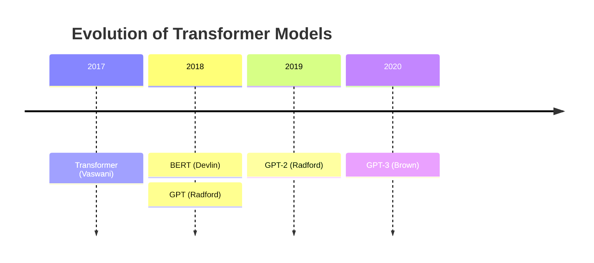

# Research Workflow with Multimedia

Transform your research process with Lokus multimedia capabilities. Learn to extract text from images with OCR, process PDF research papers, organize media in galleries, and seamlessly link media to your notes.

## What You'll Learn

By the end of this tutorial, you'll be able to:
- Use OCR to extract text from images and screenshots
- Process PDF research papers and extract content
- Organize research media in visual galleries
- Link images and PDFs to your notes effectively
- Build a comprehensive multimedia research library
- Search and filter your media collection
- Extract metadata from documents
- Create visual research workflows

## Prerequisites

- Completed [Building Your First Workspace](/tutorials/first-workspace) or familiar with Lokus
- Tesseract OCR installed (for text extraction from images)
- Research materials (PDFs, images, screenshots)
- 40 minutes of focused time

## Time Estimate

**40 minutes** - Build a complete multimedia research system

---

## Understanding Multimedia in Research

Before diving in, let's understand how multimedia enhances research.

### Why Use Multimedia in Research?

Traditional research workflows focus on text, but modern research includes:

- **Screenshots** from articles, presentations, and websites
- **PDF papers** that need text extraction and analysis
- **Diagrams and charts** that convey complex information
- **Scanned documents** that need OCR for searchability
- **Images** that illustrate concepts and findings
- **Annotated visuals** that capture insights

### What Lokus Multimedia Offers

**OCR (Optical Character Recognition):**
- Extract text from images and screenshots
- Multi-language support (100+ languages)
- Batch processing for multiple files
- Automatic text extraction workflow

**PDF Processing:**
- Extract full text from research papers
- Parse document metadata (title, author, dates)
- Detect document structure (sections, citations)
- Page-by-page content analysis

**Media Library:**
- Visual gallery with grid and list views
- Advanced search and filtering
- Automatic file classification
- Thumbnail generation with caching
- Metadata extraction (dimensions, size, dates)
- Deduplication (SHA256 hash-based)

**Integration:**
- Link media directly to notes
- Embed images in research notes
- Reference PDFs with citations
- Visual knowledge graph

> **Note:**
> **Info:** The multimedia library (v1.3.4+) is an experimental feature. Backend is fully functional, with UI integration actively being enhanced.


---

## Step 1: Setting Up Your Multimedia Environment

Let's prepare Lokus and your system for multimedia research.

### 1.1 Install Tesseract OCR

Tesseract is required for extracting text from images.

**macOS:**
```bash
# Using Homebrew
brew install tesseract

# With additional language packs
brew install tesseract-lang
```

**Linux:**
```bash
# Ubuntu/Debian
sudo apt-get install tesseract-ocr

# With language packs
sudo apt-get install tesseract-ocr-all
```

**Windows:**
1. Download from [GitHub](https://github.com/UB-Mannheim/tesseract/wiki)
2. Run installer
3. Add to PATH: `C:\Program Files\Tesseract-OCR`

**Verify Installation:**
```bash
tesseract --version
```

Should output version info (5.0+).

### 1.2 Configure Lokus Multimedia Settings

1. Open **Settings** (Cmd/Ctrl + ,)
2. Navigate to **Multimedia** section
3. Configure:
   - **Media folder:** `Media/` (relative to workspace)
   - **Thumbnail size:** 200px (default)
   - **Auto-generate thumbnails:** ON
   - **OCR language:** eng (English) or your preferred language
   - **Tesseract path:** Auto-detected or manual path

**OCR Language Codes:**
- `eng` - English
- `fra` - French
- `deu` - German
- `spa` - Spanish
- `chi_sim` - Chinese Simplified
- `jpn` - Japanese

Multiple languages: `eng+fra+deu`

### 1.3 Create Media Organization Structure

Set up folders for organized media storage:

```
Workspace/
├── Media/
│   ├── Screenshots/       # Quick captures from web/apps
│   ├── Papers/           # Research PDFs
│   ├── Diagrams/         # Charts, graphs, visualizations
│   ├── Scans/           # Scanned documents needing OCR
│   ├── Images/          # General images
│   └── Processed/       # OCR-processed files
├── Research/            # Research notes
├── Literature/          # Literature notes
└── Projects/           # Project notes
```

> **Note:**
> **Pro Tip:** Use descriptive folder names. The media library automatically scans and classifies files, but good organization helps you find media faster.


---

## Step 2: Working with OCR for Text Extraction

Learn to extract searchable text from images.

### 2.1 Extract Text from a Single Image

**Use Case:** You screenshotted a quote from an article.

**Steps:**

1. **Save image** to `Media/Screenshots/`
   - Example: `Media/Screenshots/research-quote-2025-11-12.png`

2. **Open Media Library**
   - Sidebar → Media Library icon
   - Or Command Palette: "Open Media Library"

3. **Find your image**
   - Browse or search by filename
   - Thumbnail preview shows content

4. **Run OCR**
   - Right-click image → "Extract Text (OCR)"
   - Or select image → Click "OCR" button
   - Processing indicator appears

5. **View extracted text**
   - Text appears in side panel
   - Copy to clipboard or save to note

**Example:**

Screenshot contains:
```
"Machine learning models are only as good as their training data.
Biased data leads to biased outcomes, regardless of algorithm
sophistication." - Dr. Sarah Johnson, AI Ethics Review (2024)
```

OCR extracts:
```
Machine learning models are only as good as their training data.
Biased data leads to biased outcomes, regardless of algorithm
sophistication." - Dr. Sarah Johnson, AI Ethics Review (2024)
```

**Create Research Note:**

`Research/AI Bias Training Data.md`:
```markdown
# AI Bias and Training Data

**Source:** Screenshot from AI Ethics Review article
**Image:** 

## Key Quote

> "Machine learning models are only as good as their training data.
> Biased data leads to biased outcomes, regardless of algorithm
> sophistication." - Dr. Sarah Johnson, AI Ethics Review (2024)

## My Analysis

This quote emphasizes the foundational role of data quality...

## Related
- [[Machine Learning Bias]]
- [[Data Quality]]
- [[Algorithmic Fairness]]
```

### 2.2 Batch OCR Processing

**Use Case:** Process multiple scanned documents at once.

**Steps:**

1. **Organize files** in `Media/Scans/`
   ```
   Media/Scans/
   ├── conference-slides-01.jpg
   ├── conference-slides-02.jpg
   ├── conference-slides-03.jpg
   ├── book-page-187.jpg
   └── book-page-188.jpg
   ```

2. **Select multiple files**
   - Media Library → Navigate to Scans folder
   - Cmd/Ctrl + Click to select multiple
   - Or Shift + Click to select range

3. **Batch OCR**
   - Right-click selection → "Batch Extract Text"
   - Or toolbar → "OCR Selected" button
   - Progress bar shows processing status

4. **Review results**
   - Each file gets `[filename]-text.txt` in `Processed/`
   - Example: `conference-slides-01-text.txt`
   - Bulk import to notes if needed

**Automation Option:**

Create automation rule (Settings → Automation):
```yaml
name: "Auto-OCR scanned files"
trigger: file_added
folder: "Media/Scans/"
file_types: [".jpg", ".png", ".tiff"]
action: ocr_process
output_folder: "Media/Processed/"
create_note: true
note_folder: "Research/OCR Extracts/"
```

Now any file added to `Media/Scans/` automatically gets OCR'd!

### 2.3 OCR Best Practices

**For Best Results:**

**Image Quality:**
- Resolution: 300 DPI minimum
- High contrast (black text on white)
- Avoid shadows, glare, blur
- Crop to text area only

**Language:**
- Set correct language in settings
- Use `eng+fra` for mixed language docs
- Download language packs for better accuracy

**Post-Processing:**
- Review extracted text for errors
- Common OCR mistakes: `I` vs `l`, `O` vs `0`
- Edit in note for accuracy

**Use Cases:**
- ✅ Printed text, book pages
- ✅ Screenshots from websites
- ✅ Presentation slides
- ✅ Scanned documents
- ❌ Handwritten text (less reliable)
- ❌ Very stylized fonts
- ❌ Low resolution images

---

## Step 3: Processing PDF Research Papers

Extract content and metadata from PDFs.

### 3.1 Add PDF to Library

**Use Case:** Download a research paper, extract key information.

**Steps:**

1. **Download PDF** to `Media/Papers/`
   - Example: `Media/Papers/attention-is-all-you-need.pdf`

2. **Open Media Library**
   - PDF appears with thumbnail (first page)
   - File info shows size, pages, date

3. **Extract PDF metadata**
   - Right-click PDF → "Extract Metadata"
   - Shows:
     - Title
     - Author(s)
     - Creation date
     - Modification date
     - Number of pages
     - Keywords (if embedded)

4. **Extract full text**
   - Right-click PDF → "Extract Text"
   - Processing may take a few seconds
   - Text saved to `.txt` file

**Create Literature Note:**

`Literature/Attention Is All You Need - Vaswani 2017.md`:
```markdown
---
title: "Attention Is All You Need"
authors: "Vaswani et al."
year: 2017
type: paper
pdf: "../Media/Papers/attention-is-all-you-need.pdf"
pages: 15
---

# Attention Is All You Need

**PDF:** [Open](../Media/Papers/attention-is-all-you-need.pdf)
**Authors:** Ashish Vaswani, Noam Shazeer, Niki Parmar, et al.
**Published:** NeurIPS 2017
**Pages:** 15

## Abstract

[Paste extracted abstract here]

## Key Contributions

1. **Transformer architecture** - Novel sequence model
2. **Self-attention mechanism** - No recurrence needed
3. **Multi-head attention** - Attend to different aspects

## Methodology

**Model:**
- Encoder-decoder structure
- 6 layers each
- Multi-head self-attention

**Experiments:**
- Machine translation (WMT 2014)
- English-German: 28.4 BLEU
- English-French: 41.8 BLEU

## Figures


## My Notes

Revolutionary paper that fundamentally changed NLP...

## Related Papers
- [[BERT - Devlin 2018]]
- [[GPT-3 - Brown 2020]]
- [[Neural Machine Translation - Bahdanau 2014]]
```

### 3.2 Advanced PDF Processing

**Extract Specific Sections:**

Settings → Multimedia → PDF Processing:
```yaml
auto_detect_sections: true
extract_citations: true
extract_tables: true
extract_figures: true
```

This enables:
- Automatic section detection (Introduction, Methods, Results, etc.)
- Citation list extraction
- Table content extraction
- Figure captions

**Example Output:**

`Media/Papers/attention-is-all-you-need/`:
```
├── metadata.json
├── full-text.txt
├── sections/
│   ├── 1-introduction.txt
│   ├── 2-background.txt
│   ├── 3-model-architecture.txt
│   ├── 4-experiments.txt
│   └── 5-conclusion.txt
├── citations.txt
├── tables/
│   ├── table-1.txt
│   └── table-2.txt
└── figures/
    ├── figure-1-caption.txt
    └── figure-2-caption.txt
```

**Integrate into Notes:**

```markdown
## Introduction

{{import:Media/Papers/attention-is-all-you-need/sections/1-introduction.txt}}

## Key Results

{{import:Media/Papers/attention-is-all-you-need/sections/4-experiments.txt}}

## Citations

{{import:Media/Papers/attention-is-all-you-need/citations.txt}}
```

### 3.3 PDF Annotation Workflow

**Goal:** Annotate PDFs and link annotations to notes.

**Workflow:**

1. **Open PDF** in external reader (Preview, Adobe, etc.)
2. **Highlight and annotate** key passages
3. **Screenshot annotations**
4. **Save to** `Media/Papers/[paper-name]/annotations/`
5. **Link in note:**

```markdown
## Key Quotes

### Self-Attention Advantage


**Text:** "Unlike recurrent models, self-attention allows for
parallelization and has constant path length..."

**My thought:** This is why Transformers are so much faster to train.

**Related:** [[Parallel Computing]], [[RNN Limitations]]
```

---

## Step 4: Building a Visual Media Gallery

Organize and browse your research media.

### 4.1 Using the Media Library Interface

**Open Media Library:**
- Sidebar icon
- Command Palette: "Open Media Library"
- Keyboard: `Cmd/Ctrl + Shift + M`

**Interface:**

**View Modes:**
1. **Grid View** - Visual thumbnails (default)
2. **List View** - Detailed file information
3. **Timeline View** - Organized by date

**Toolbar:**
- Search bar - Find by filename or content
- Filter dropdown - By type, date, tags
- Sort options - Name, date, size, type
- View mode toggle
- Refresh button

**Sidebar Filters:**
- All Media
- Images
- PDFs
- Videos
- Audio
- Documents
- Screenshots (auto-detected)
- Favorites (starred)

### 4.2 Organizing with Tags and Metadata

**Add Tags to Media:**

1. Select file in Media Library
2. Click "Edit Metadata" (pencil icon)
3. Add tags:
   ```
   Tags: research, transformers, neural-networks, foundational
   ```
4. Add description:
   ```
   Description: Architecture diagram from Vaswani et al 2017 paper
   showing Transformer encoder-decoder structure
   ```
5. Save

**Batch Tag:**
- Select multiple files
- Right-click → "Edit Tags"
- Add tags to all selected

**Search by Tags:**
```
#research #transformers
```

Shows all media with both tags.

### 4.3 Creating Research Collections

**Use Case:** Group related media for a project.

**Steps:**

1. **Create Collection**
   - Media Library → Collections → "New Collection"
   - Name: "Transformer Architecture Research"
   - Description: "Papers, diagrams, and notes on Transformer models"

2. **Add Media to Collection**
   - Drag and drop files into collection
   - Or select files → Right-click → "Add to Collection"

3. **Collection View**
   - Browse collection separately
   - Export collection as ZIP
   - Share collection metadata

**Example Collections:**

- **"Literature Review - AI Ethics"**
  - 15 PDF papers
  - 23 highlighted screenshots
  - 8 diagrams

- **"Case Study - Facial Recognition Bias"**
  - 5 PDFs
  - 12 news article screenshots
  - 6 statistical charts

- **"PhD Dissertation Figures"**
  - All diagrams for chapters
  - Tables and graphs
  - Annotated mockups

### 4.4 Advanced Search and Filtering

**Search Syntax:**

```
# By filename
filename:transformer

# By type
type:pdf

# By date
created:2025-11
modified:this-week

# By size
size:>1mb
size:<100kb

# By tags
#research #important

# By OCR text content (if processed)
content:"attention mechanism"

# Combined
type:image #diagram created:2025-11 size:<500kb
```

**Saved Searches:**

Save common searches for quick access:

```yaml
name: "Recent Research Screenshots"
query: "type:image folder:Screenshots created:last-30-days"

name: "Unprocessed PDFs"
query: "type:pdf NOT processed:ocr"

name: "Large Media Files"
query: "size:>10mb"
```

Access from Media Library → Saved Searches dropdown.

---

## Step 5: Linking Media to Research Notes

Integrate media seamlessly into your research workflow.

### 5.1 Embedding Images in Notes

**Basic Image Embed:**
```markdown

```

**With Caption:**
```markdown

*Figure 1: Encoder-decoder architecture from Vaswani et al. (2017)*
```

**Resized:**
```markdown
{width=500}
```

**Lightbox (Click to Enlarge):**
```markdown
[](../Media/Diagrams/transformer-architecture.png)
```

### 5.2 Referencing PDFs

**Link to PDF:**
```markdown
[Read full paper](../Media/Papers/attention-is-all-you-need.pdf)
```

**PDF with Metadata:**
```markdown
**Paper:** [Attention Is All You Need](../Media/Papers/attention-is-all-you-need.pdf)
- **Authors:** Vaswani et al.
- **Year:** 2017
- **Pages:** 15
- **Status:** ✓ Read
```

**Specific PDF Page:**
```markdown
See [Figure 3 on page 5](../Media/Papers/attention-paper.pdf#page=5)
```

### 5.3 Creating Visual Research Notes

**Template: Visual Research Note**

`Templates/Visual Research Note.md`:
```markdown
---
type: visual_research
topic: {{topic}}
date: {{date}}
media_count: 0
---

# {{title}}

## Overview

[Brief description of what this research covers]

## Visual Materials

### Key Diagram


**Analysis:**
[What does this diagram show?]

**Key Insights:**
-
-

### Supporting Images
<table>
<tr>
<td></td>
<td></td>
</tr>
<tr>
<td>Caption 1</td>
<td>Caption 2</td>
</tr>
</table>

## PDF Sources

1. [Paper 1]({{pdf1}})
   - Key finding: ...
   - Relevant pages: 3-5, 12-15

2. [Paper 2]({{pdf2}})
   - Key finding: ...

## Extracted Quotes (OCR)

> "Quote from screenshot or scan"
> - Source: {{source_image}}

## My Synthesis

[Your analysis combining all visual evidence]

## Related Visual Notes
- [[]]
- [[]]

---
**Media:** {{media_count}} files
**Last updated:** {{date}}
```

### 5.4 Media-Driven Literature Review

**Workflow:**

1. **Collect Papers** → `Media/Papers/`
2. **Extract Key Figures** → `Media/Papers/[paper]/figures/`
3. **OCR Screenshots** → `Media/Processed/`
4. **Create Visual Index:**

`Literature/Visual Index - Transformer Models.md`:
```markdown
# Visual Index: Transformer Models

## Architecture Diagrams

| Paper | Diagram | Key Innovation |
|-------|---------|----------------|
| Vaswani 2017 |  | Self-attention |
| BERT 2018 |  | Bidirectional |
| GPT 2019 |  | Generative |

## Performance Charts

### WMT Translation Results


**Observation:** Transformer outperforms RNN/LSTM across all benchmarks.

## Timeline Visualization



## Gallery View

[Open Media Library Collection: "Transformer Papers"](lokus://media-library/collection/transformer-papers)
```

---

## Step 6: Advanced Multimedia Research Workflows

Put it all together.

### 6.1 The Paper Reading Workflow

**Goal:** Efficiently process and understand research papers.

**Steps:**

1. **Download PDF** → `Media/Papers/[author-year].pdf`

2. **Extract Metadata** (automatic or manual)
   ```
   Media Library → Right-click PDF → Extract Metadata
   ```

3. **Create Literature Note** from template
   ```markdown
   # {{title}}
   **PDF:** [Open]({{pdf_path}})
   {{metadata}}
   ```

4. **First Pass** - Skim and screenshot key figures
   - Save to `Media/Papers/[paper]/figures/`

5. **Second Pass** - Deep read and annotate
   - Highlight in PDF viewer
   - Screenshot annotations

6. **Extract Text** for searchability
   ```
   Right-click PDF → Extract Text
   ```

7. **Create Permanent Notes** for key concepts
   - Link figures from paper
   - Reference PDF with page numbers

8. **Link to Projects**
   ```markdown
   ## Related Projects
   - [[Project: Transformer Implementation]]
   - [[Dissertation: Chapter 3]]
   ```

### 6.2 The Visual Knowledge Graph Workflow

**Goal:** Build interconnected visual knowledge.

**Approach:**

1. **Capture** - Screenshots, PDFs, diagrams
2. **Process** - OCR, metadata extraction
3. **Organize** - Tags, collections, folders
4. **Connect** - Link media in notes
5. **Visualize** - Graph view shows connections

**Example Graph:**

```
[Paper: Attention] ← cites ← [Paper: BERT]
       ↓                           ↓
   [Diagram:                  [Diagram:
   Architecture]              Bidirectional]
       ↓                           ↓
  [Note: Self-Attention] → builds on → [Note: Transformers]
       ↓
  [Project: Implementation]
```

**View in Graph:**
- Each note and linked media appears as node
- Connections shown as edges
- Filter to show only image-linked notes

### 6.3 The Multi-Source Research Synthesis

**Goal:** Synthesize findings from multiple papers with visual evidence.

**Template: Multi-Source Synthesis**

```markdown
# Synthesis: {{topic}}

## Research Question

[What are you investigating?]

## Evidence from Papers

### Finding 1: {{finding}}

**Source 1:** [[Paper A]]


**Source 2:** [[Paper B]]


**Synthesis:**
Both papers demonstrate... [Your analysis]

### Finding 2: {{finding}}

[Repeat pattern]

## Comparative Analysis

| Aspect | Paper A | Paper B | Paper C |
|--------|---------|---------|---------|
| Method |  |  |  |
| Results | X | Y | Z |

## Visual Summary

[Create composite diagram showing synthesis]


## Conclusion

[Your integrated understanding]
```

---

## Best Practices

### Do's

**✓ Name files descriptively** - `transformer-architecture-fig1.png` not `image001.png`

**✓ Use consistent folder structure** - Makes automation easier

**✓ Tag media immediately** - Don't let untagged media pile up

**✓ Process OCR in batches** - More efficient than one-by-one

**✓ Extract PDF text early** - Makes content searchable

**✓ Link media bidirectionally** - Note → Media and Media → Note

**✓ Create visual indexes** - Quick reference for related media

**✓ Back up media folder** - Separately from notes

### Don'ts

**✗ Store huge files** - Keep videos/large files external, link instead

**✗ Duplicate files** - Use hash-based deduplication

**✗ Forget image optimization** - Compress before adding to library

**✗ Ignore metadata** - Tags and descriptions make media findable

**✗ Skip OCR** - Text extraction makes images searchable

**✗ Use vague tags** - Be specific: `transformer-architecture` not just `diagram`

---

## Troubleshooting

### OCR Not Working

**Solution:**
- Verify Tesseract installation: `tesseract --version`
- Check path in Settings → Multimedia → Tesseract Path
- Ensure image quality (300 DPI, high contrast)
- Try correct language code (eng, fra, etc.)

### PDF Text Extraction Failing

**Solution:**
- Some PDFs are image-based (scanned) - use OCR instead
- Check PDF isn't password-protected
- Try "Extract as Images" then OCR each page
- Verify PDF isn't corrupted (open in reader)

### Media Library Slow

**Solution:**
- Reduce thumbnail size (Settings → Multimedia)
- Disable auto-thumbnail generation
- Clear thumbnail cache
- Move very large files to external storage

### Missing Thumbnails

**Solution:**
- Click "Regenerate Thumbnails" in Media Library
- Check file permissions (read access)
- Some file types don't support thumbnails (use icons)

---

## Practice Exercise

**Goal:** Process a research paper with full multimedia workflow

**Task:**
1. Download a research PDF on a topic you're studying
2. Extract metadata and text
3. Screenshot 3 key figures from the paper
4. Run OCR on the screenshots
5. Create a literature note linking all media
6. Add to a collection

**Bonus:** Create a visual synthesis note comparing this paper to another on the same topic, using diagrams from both.

---

## Next Steps

### This Week
- Install Tesseract and test OCR
- Process 3-5 PDFs from your reading list
- Create media organization structure
- Build your first visual research note

### This Month
- Process entire paper backlog
- Create collections by research topic
- Build visual indexes for key subjects
- Integrate multimedia into existing notes

### Continue Learning

- **Related Tutorial:** [Research Workflow](/tutorials/research-workflow) - Academic research system
- **Related Tutorial:** [Content Creation](/tutorials/content-creation) - Using media in writing
- **Resource:** [Multimedia API Documentation](/reference/multimedia-api)

---

## Summary

In this tutorial, you learned:

- Installing and configuring Tesseract OCR for text extraction
- Extracting text from images and screenshots with OCR
- Processing PDFs to extract content, metadata, and structure
- Organizing research media in visual galleries with tags and collections
- Linking images and PDFs effectively in research notes
- Building visual research workflows that combine multiple media types
- Advanced techniques for multi-source research synthesis
- Best practices for multimedia research organization

You now have the skills to build a comprehensive multimedia research library that makes visual materials as searchable and useful as text-based notes.

---

**Resources:**
- [Tesseract OCR Documentation](https://github.com/tesseract-ocr/tesseract)
- [Multimedia API Reference](/reference/multimedia-api)
- [PDF Processing Guide](/features/pdf-processing)
- [Media Library Documentation](/features/media-library)

**Estimated Completion Time:** 40 minutes
**Difficulty:** Intermediate
**Last Updated:** November 2025
